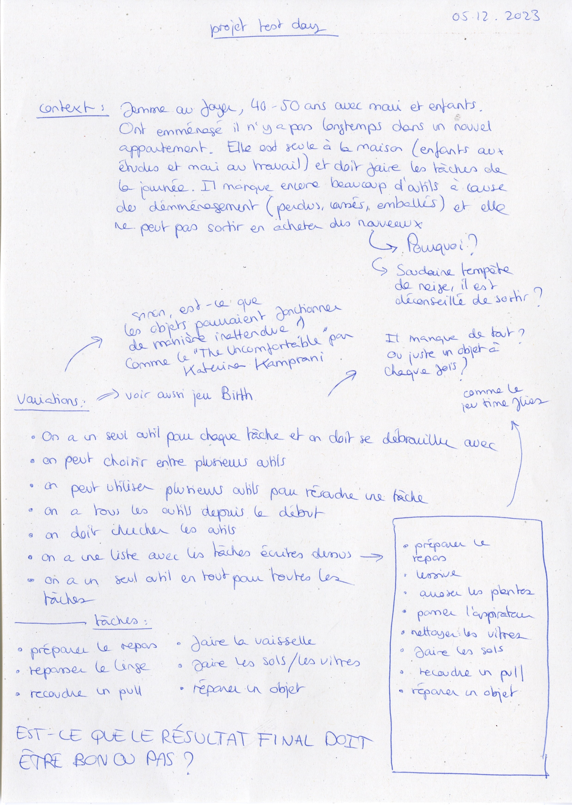
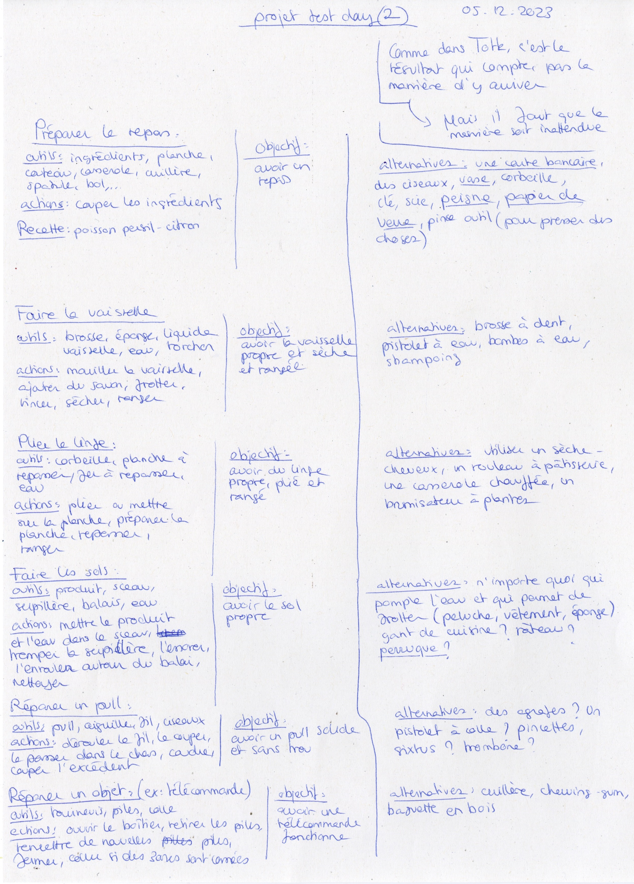
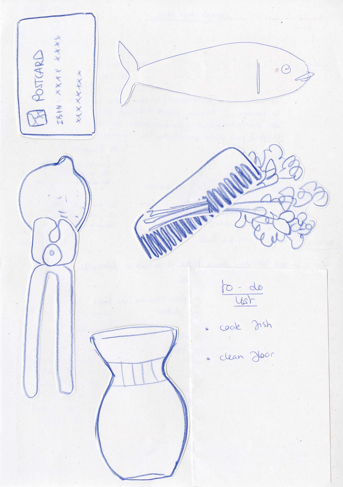
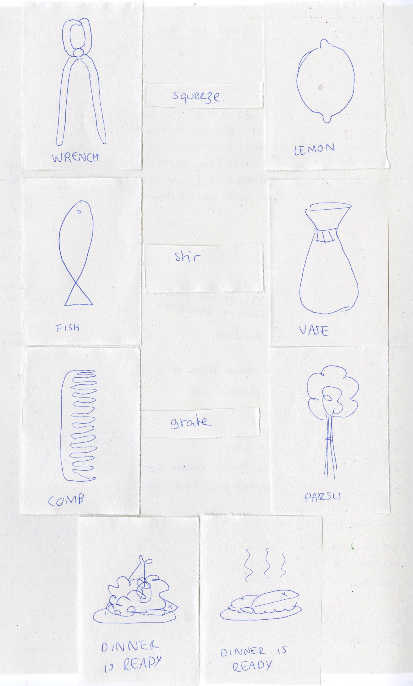
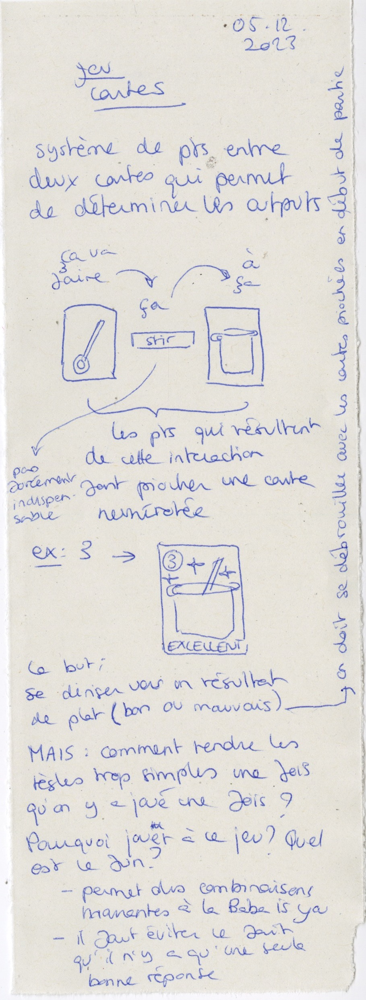

# Exploring my ideas

## 05.12.2023

I extended my ideas to domestic tasks. I listed them and the different actions and tools associated to it. I also imagined a beginning of story for the context of the game. The main character is a middle-aged wife that just moved out with her children and her husband in a new house.

I made some more paper shapes to see how they could interact between each other.

Dominic suggested I try to make a simple card game out of my ideas. I started some tests but I struggled finding a way to make an output out of the combinaisons.

