# Goal of the game and sate of the arts

## 07.12.2023

I thought about how the result we get after completing a chore can affect the message of my project. I explored different possibilities.

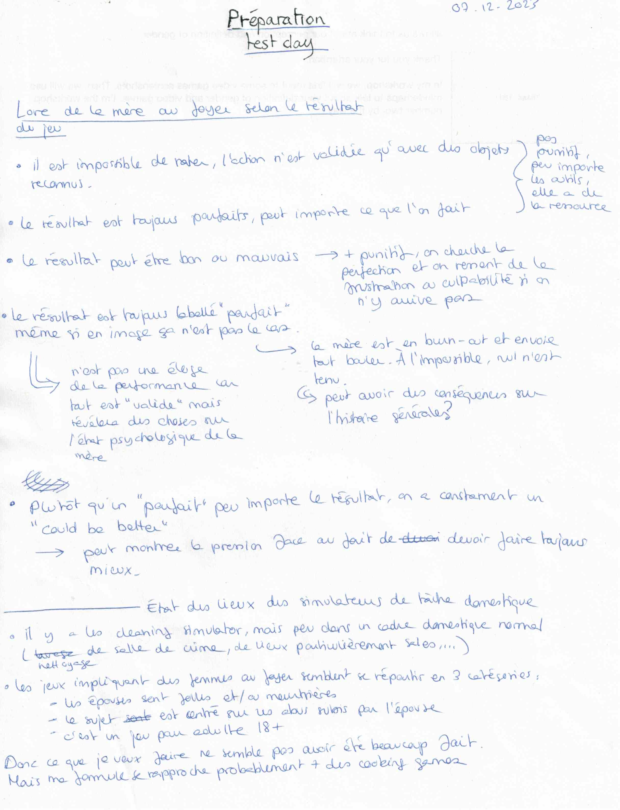

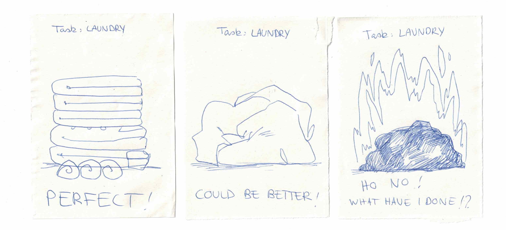

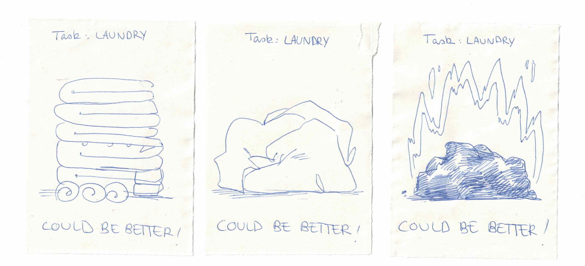

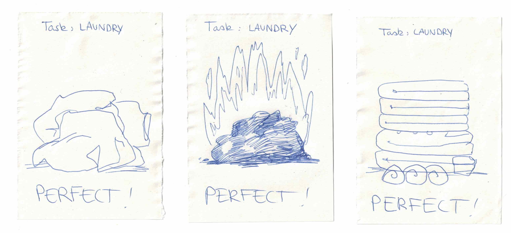

## State of the arts

I took some time to see if some video games similar to my project already existed. The games I found were quite different from what I have in mind, which is a good thing. But it also shows how hard it is to find a realistic game about being a housewife and doing housechores.

I started my research with the key words "cleaning" and "housechores". I discoverded the "Cleaning game" genre.
Often, "cleaning games" are games in which you have to clean really dirty places or crime scenes. Apparently, there is also a sub-genre in ""cleaning games" in which you clean by doing power washing.

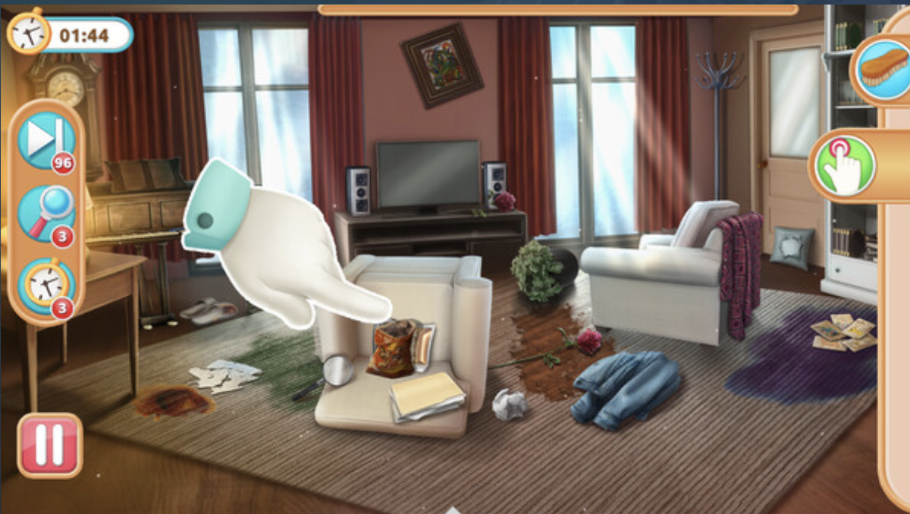
Cleaning Queens (Image source: https://store.steampowered.com/app/2229420/Cleaning_Queens/)

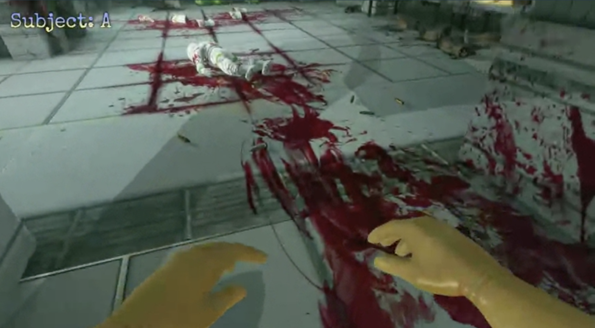
Viscera Cleanup Detail (Image source: https://store.steampowered.com/app/246900/Viscera_Cleanup_Detail/)

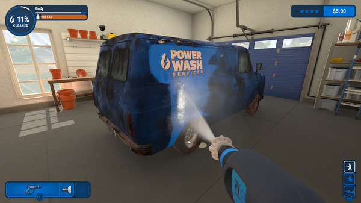

PowerWash Simulator (Image source: https://store.steampowered.com/app/1290000/PowerWash_Simulator/)

"Cleaning" as a gameplay seems alos to be often used in mystery games in which you have to solve murders and crimes. For example, the game "This Bed We Made" tells the story of a cleaning lady working in a hotel in the 50's. She uses her job to investigate and discover the clients' darkest secrets.

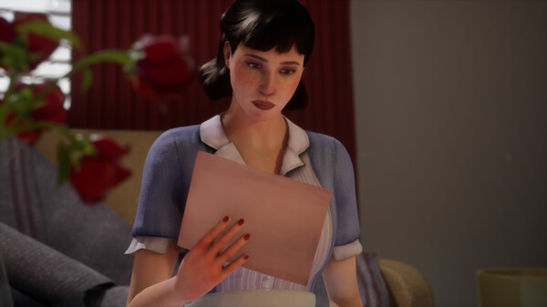

This Bed We Made (Image source: https://store.steampowered.com/app/1243850/This_Bed_We_Made/)

I also made some researches using the key word "Housewife". The first results I got were "Adult games" (+18). I also found a "Happy Family Life Simulator" in which you do chores. But the gameplay is limited to click to the right place and wait for the chore to be fullfield.
Then, I found a game called "The Housewife". This game is about domestic violences. Rougly at the same time, I discovered the weird game sub-genre of "Angry wifes" with games named the exact same way.
I also came accross a cute game made for a game jam: "Housewife Simulator". It's a plateform game talking about the stress of being a housewife. But the message we get when losing the game is weird since it talks about ecology and how we should take care of our "home planet". So, for me, we get some mixed/paradoxal messages.

House Wife is an example of "Adult games" I found.

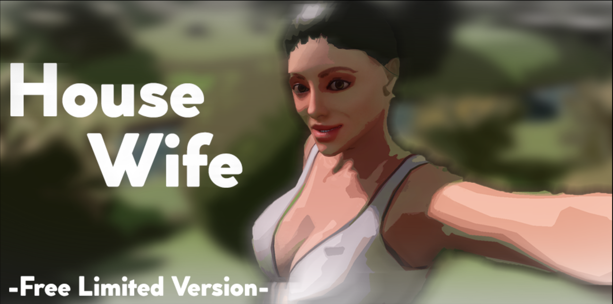
House Wife (Image source: https://retsymthenam.itch.io/housewife-free-version)

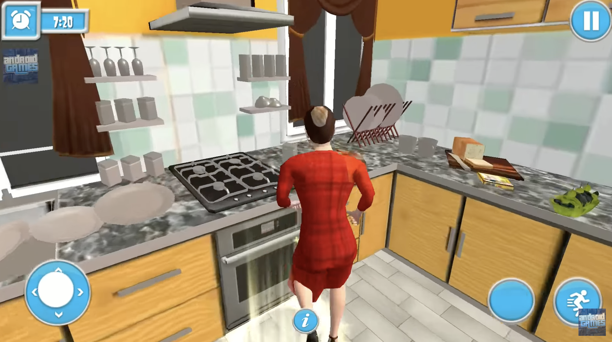
Happy Family Life Simulator 2020 (Image source: https://www.youtube.com/watch?v=RIvBVQnmSXE)

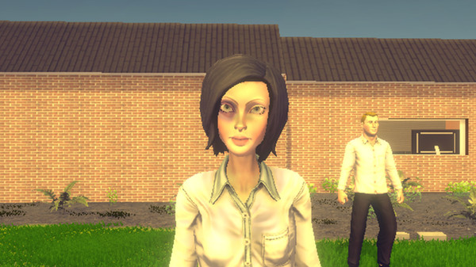

The Housewife (Image source: https://store.steampowered.com/app/496750/The_Housewife/)

"Angry Wife" is probably a kickstarter project. The trailer explains the story which is the following. You are a poor husband working hard during the day but neglecting your wife and your chores. Therefore, she is angry at you and beats you. To heal your relationship, you have to do different domestic chores. This project has a gameplay close to what I have in mind: to fulfill the chores, you don't have to click and wait like in other games, you actually have to "do" them. But since I find the overall message of this project pretty unhealthy, I don't want to use it as a reference.

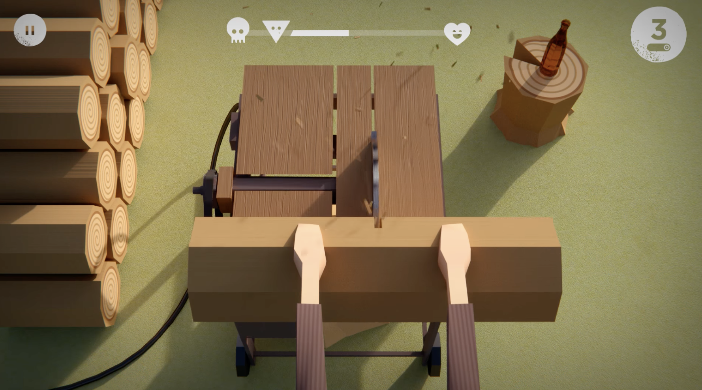
Angry Wife (Image source: https://www.youtube.com/watch?v=L1Pt03ASu98)

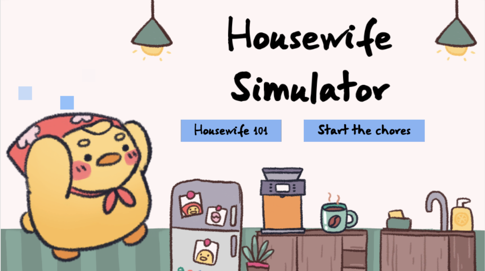
Housewife Simulator (Image source: https://hadios.itch.io/housewife-simulator)

In the end, I made a small list of games similar in some ways to what I want to do for my project. I already had "Cooking Mama" and "Venba" in mind for the gameplay, but I added "Technically Clean" and "Birth".

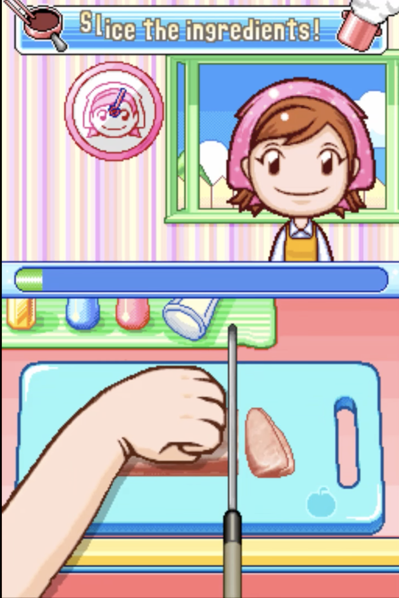

Cooking Mama 2, Dinner with friends (Image source: https://www.youtube.com/watch?v=hr-V9g_yl9Q)

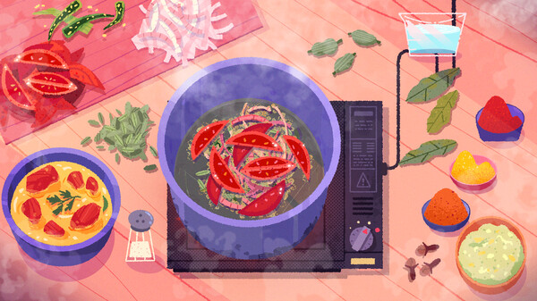

Venba (Image source: https://store.steampowered.com/app/1491670/Venba/)

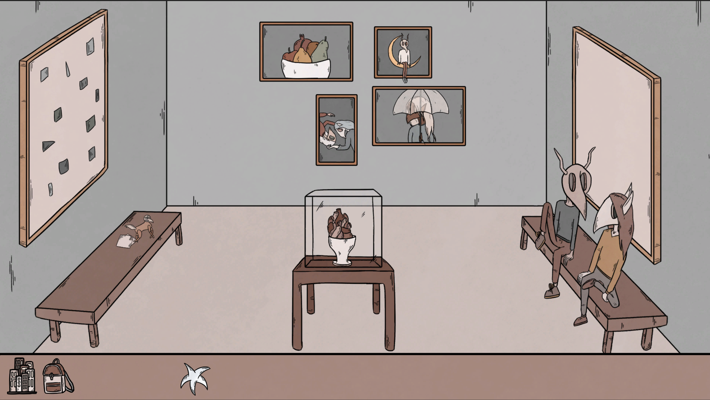

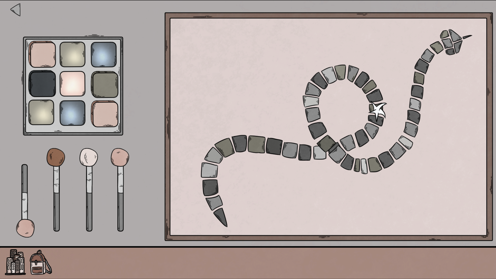
Birth (Image source: Screenshots)

"Technically Clean" is a bit similar to the kind of experience I would like to provide. The goal of the game is to clean your appartement before your parents arrive. You can clean it "the good way" or just making it "look clean". Therefore, you have different ways to achieve your goal in a minimum of time.

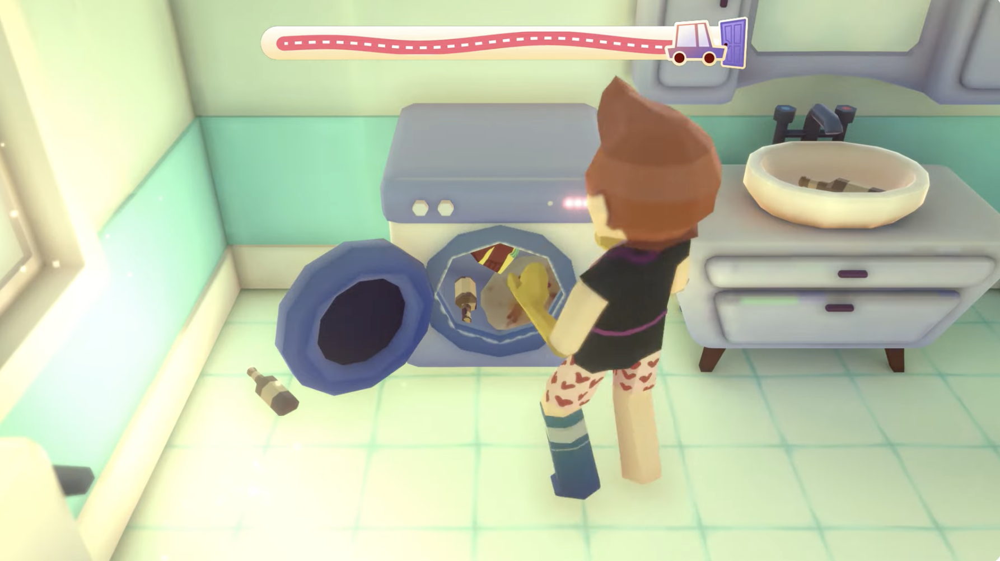
Technically Clean (Image source: https://www.youtube.com/watch?v=GYOs2d9bcw4)

I also added the game "Unpacking" to my list. This game is a good example for telling stories with objects and the environment.

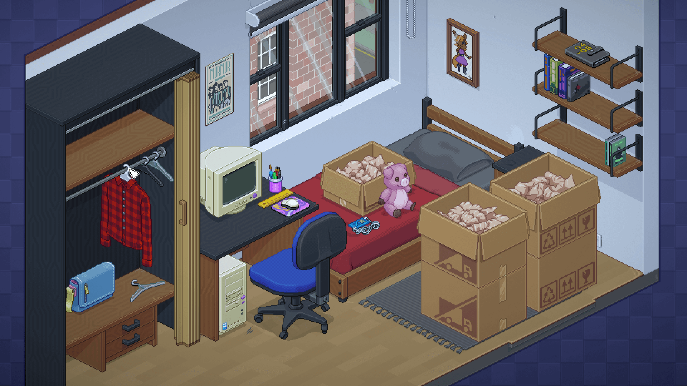
Unpacking (Image source: https://www.unpackinggame.com)
