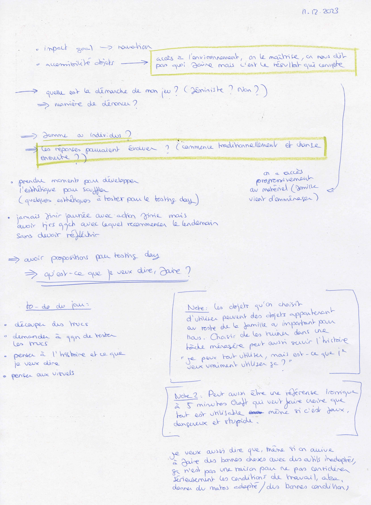
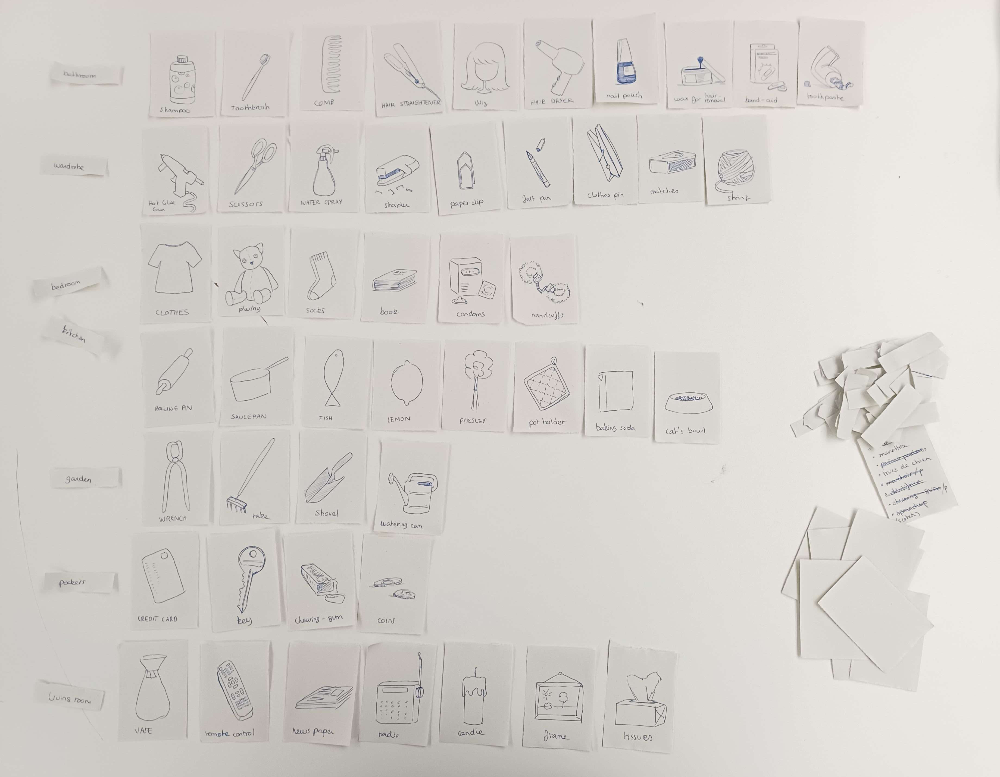

# I made a lot of cards

## 11.12.2023

I thought again about how the result we get after fulfilling a chore can impact the narration. Camille suggested the results could change the more we play to the game, starting "normal" and getting more and more different. We talked about the main charcater, the aesthetic and the messages I want to share through my project. I also told her I'm not sure for now if the player should have access to all the objects when doing a chore (like when we are in our house) or if they should have access to only some of them (easier for the interactions but may limit them).

Therefore, I decided to spend the rest of the day cutting "object" and "action" cards to do a test with someone the day after.

To help me organize and see the kind of objects I have, I grouped them by places in the house (kitchen, bedroom, ...). I thought that maybe this could also be a good idea for the test day. This way, people may look for objects with more logic and efficiency and it may also reproduces the feeling of being in a house.
