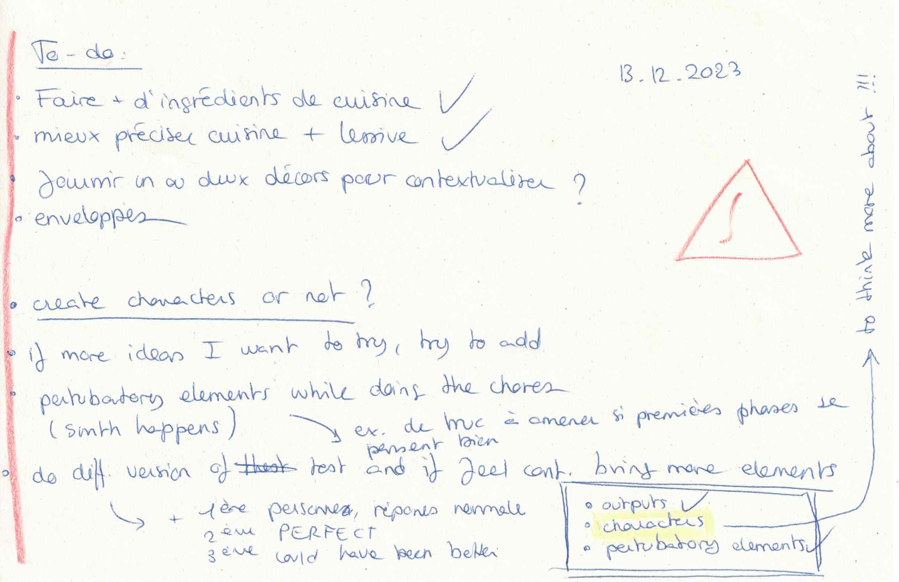
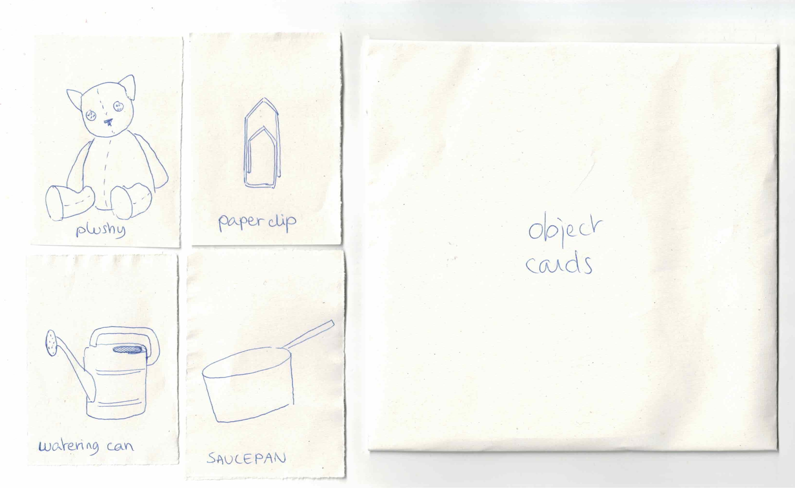
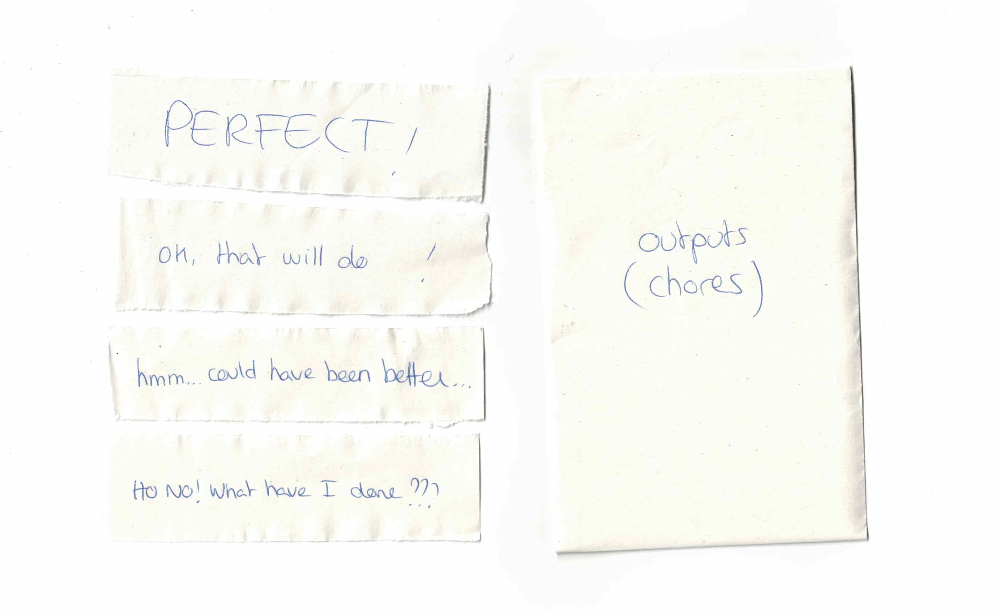
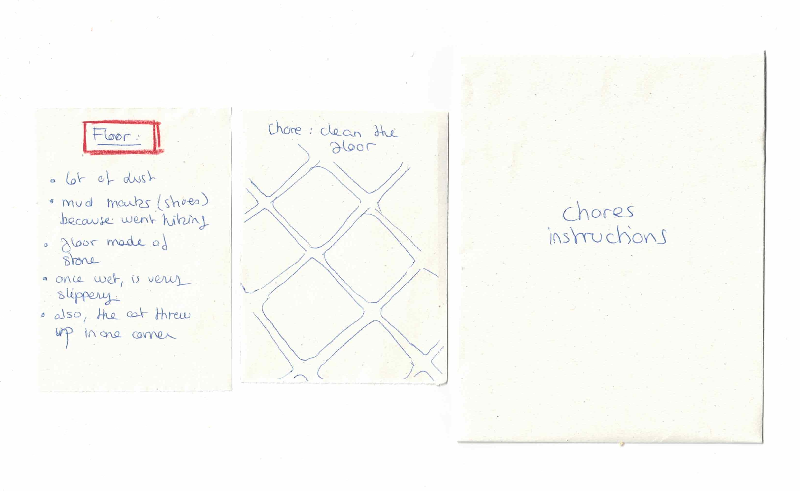
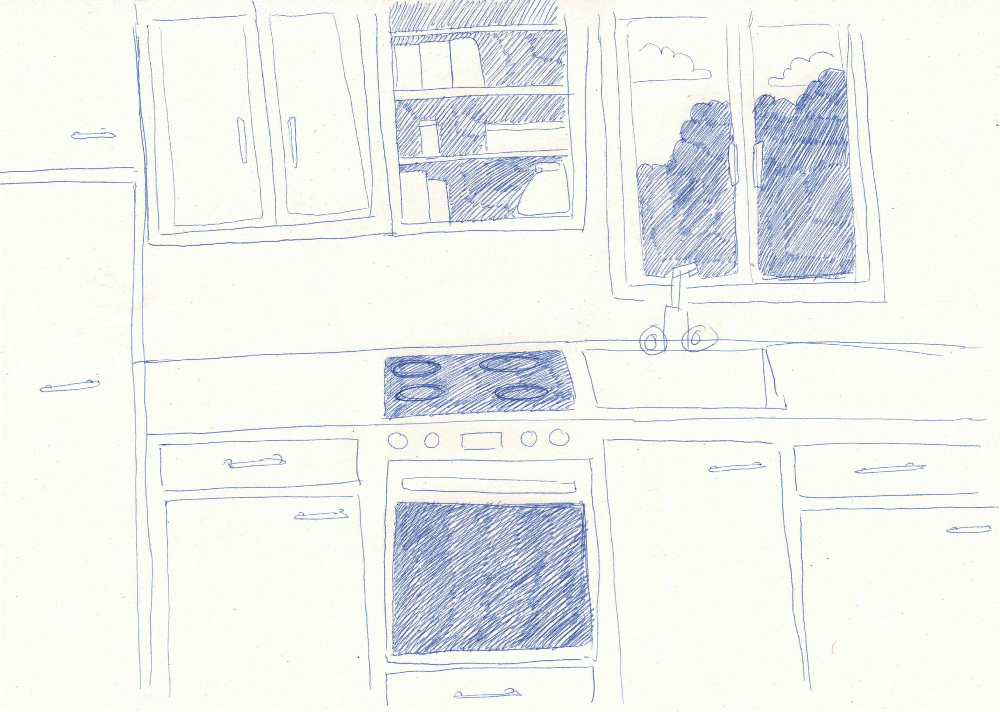
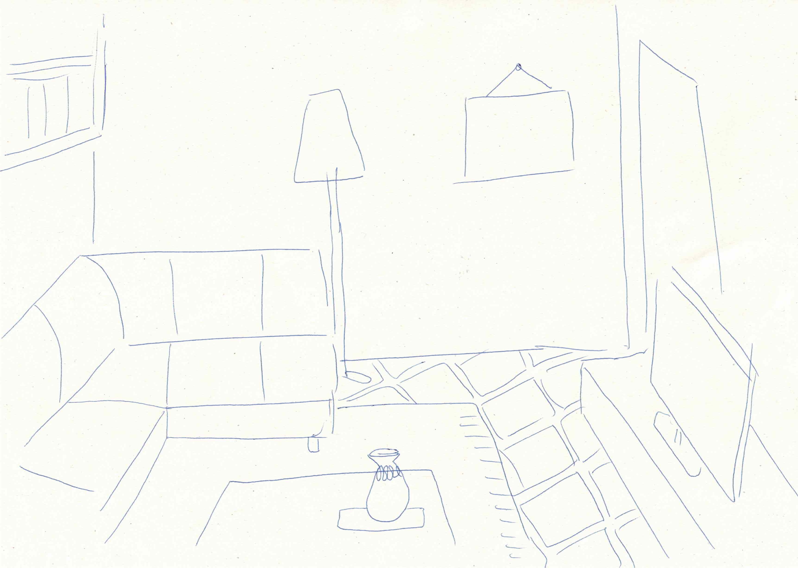
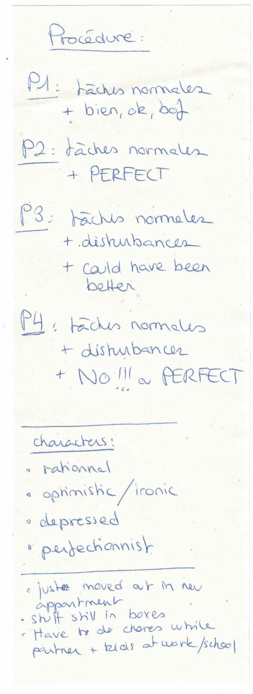

# Getting everything ready

## 13.12.2023

During this day, I prepared everything I needed for the TEST DAY. I started by making a to-do list of what was left to do for my prototype.

Then, I made enveloppes to organize all the little cards I had.

I also drew two backgrounds to help the participants understanding the context of the game.

Finally, I made a small list with different procedures for each participant to test different aspects of my prototype.

