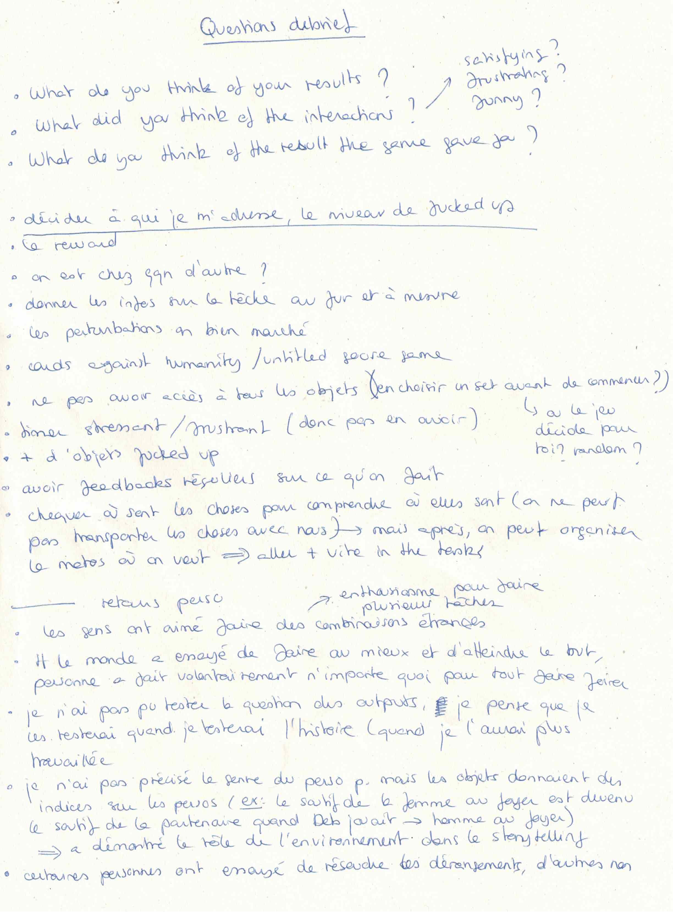
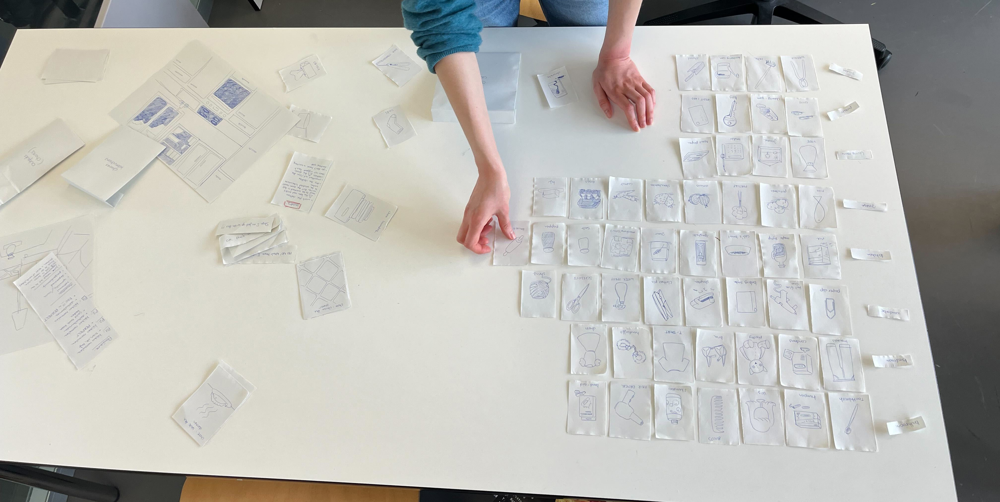
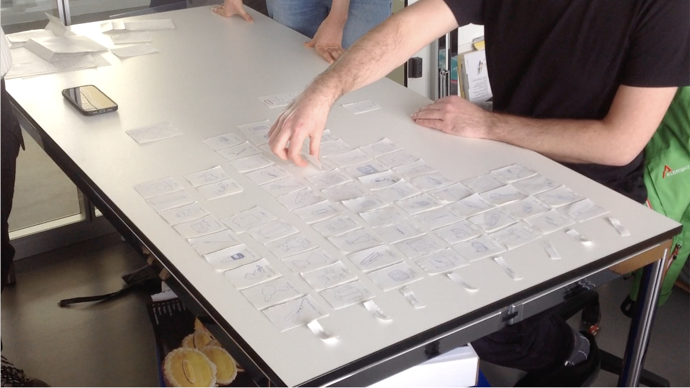
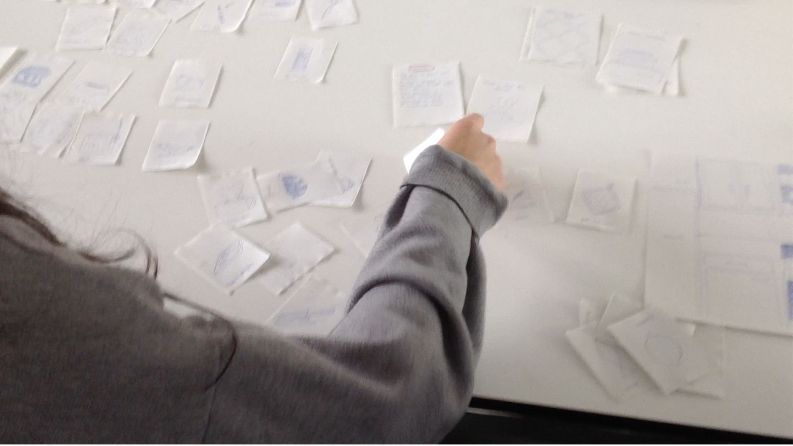
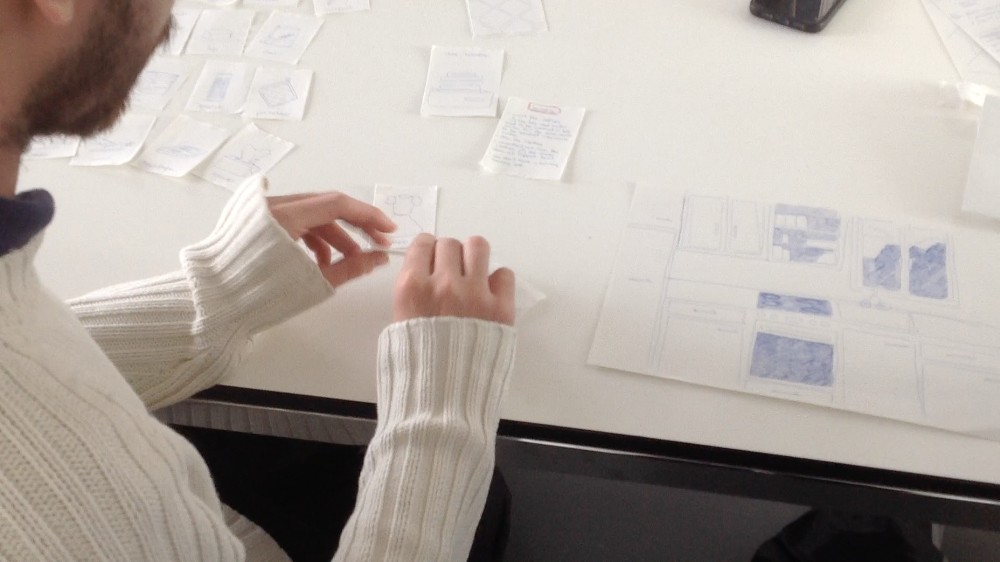
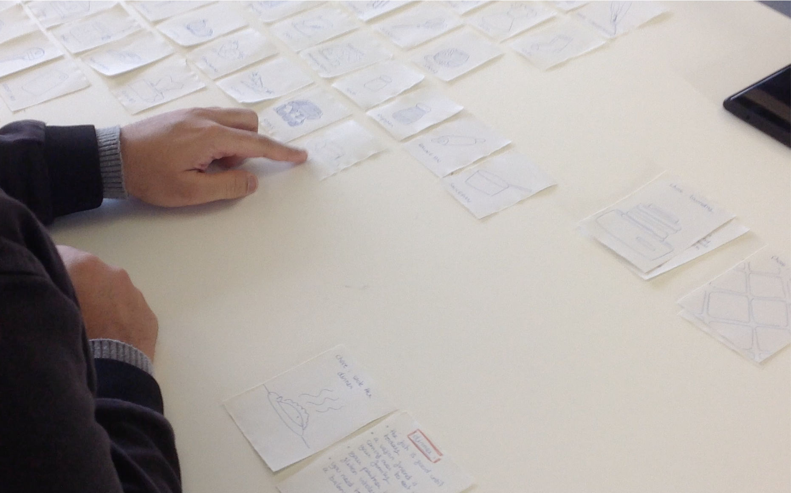

# Test Day

## 14.12.2023

The test day went well. Overall, everybody enjoyed combining silly objects to fulfill housechores. I tested my prototype with 4 different people. Everybody tried to do the best as they could. Nobody went crazy and tried ruining the chore. I think testing the limits of the interactions may comes after doing the game correctly at least once. But maybe they also tried their best because we were here to test a prototype, not testing an actual game.
I didn't test the outputs cards the way I would have liked to. During the testing phase, I realized the way I wanted to do it wasn't fitting with what was happening. I didn't know how to get useful feedbacks from it so I decided to test this part of my prototype an other day.
Having to test my prototype under limited time (because of the TEST DAY) confirmed that my game doesn't need such thing as a timer. It stressed out people and made them feel frustrated because they wanted to take their time to choose the objects.
I had to remove some objects for the afternoon session. In the morning, the participants told me there were to much objects to choose from in the little time we had.
The chores'disturbances worked well. Some people tried to solve them, some did not.
I didn't precise the character's gender. Therefore, everybody could project themseves into the story. I noticed that some objects were interpreted differently depending of one player's gender. For example, "the bra" could be the player's own bra but could also belong to the player's partner (in the story). This example showed me the importance of storytelling through ojects. It also showed me how the main character's description can change the perception of certain objects.

The participants gave me feedbacks and references I listed on a piece of paper (see below). Overall, I need to focus on the story, the main character(s) and the final goal/reward of the game. One player said he liked having comments from me while he was playing. He said it could be good to have an inner voice interacting with us while doing the chores. I think this is a good idea and I want to explore it.

