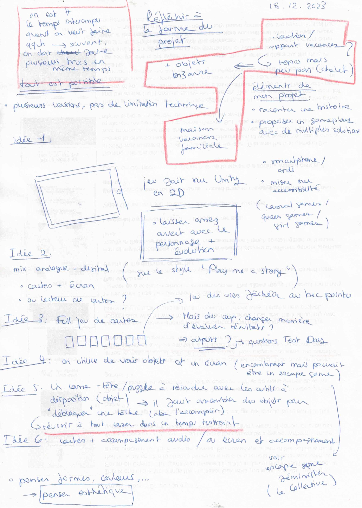
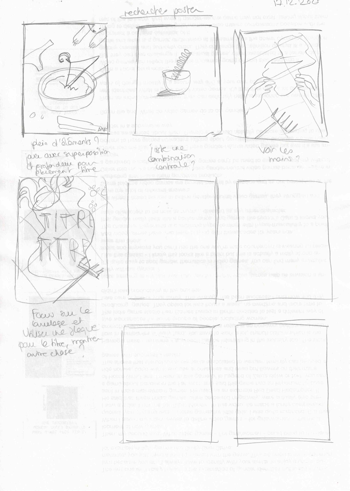
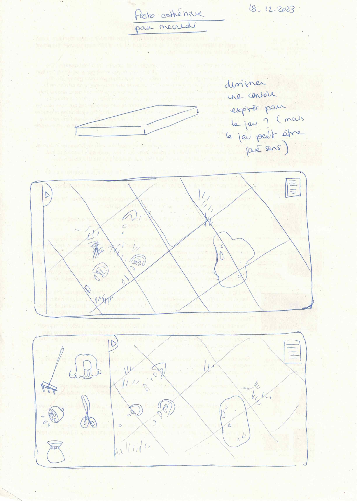
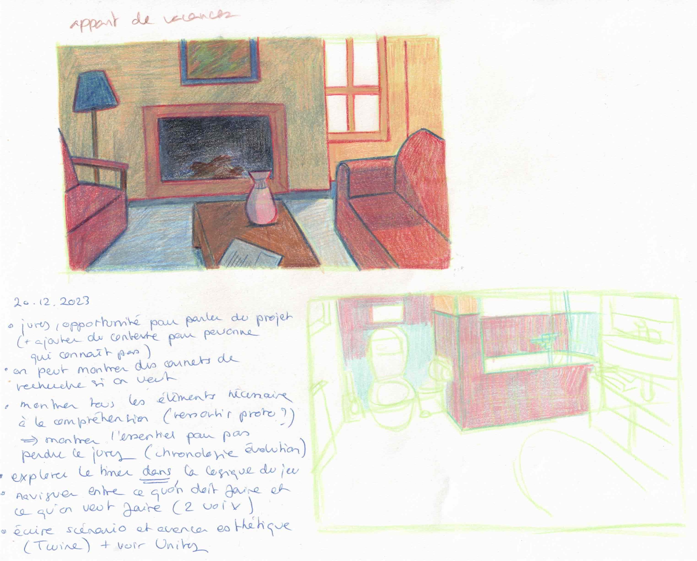
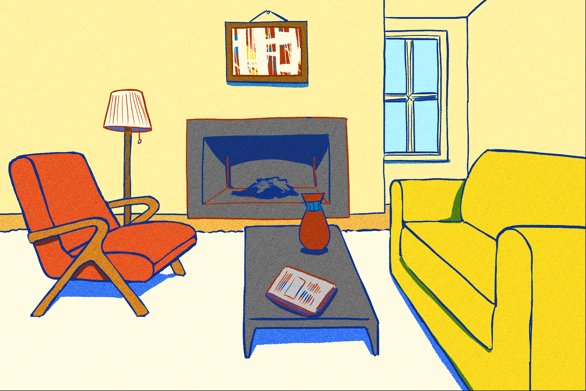
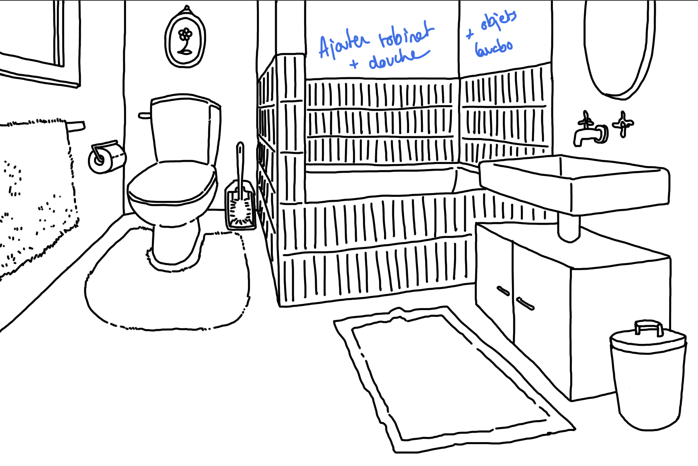

# Thinking about the visuals

## 18-20.12.2023

We used the three days left before holidays to start thinking about different things like the poster and our project as a physical object.

Since I would like to do a video game, I decided to focus on the visuals and stared making some sketches and drawings.

For the holidays, I need to keep producing drawings for my project while thinking about the story. This will help me defining a first idea of the aesthetic I want to use for my game and for the poster.

I also need to start watching tutorials about Unity to see what might be possible or not for my game.
