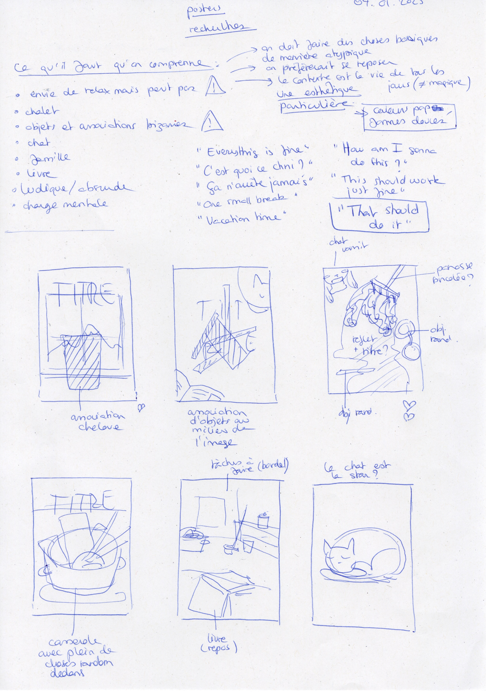
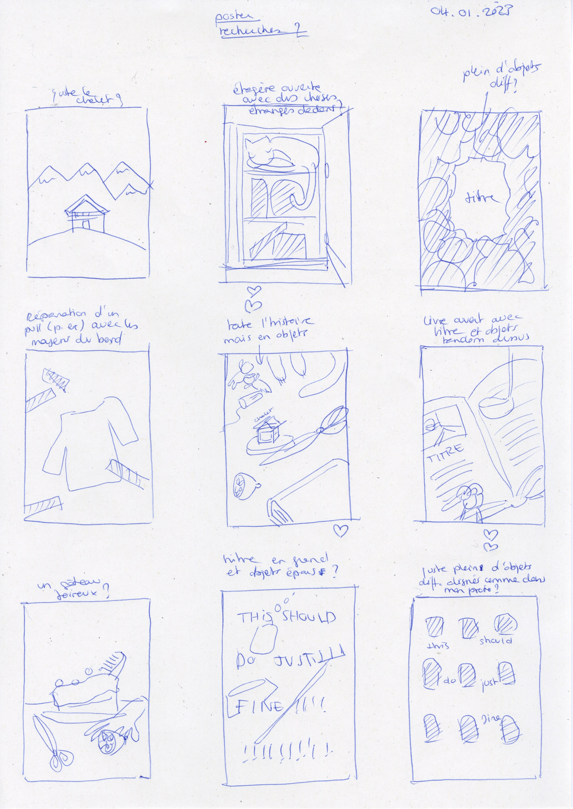
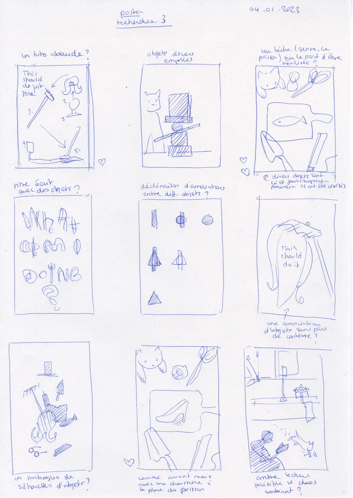
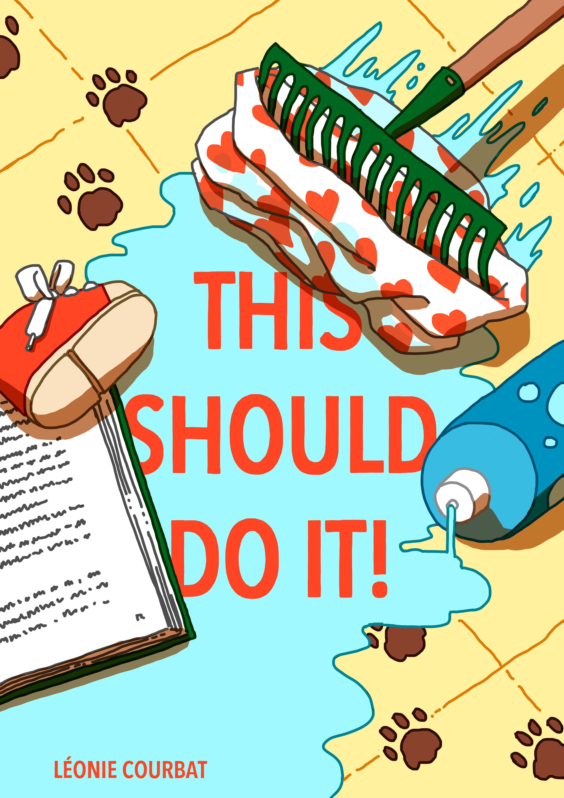

# Poster

## 09.01.2023

We had to make an A1 poster to give a first impression of our project.

I started by making some quick sketches to find the composition that worked the best for me. Then, after picking one, I worked in Clip Studio Paint to create the illustration.

