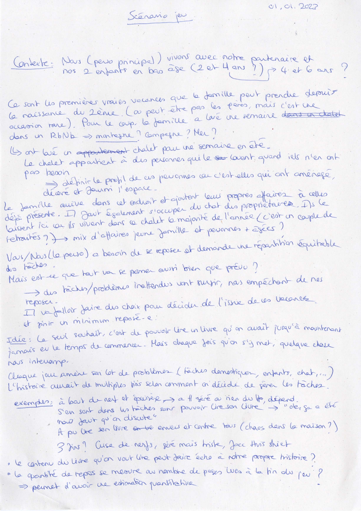
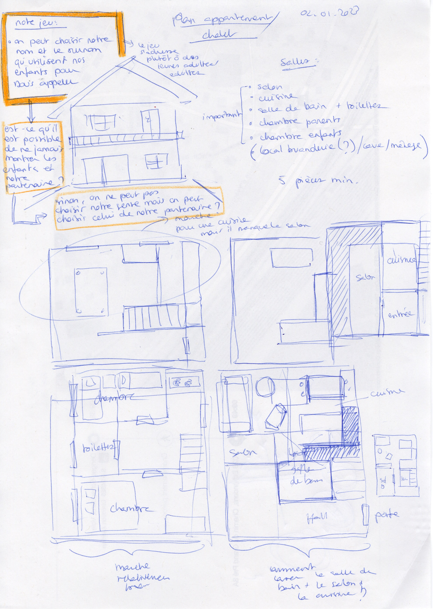
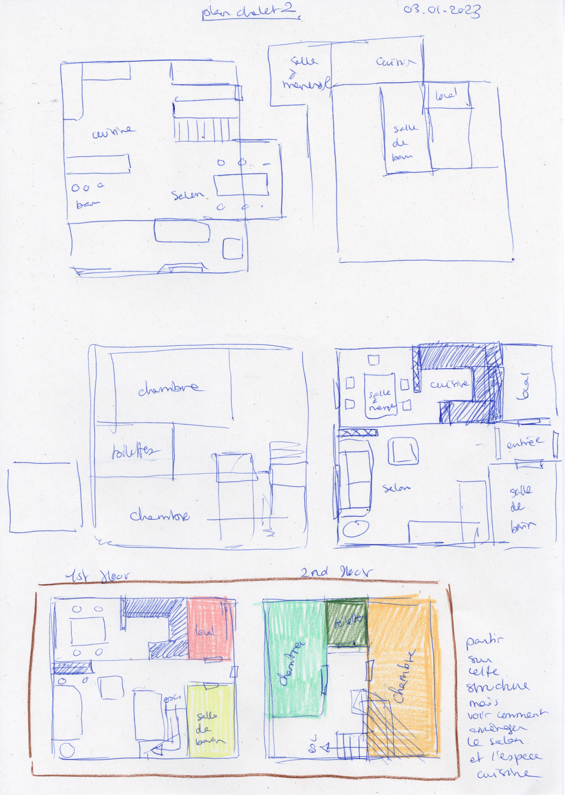

# Scenario and chalet's plans

## 10.01.2023

During Christmas Holydays, I thought a bit more about my initial story. I wrote down the context and different ideas about certain elements.

Therefore, I have a basic structure that can still be pretty flexible. This is a good thing because I'm still not sure about some aspects, for example, the type of ending we can have.

After focusing on the narration, I thought about the environment. For now, the story happens in a chalet in the mountains. I tried making some plans to fit all the rooms in two floors. I found a rather working repartition of space. Now, I need to draw backgrounds to see if it actually works.

