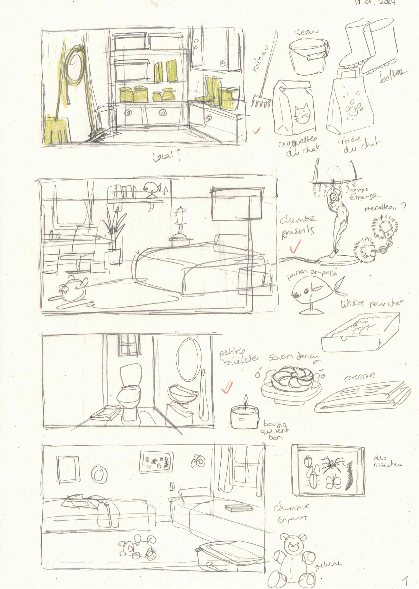
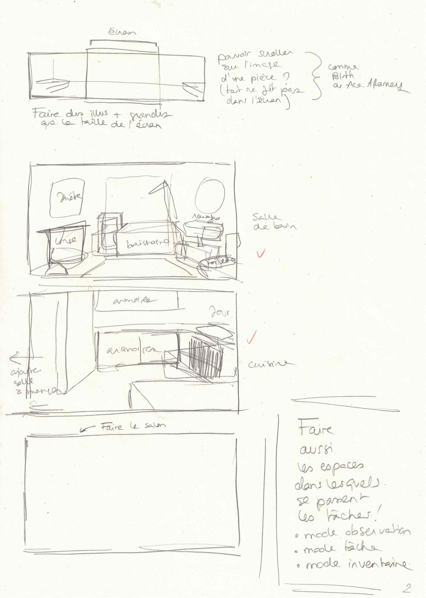
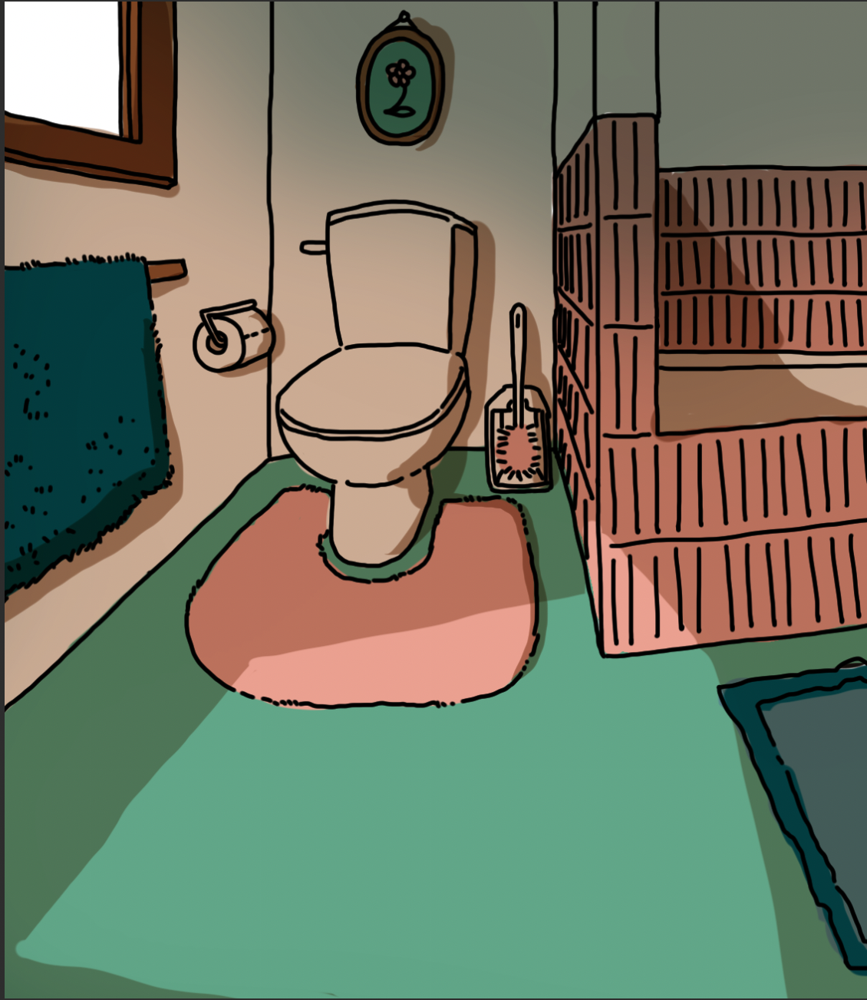

# Chalet doodles and background test

## 10.01.2024

To speed up my drawing process, I made quick sketches of (almost) each room in the chalet. This allowed me to quickly think about the furniture and objects I need to display. I also noticed that not all the rooms fit in the same "screen size". Some would render better with more space. Therefore, I considered the necessity to maybe being able to scroll horizontally in some of the game's backgrounds. I will use these sketches as references to draw cleaner versions of the backgrounds.

During the day, I also finished a first background/coloring test I started before the Holidays.

