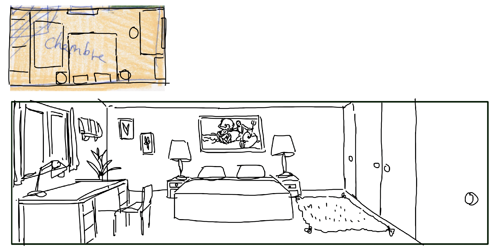

# Drawing backgrounds

## 11.01.2024

I spent the whole day drawing cleaner version of yesterday's sketches. I tested a hack that makes easier the production of background with perspective.

To do so, I first made a small and quick plan from above showing where the main elements of the room should be. Then, I used the perspective tool in Clip Studio Paint to stretch the doodle and display it as the floor. Then, I just needed to follow my distorded sketch and add verticals from it to "bring the 3D objects to life". This worked really well for me. I still need to do some adjustements but I was able to work way much faster than if I had to create all the perspective lines from scratch.

While drawing, I was also thinking about the objects and the decoration of each room, wondering how to tell the story of the owners through it. For now, while decoring the chalet, I'm imagining a couple in their 70's that traveled a lot during their life. I don't know if I'll keep this idea or change it for a different type of owners. But for now, it is useful to experiment the storytelling through the environment and see how crazy the objects can go through this approach.

