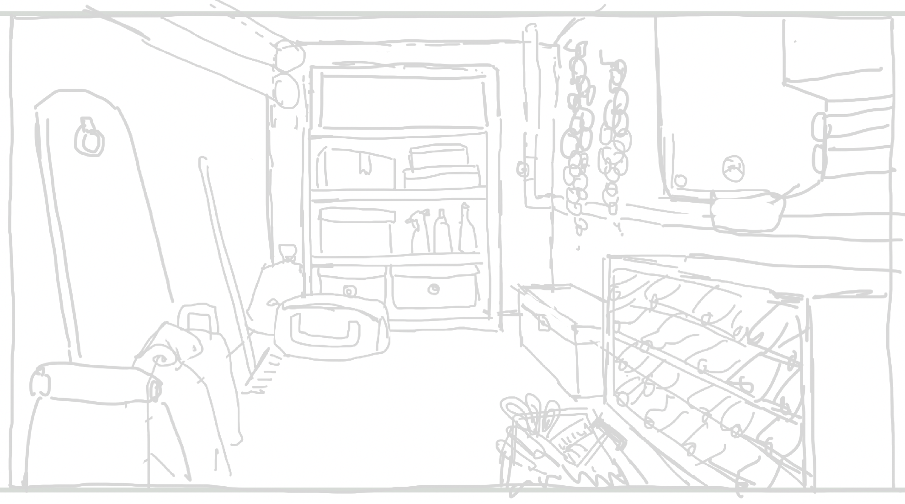
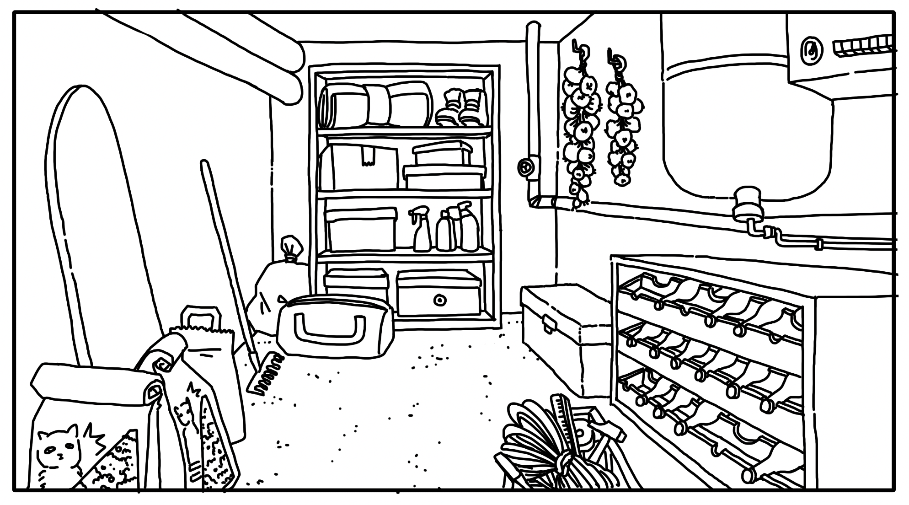
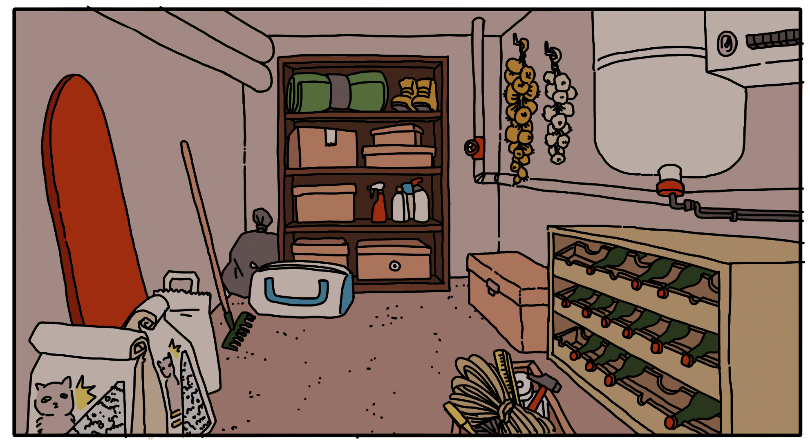
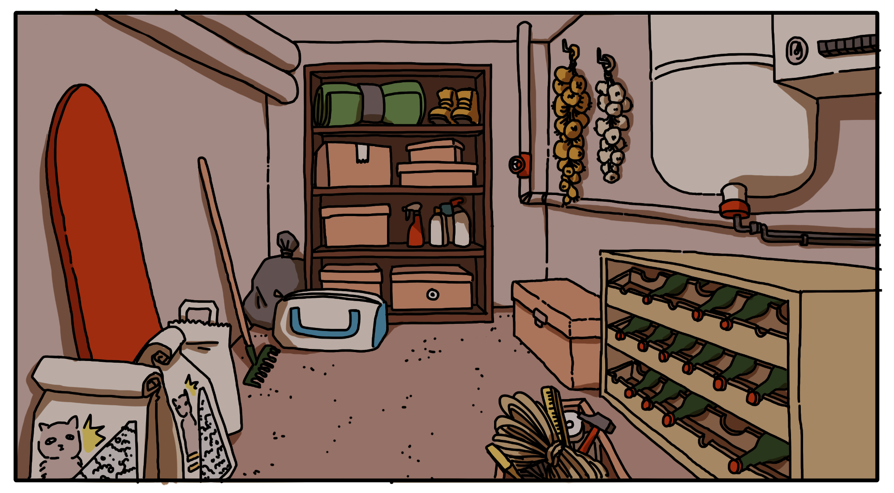
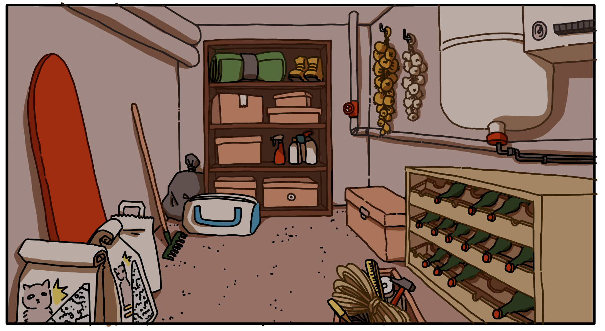

# The cellar

## 15.01.2024

I spent the whole day drawing a clean version of the cellar. I wanted to have at least one pretty background to show to the jury to gave them an idea of the (probably not final) aesthetic. I started with the sketch made the previous days, I lined it, added the colors, shadows and ended by also adding some colors to the line.

