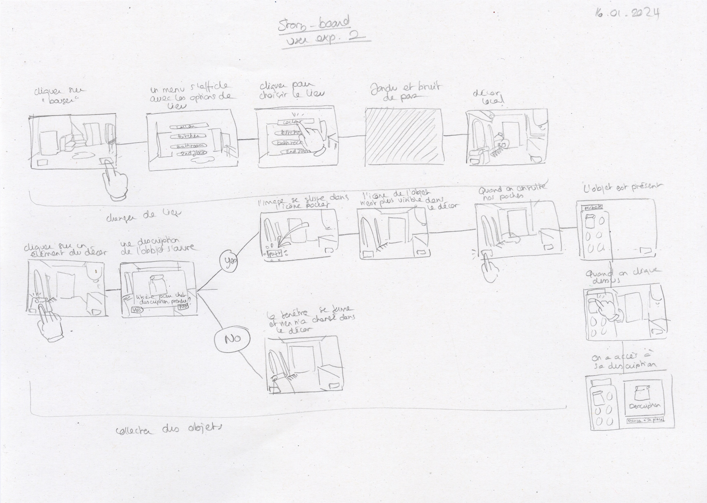
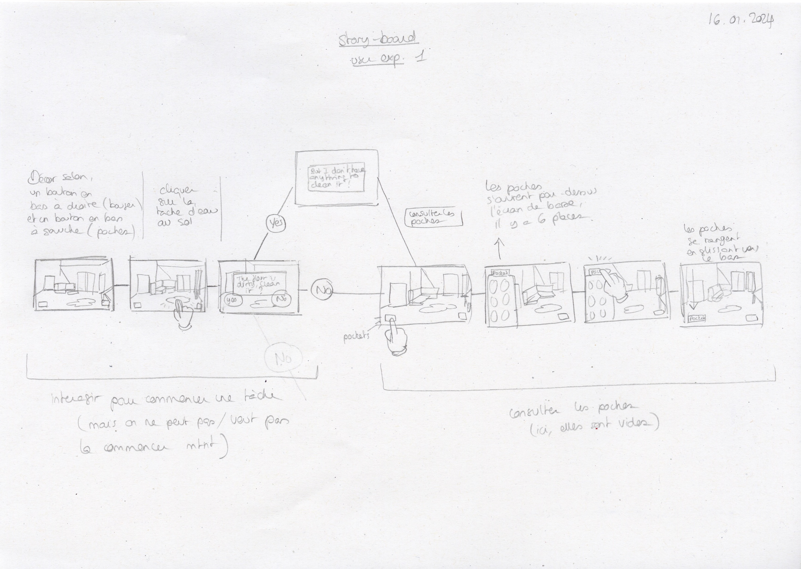
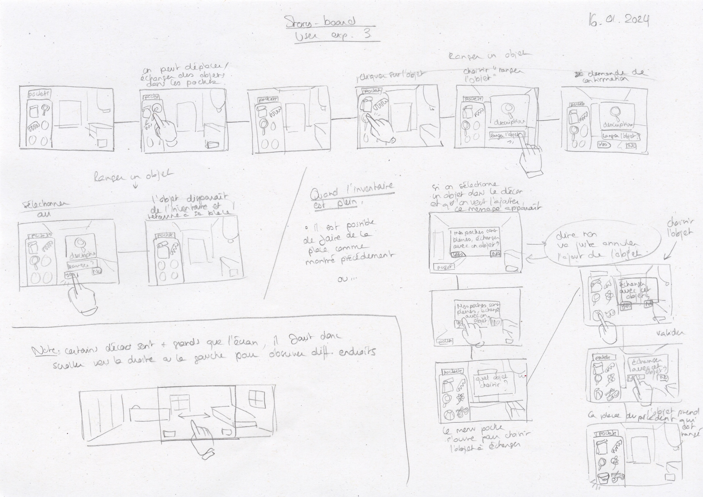
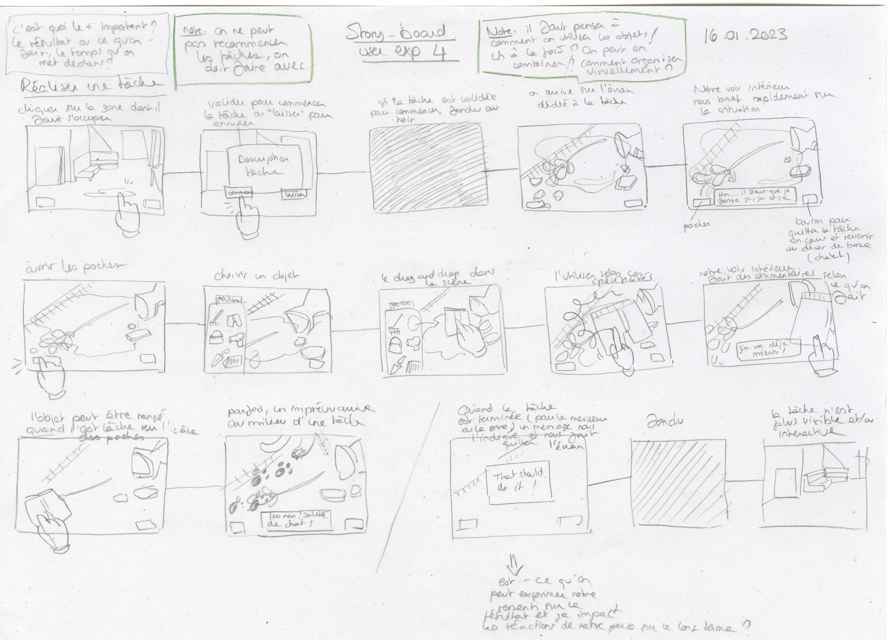
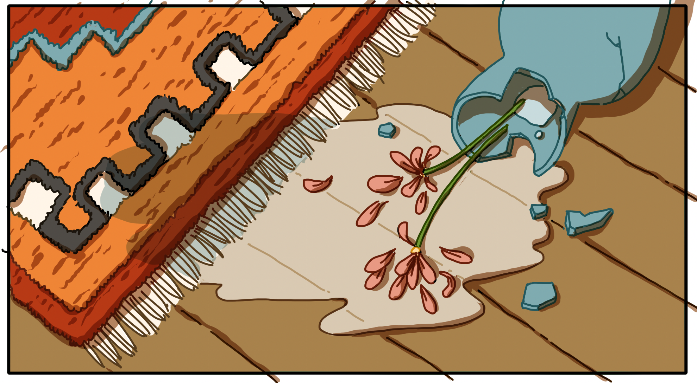
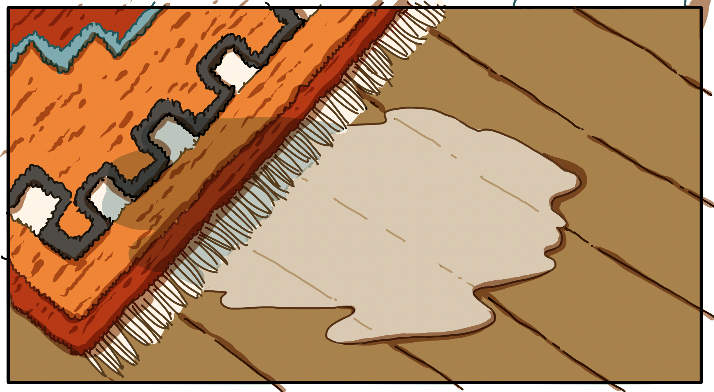
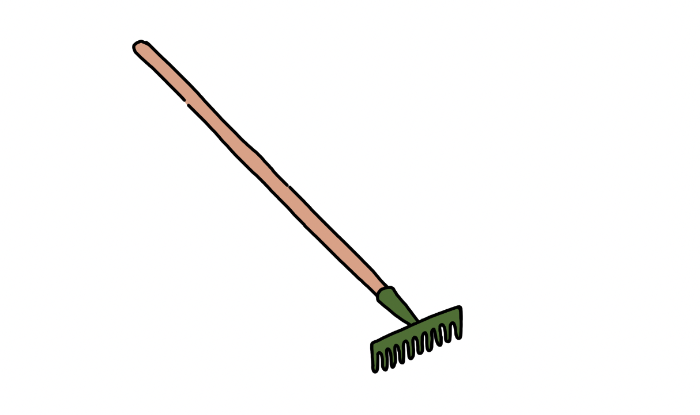
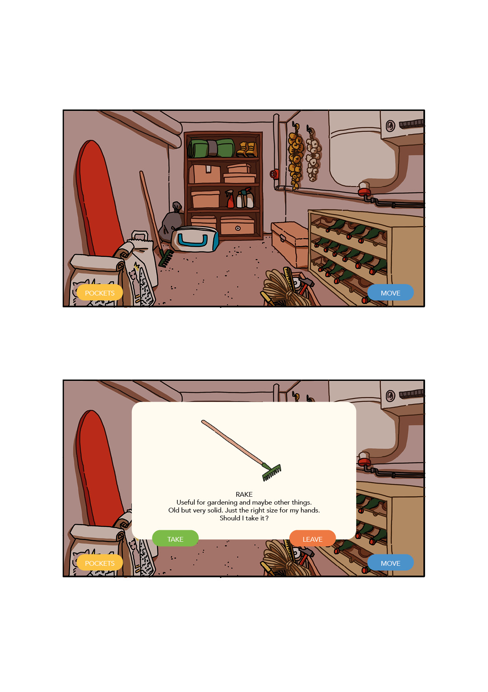
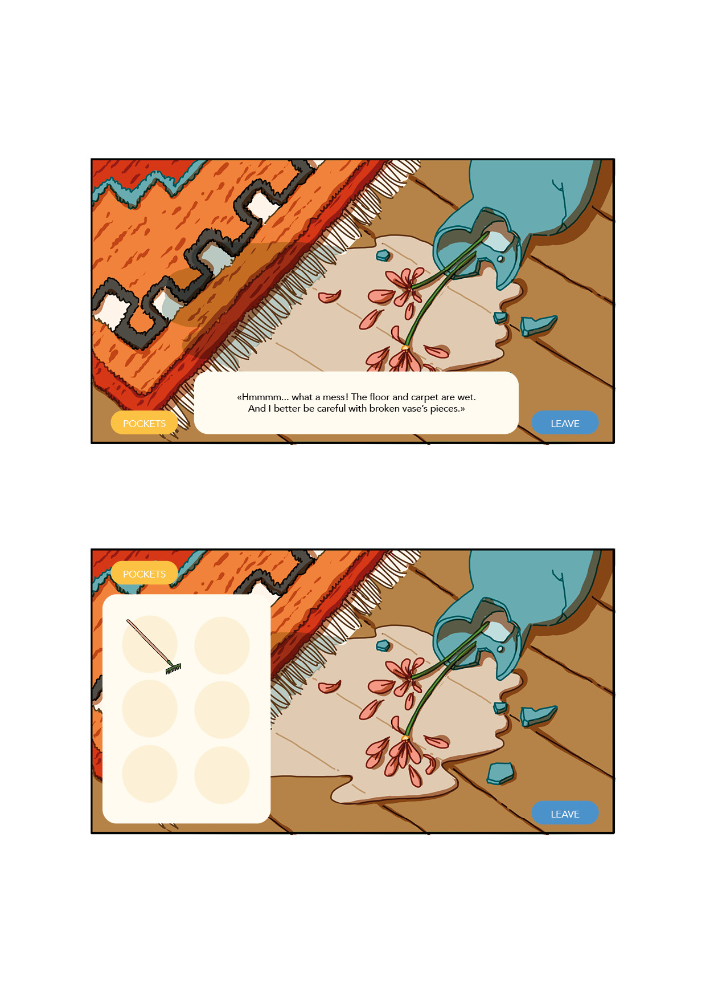
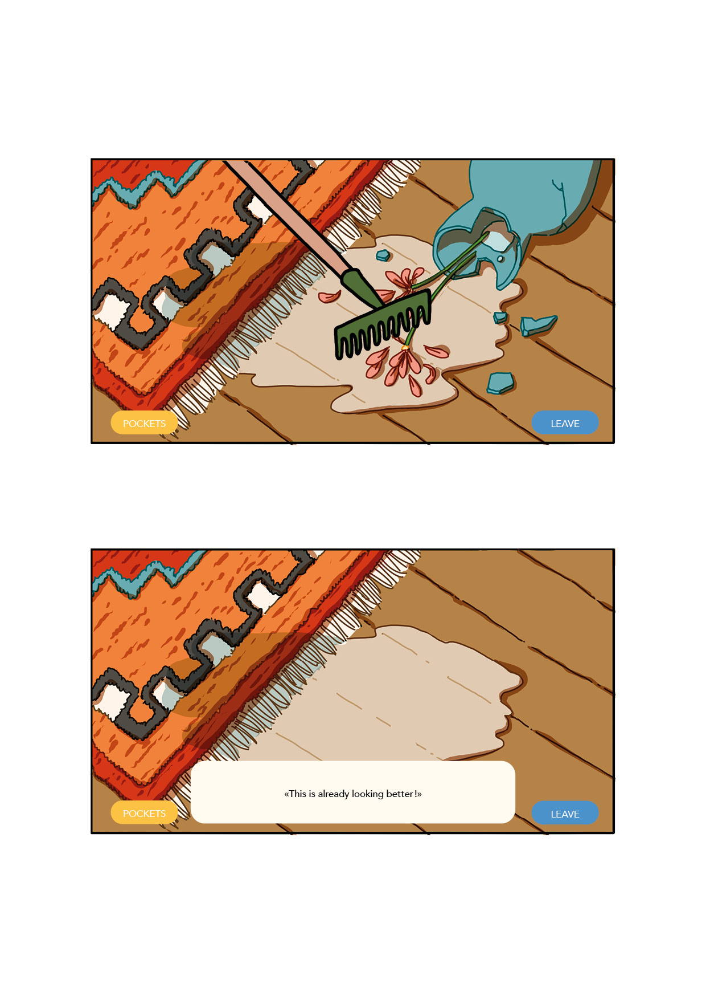

# Concept arts and story-board

## 16.01.2024

I started the day doing a story-board for the different interactions in the game. It helped me deciding what could be important to show to the jury. After that, I drew a rake and two versions of a background for a chore. Then, I used these pictures to create some fake screenshots to show the jury a first idea of the interface and aesthetic.

