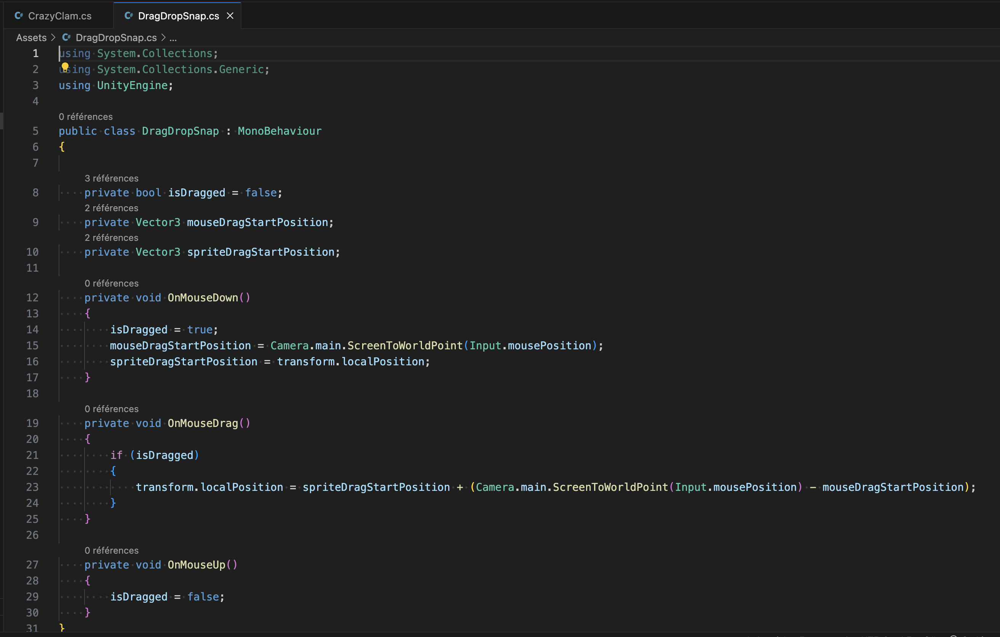
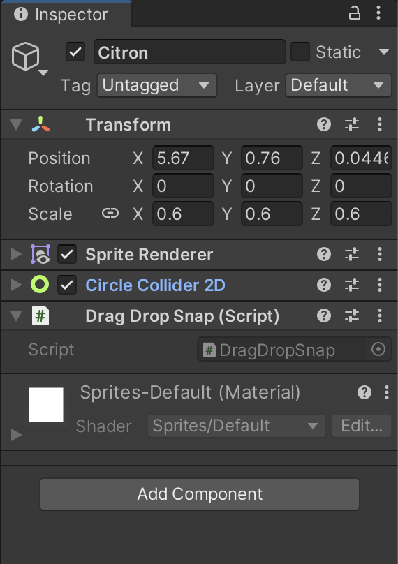

# Drag objetcs in Unity

## 31.01.2024

After getting stuck trying to show/hide text in Unity the day before, I wanted to start the day with something different. I created a new project and followed a tutorial to try to drag objects with the mouse. It was also a good occasion to test the OnMouseDown function in another context since I didn't manage to make it work for the text.

I followed this tutorial:

https://www.youtube.com/watch?v=axW46wCJxZ0

I replicated their script and instructions:

It worked on the first attempt. I was glad to see that the OnMouseDown function wasn't a problem in itself like I thought yesterday and that the troubles to make my other script work might come from something else.

