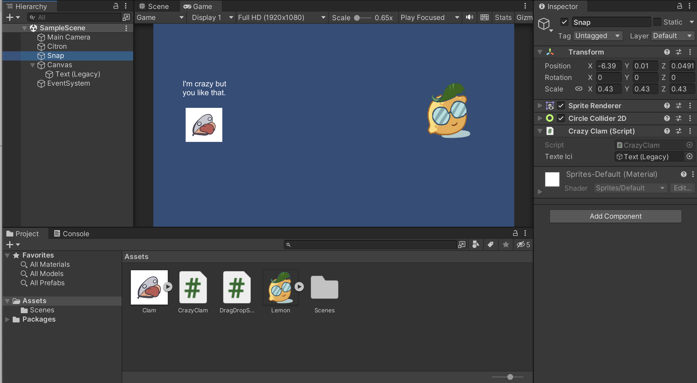
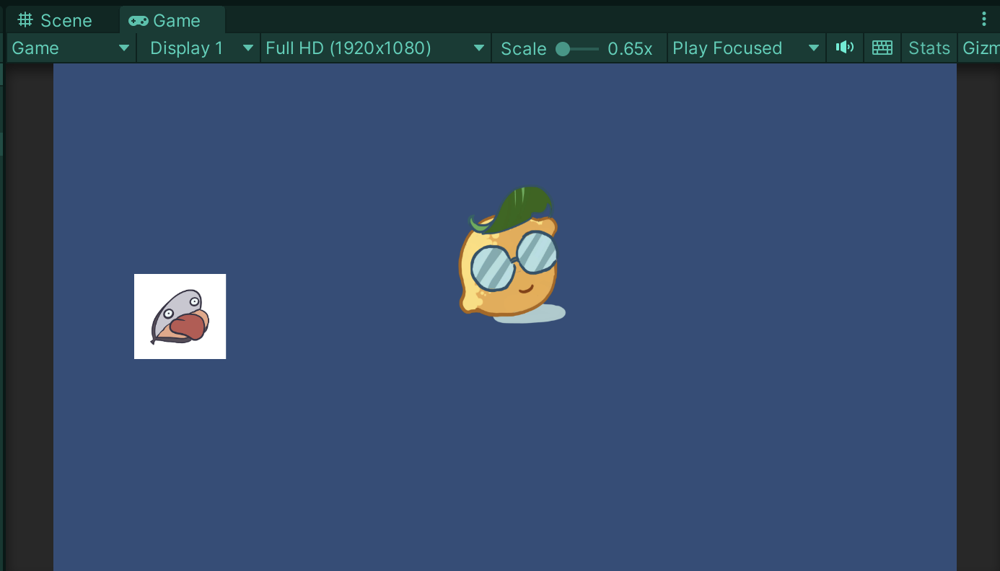
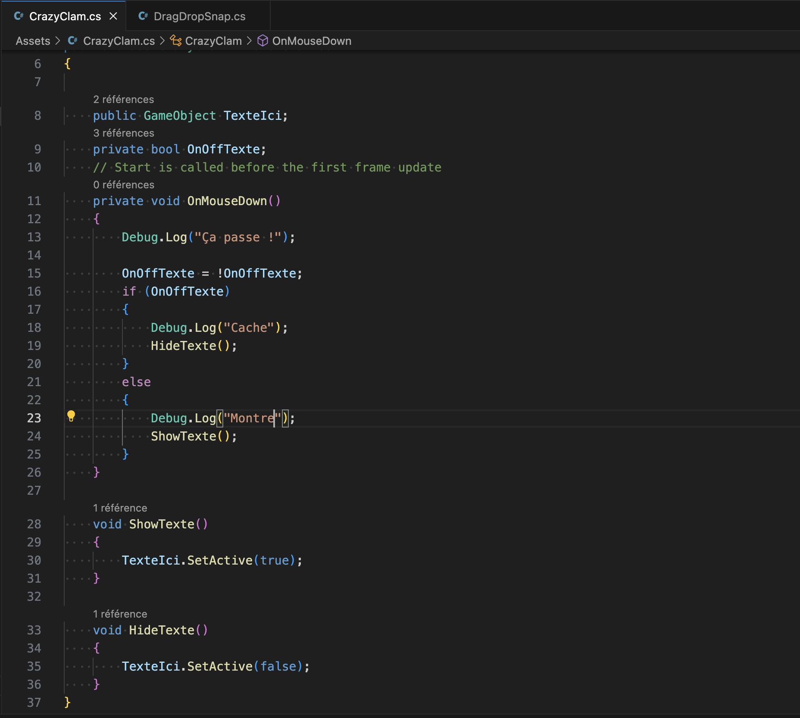
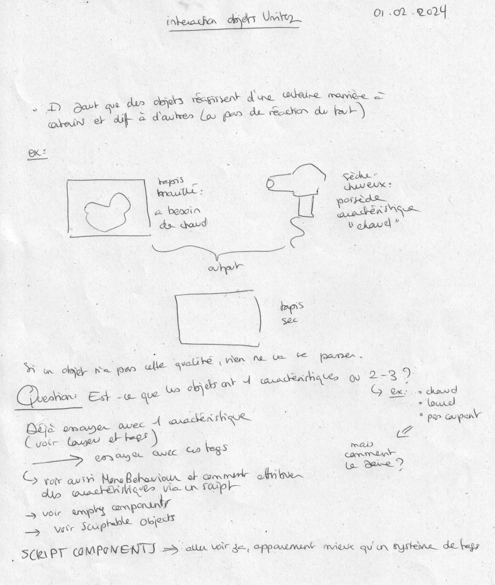

# Succeeding with the hide/show texte in Unity

## 01.02.2024

I tried again to make the hide/show text work. Since I had problems to make the mouse being detected by the collider in my previous project, I decided to re-do the process, but this time, in the new project that was created to test the drag script.

I wanted the "I'm crazy but you like that" text to show when we click on the clam drawing. Again, I had a lot of problems while doing it. With the first script (the one using true-false, see note number 2), I was able to show the text on the first click but then nothing would happen. I tried the second script (the one using a bool, see note number 2) but I kept getting error messages. I finally was able to understand what was happening because, at some point, I accidentaly added the scrip to the wrong GameObject. I noticed it worked on this one (the lemon) and not the clam. After further observations, I understood that the problem was actually coming from the fact that I forgot to delete the older script from the clam's inspector.

After this, everything worked perfectly fine.

The working script ended up being this one:

I came back to my first attempt to understand what went wrong. I played a bit with different parameters and ending up supposing that the collider couldn't detect the mouse because of the canvas I created to add a background image. I still need to document myself to validate this theory.

For the rest of the day, I wanted to start experimenting with the main interaction of my game: making objects react to other based on given caracteristics.

I didn't really know where to start. I wasn't sure if tags and layers were the best way to go so I took some time to watch tutorials and read documentation on the internet.

