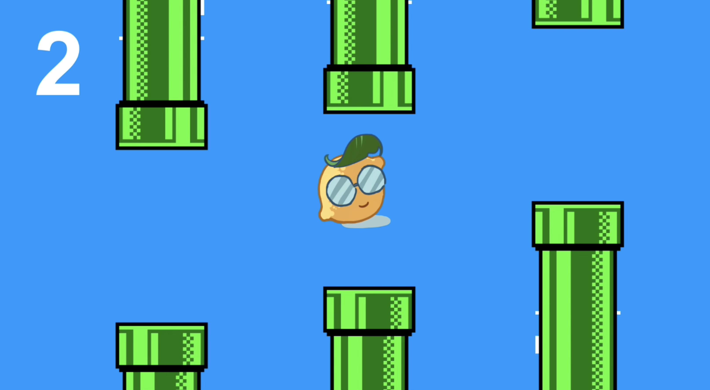
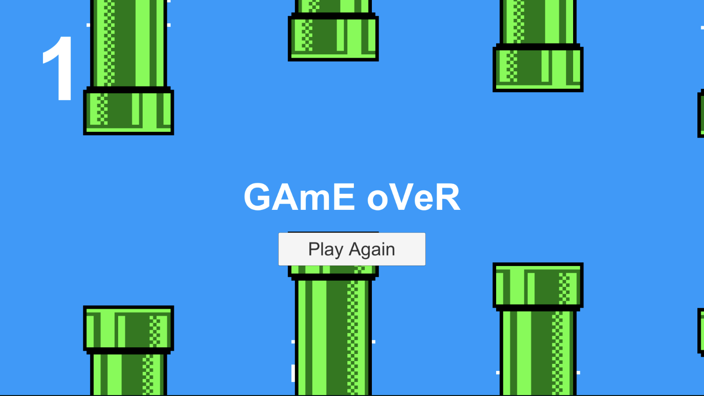
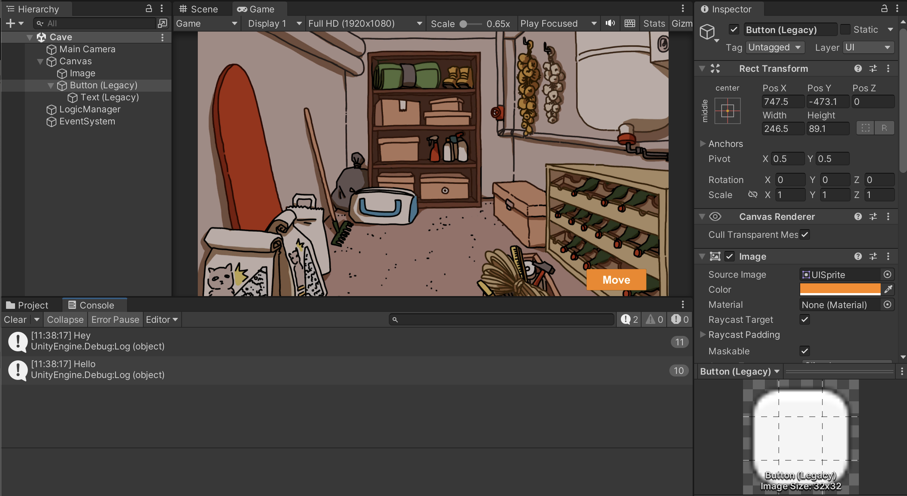
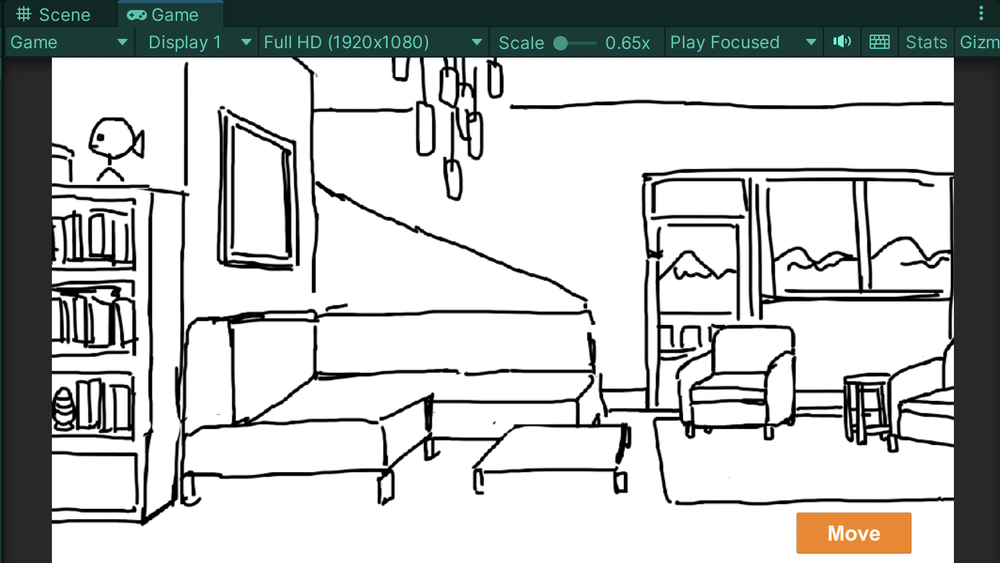
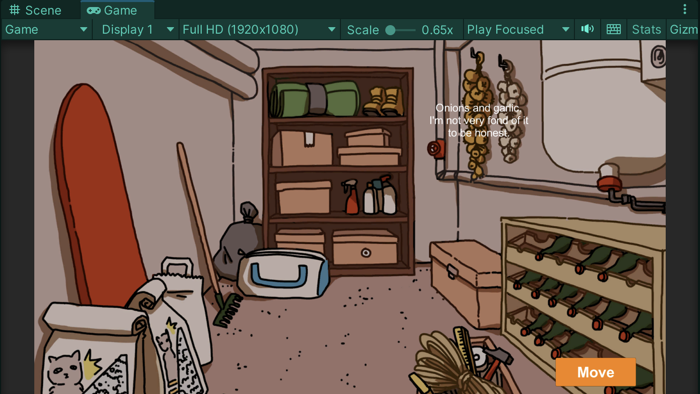
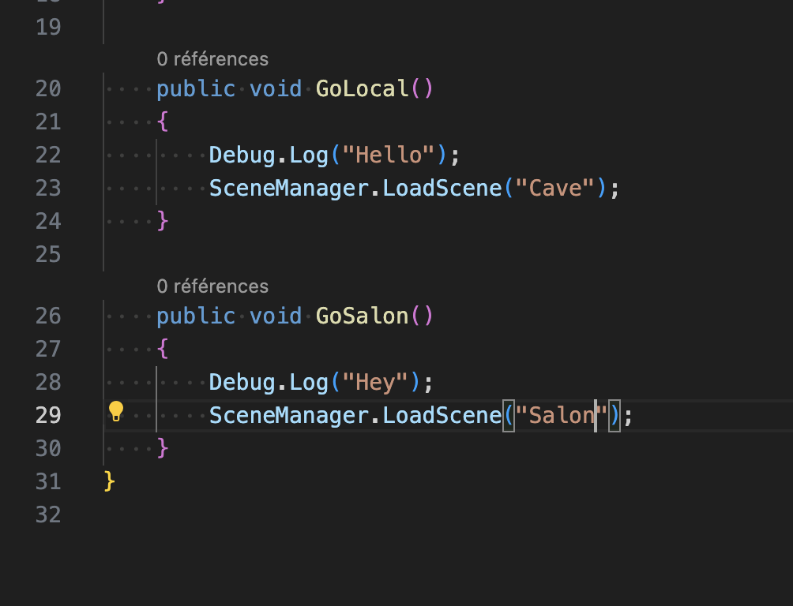

# Unity 2D and tutorials

## 22-26.01.2024

I spent the whole week following tutorials about how making 2D projects and scripts in Unity. Until now, I only used Unity for 3D project and only with the visual scripting.

I started by following a tutorial recommended by a friend:

https://www.youtube.com/watch?v=XtQMytORBmM

It's a great tutorial but it took me most of the week to do it, mostly because I had troubles installing the auto-complete in Visual Studio Code.

In the end, I managed to do my little own version of Flappy Bird and felt more confident using Unity.

After that, I created a new project to try switching between two scenes with a button.

Once this was done, I wanted to make text appear when clicking on a collider. But I had some error messages and was also wondering how to deal with bool values to enable and disable the text only by clicking.
