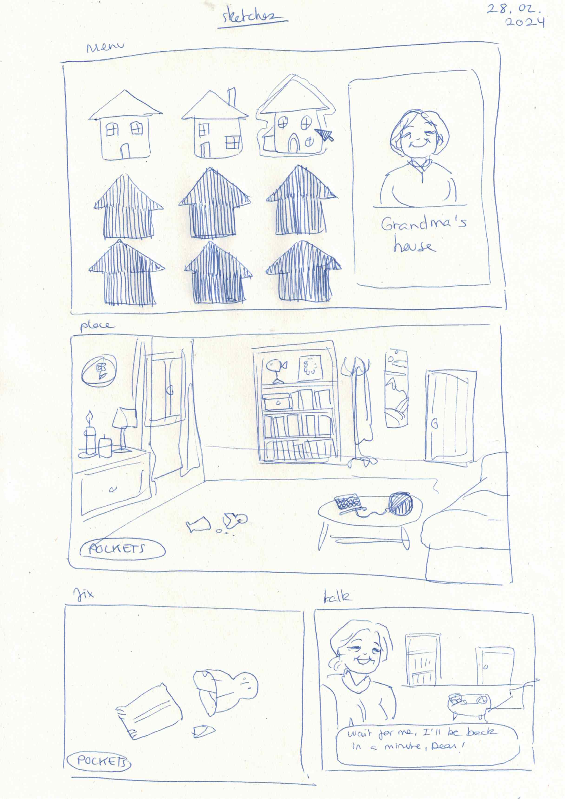
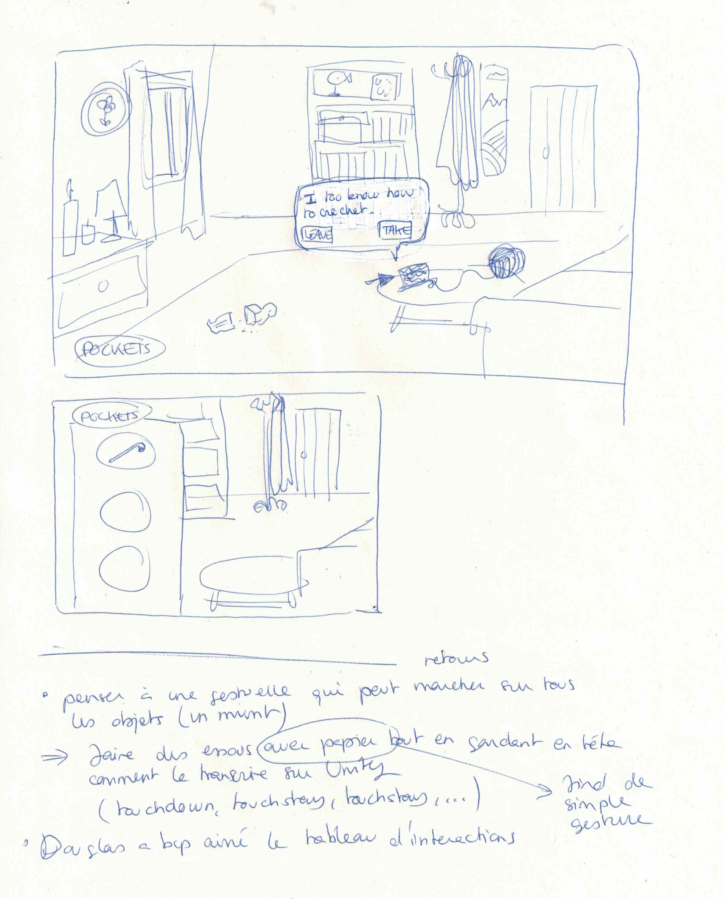

# Classe presentation

## 28.02.2024

I showed my Github, my interaction map and quick concept sketches to the teachers (see below). Douglas didn't really know my project yet so it was a good exercising for my trying to brief him about the general concept of my game.

Douglas really liked my interaction map and wanted the game to really focus on this aspect (which I want to value too). Talking about my project, he also mentioned the short film [Dimensions of Dialogue by Jan Svankmajer (1982)](https://www.youtube.com/watch?v=J-0a4Yxs4YY) and the video game [Florence](https://store.steampowered.com/app/1102130/Florence/?l=french). He also told me I need to think about the actual gesture we need to make to execute an action. He recommended me to use a paper prototype to find one simple movement that could suit almost every interaction in my game.

