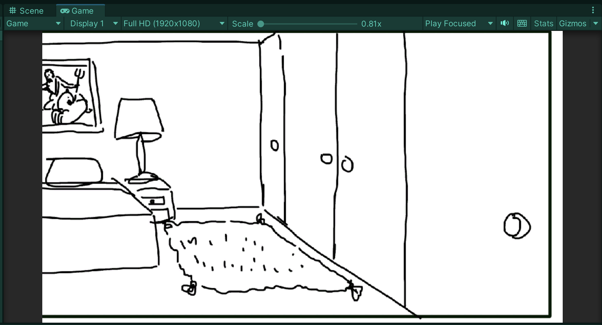
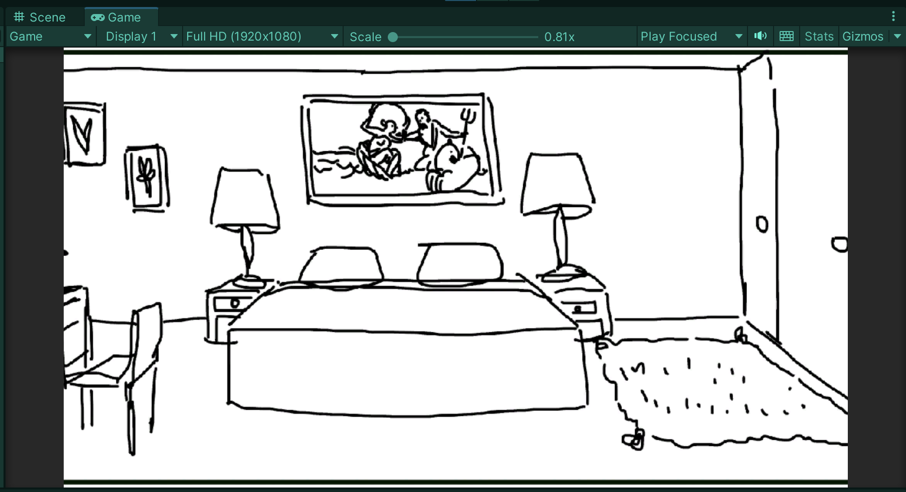
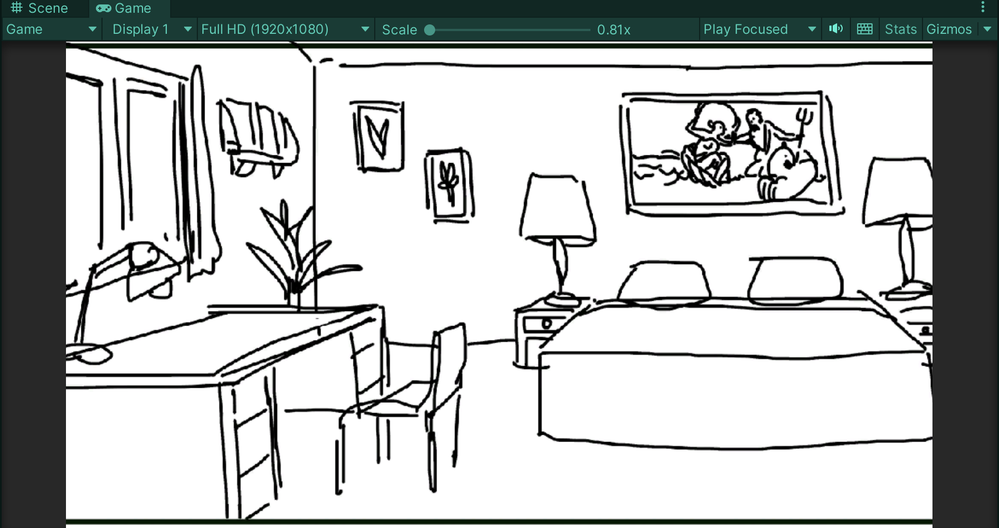
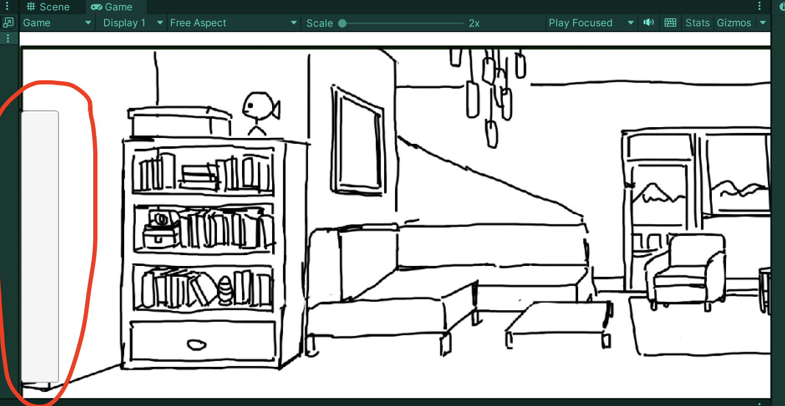
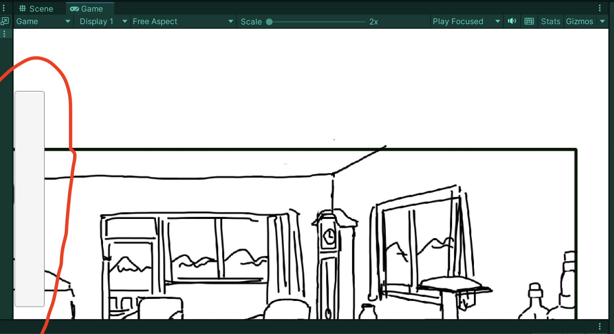
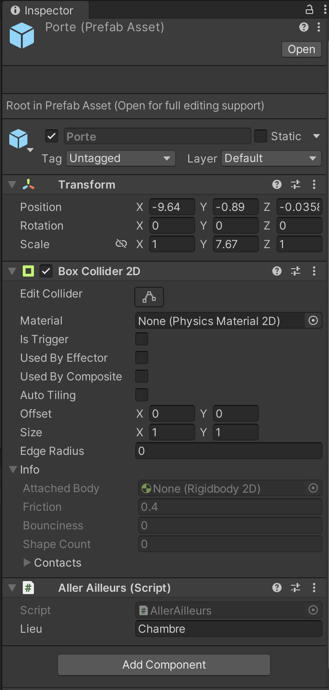
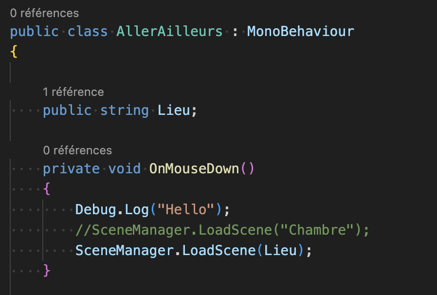

# Pan camera and moving to one room to another

## 29.02.2024

I spent the day working with Unity. I wanted to test a way to move the camera using the mouse. I followed this [tutorial](https://www.youtube.com/watch?v=R6scxu1BHhs). It worked very well.

Then, I wanted to add a collider to make a "door" to move from a room to another. I thought it would be more elegant and would suit more the exploration vibe rather than a button. Talking about buttons, at first, I thought I could actually use one from the UI and make it invisble to use the "on click" option. I thought it was easier to set up. Turned out that, since the button belongs to the UI, it wouldn't (obviously) stay in place and would actually follow the camera (see pictures below). So it was a fail.

So I had to use a collider which was actually way much better choice. I created a gameObject, added it a 2D collider and a script. To make it easily re-usable, I made a prefab out of it. In the script, I added a public String that would define the destination. This way, I can use the prefab and write in the Inspector the name of the scene I want the door to lead the player.

I was really happy with the final result !
