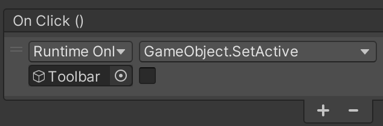
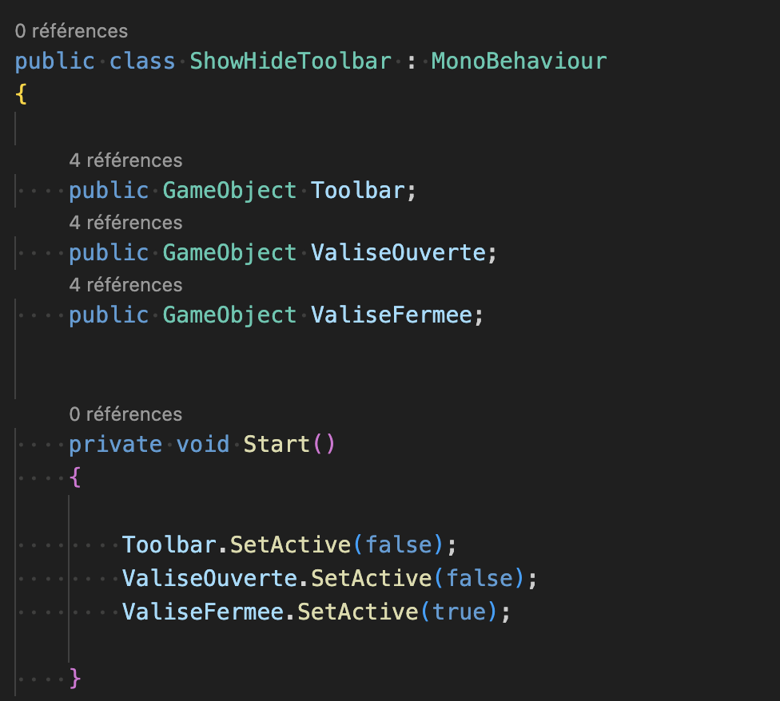
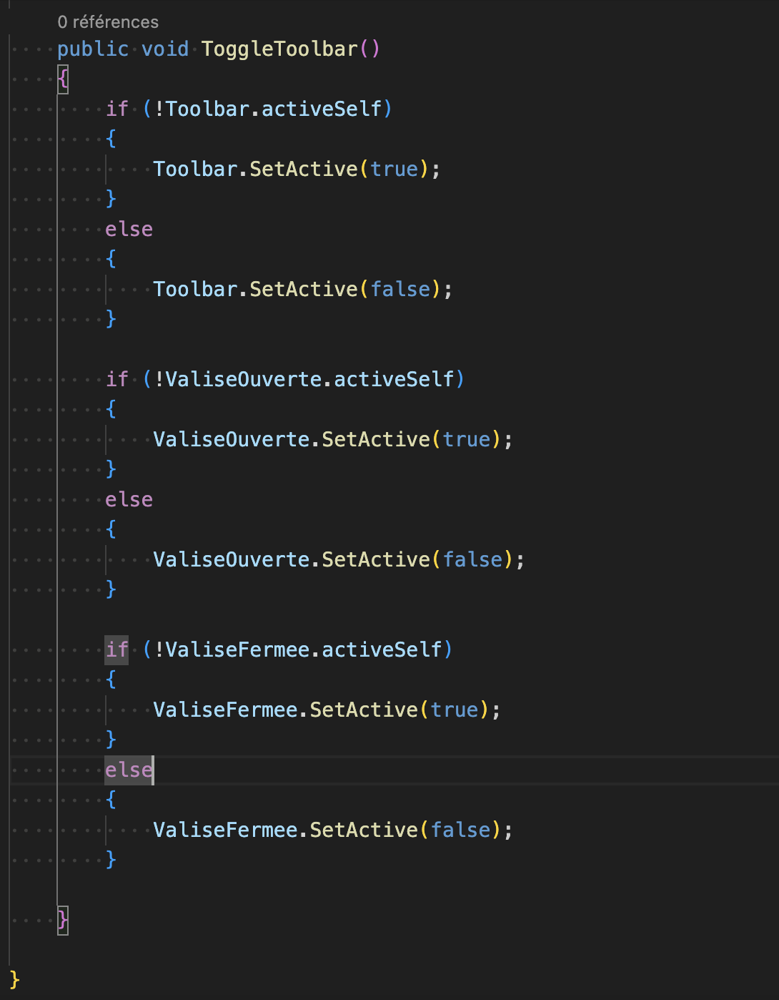
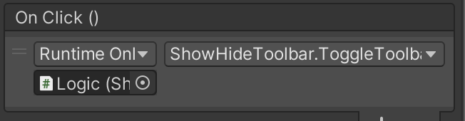
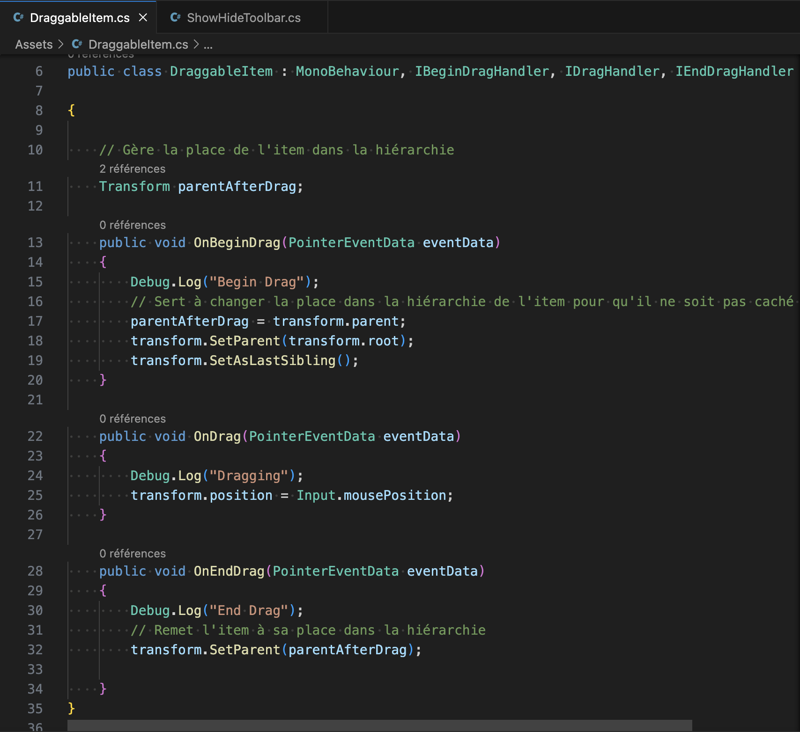

# Starting an inventory

## 01.03.2024

I wanted to try to make a first inventory for my game. I found a lot of tutorials and didn't really know where to start. I created a new project and followed [this one](https://www.youtube.com/watch?v=oJAE6CbsQQA).
Everything went fine with the first steps: creating a canvas and the "pocket area" within + making it possible to be showed and hidden. In this tutorial, to make the open/close button functional, the GameObjet.Setactive(bool) is used in the onClick in the inspector. You also need to check and uncheck manually the different gameObjects to define their status.

But after doing it, I wondered if it wouldn't be better to do it through a script like [another tutorial does.](https://www.youtube.com/watch?v=GXr2zNKN-fk) So I followed it and now my project manages this steps using a script.

I don't know if it is really better but at least, I know now two ways of doing it.

Then, I wanted to add draggable items and kept following the first tutorial. Since this part was a condensed version because the youtuber made a more detailed version of it in another tutorial, I jumped to [this other video](https://www.youtube.com/watch?v=kWRyZ3hb1Vc).

I followed it and wrote this script:

But when I played the project in Unity, after starting to drag my item, it suddenly disappear. I still need to figure out the cause. Maybe a different script is causing a conflict or it is because the tutorial I'm following isn't starting the same as the one done after and it's missing something (the hide/show part isn't present in the last tutorial).

I decided to solve this problem a different day.
