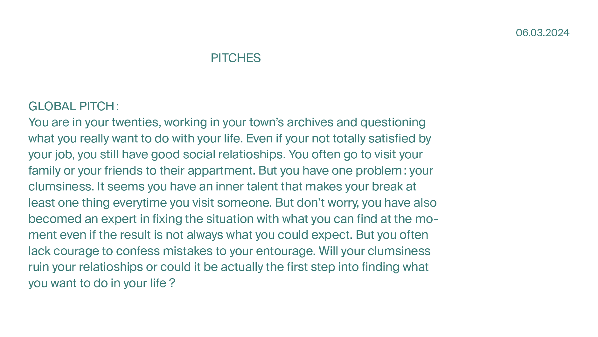

# Scenario, pitch and game description

## 05-06.03.2024

I wrote again a pitch. This one present the game in general. I will write a more specific one for the demo once I would have decided where the story will take place.

I also wrote two descriptions (one for the demo and one for the full game) that I added to my "project presentation" sheet.

I took time to make a table listing the different stories for each place and each level we can play to. For now, four scenarios are inspiring me for the demo: "the Airbnb", "Our grandma", "Our job" and "Our friend". I might choose between one of them.

Working on the story allowed me to answer at the same time to a lot of questions I had before.

