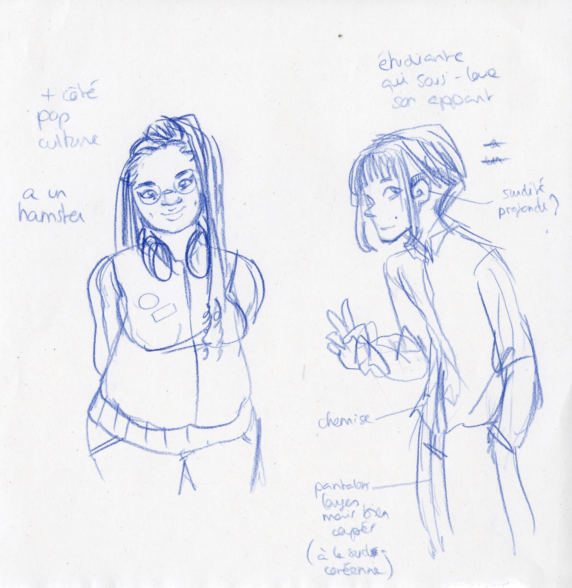
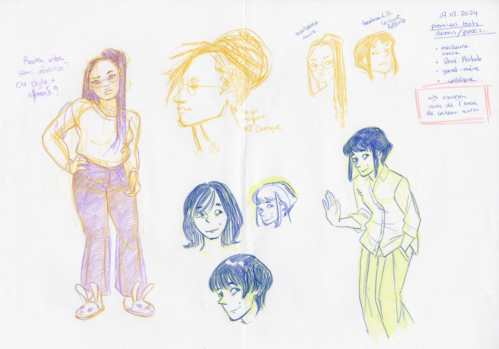
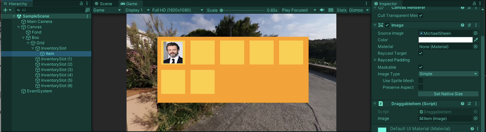

# Chara-design and inventory in Unity

## 07.03.2024

I drew two characters (the best friend and the Airbnb owner) with color pencils. The next steps are scanning the drawing and coloring them in Clip Studio Paint in order to test an aesthetic mixing analogical and digital art.

I tried to solve my problem in Unity with the dragging not working when applied to the UI inventory.
I created a new project to see if other elements where responsible of the problem in the previous file. It wasn't the case. The problem actually comes from the line: transform.position = Input.mousePosition; which is the one that is supposed to allow your object to follow your mouse by copying its position. I wasn't able to understand specifically why this line wasn't working but I decided to give it another try tomorrow.

