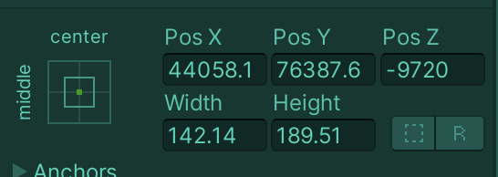
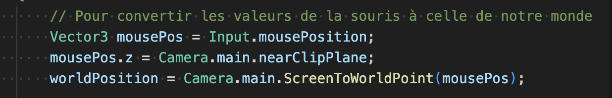
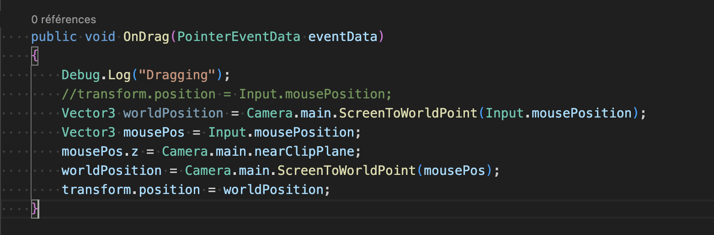
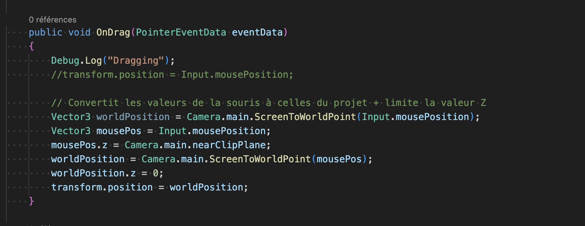
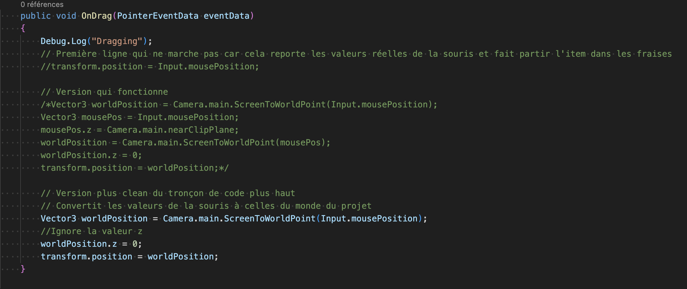

# Inventory UI + drag and drop problem

## 08.03.2024

After checking some forums and Youtube comments, I finally understood why the line: transform.position = Input.mousePosition; wasn't working properly when trying to add dragging to my UI inventory.

When I click on the element I want to drag, its z value goes from zero to -9700. And this is not the only problem. X and y value also become completely crazy. This means my element didn't disappear but was actually moved where I couldn't see it.

This [post](https://stackoverflow.com/questions/56101871/problem-when-assigning-input-mouseposition-to-transform-position-in-unity2d) sums up my problem very well.

Apparently, when using them, the x, y and z of the mouse needs to be converted to the Unity project world's scale. Otherwise, they will not correspond and will mess everything up. Therefore, I tried converting them by following [this tutorial](https://gamedevbeginner.com/how-to-convert-the-mouse-position-to-world-space-in-unity-2d-3d/#screen_to_world_2d).

I made a few attempts but it still wasn't working. I saw in the tutorial that I needed to use the "ScreenToWorldPoint" and I remembered that I already used it for the project in which I tested the camera movement controlled by the mouse. By observing the code in this project, I was able to solve 50% of the problem. I could drag the element one time. But after that, even if it was still visible on the screen, I couldn't detect it with the mouse and make it move again.

Luka helped me to understand what was wrong. Even if I tried to ignore the z value, it was still changing after the first drag, making it impossible to be detected a second time.
Luka showed me how to keep the z value setted on 0. It was finally totally working.

I cleaned my code, making it fit into two lines: one to convert the mouse values to the project's world and one to keep the z value permanently setted on 0.

