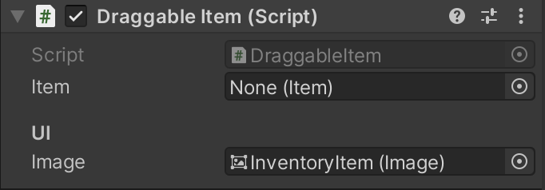

# Going further into making an inventory

## 11.03.2024

Since the dragging was working, I kept following [this tutorial](https://www.youtube.com/watch?v=kWRyZ3hb1Vc). Now, the item is in front of everything while being dragged (before, it was hidden by the inventory's slots). I also learned how to update a prefab and how to use the Raycast to make an item detectable (or not) by the mouse.

After finishing following the tutorial, I went back to my previous project to add to it what I learned. It worked perfectly fine. I ended the day by starting documenting myself about scriptable ojects and kept following [this tutorial](https://www.youtube.com/watch?v=oJAE6CbsQQA) in order to pursue the making of the inventory.

