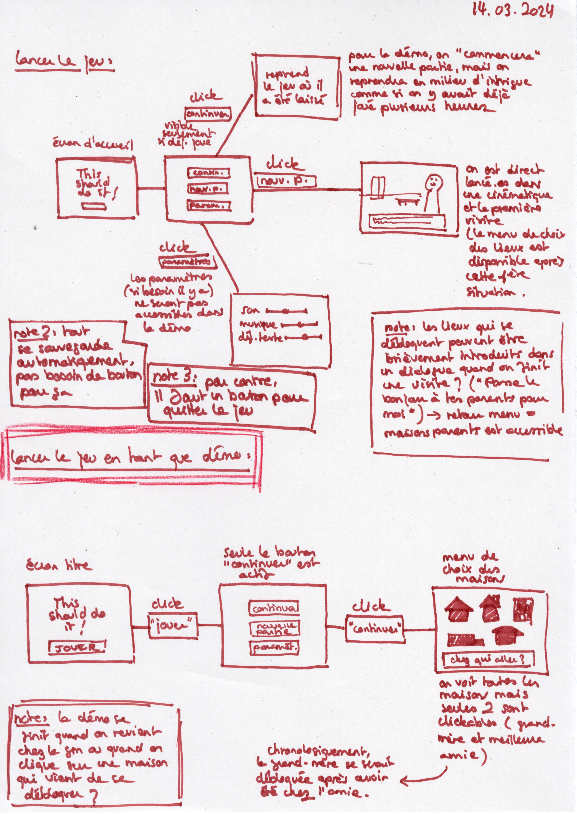
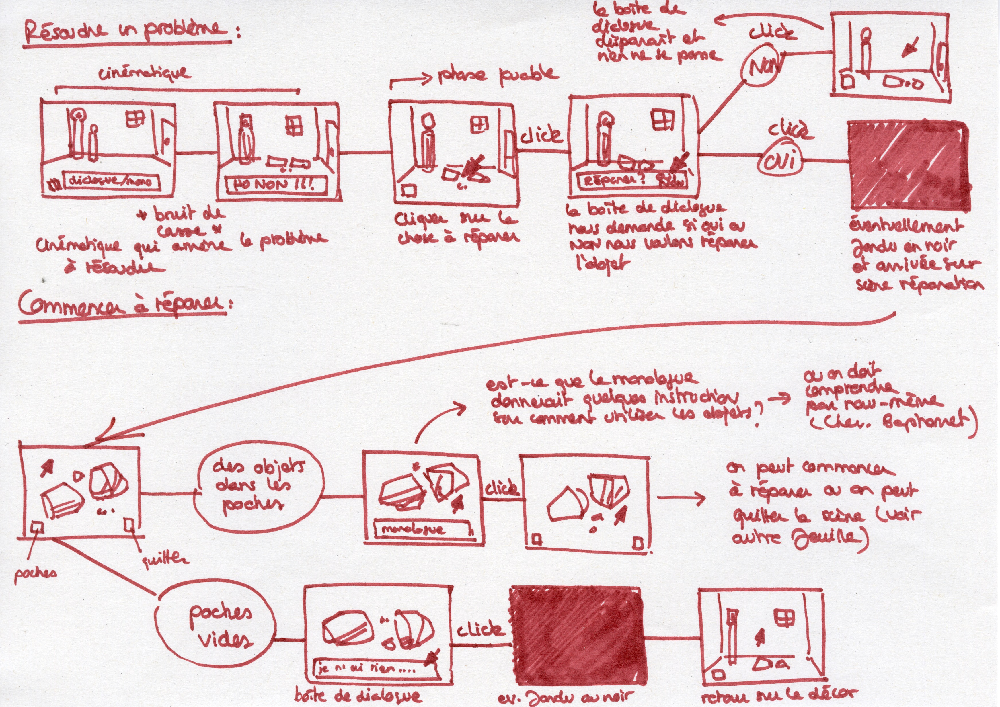

# Wireframes and scenario

## 13-15.03.2024

I spent the second half of the week writing a first version of the scenario for my demo (with bits that still need to be completed). I also drew wireframes to see how the different interactions will work and what will be needed for the demo. From these wireframes, I wrote a list of what I will have to do for the final project (scenes, sprites, ...).

