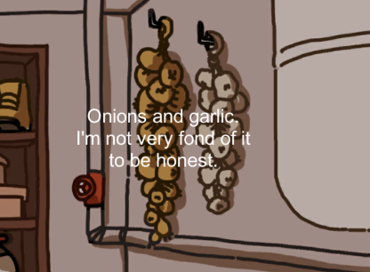
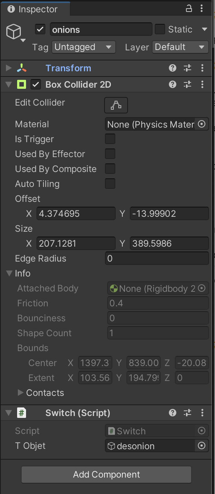
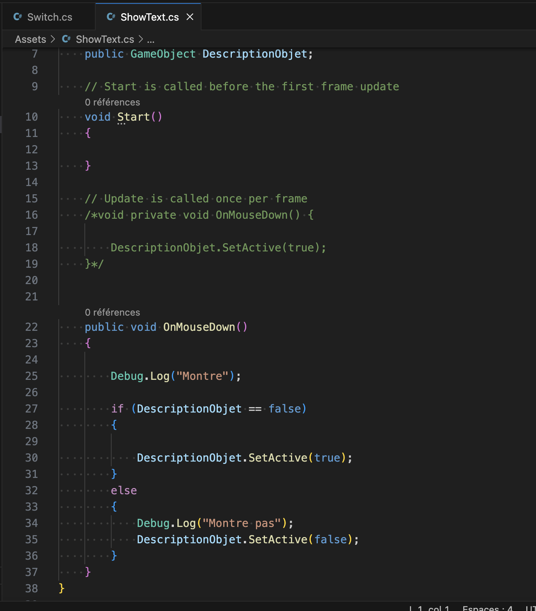
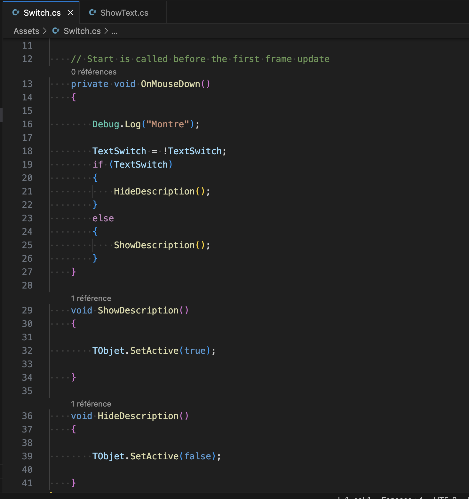

# Trying to show/hide text

## 30.01.2024

I wanted to try a few more things in order to get more used to Unity before moving to the more complex stuff. Since my project is gonna be a point and click game, I thought having sometimes some descriptions of the objects we just clicked on would be nice. I wanted the text to show when we click and to hide when we click a second time.

I added some text in the project I already used to test moving from a scene to another. The text would appear when clicking on a collider.

To achieve this, I tried to adapt a tutorial I found on the internet, which is the following:

https://www.youtube.com/watch?v=uUXmbYVFWME

And I wrote the following code:

I wanted to use OnMouseDown but it didn't seem to work. I thought the problem might come from the fact I should have used a bool to active/desactive the text so I followed anothe tutorial using this:

https://www.youtube.com/watch?v=OAXc5iMH5n8

And I wrote the following code:

Still, it wasn't working. With the Debug.log, I found out the code wasn't even runing through the OnMouseDown function. Which meant that the collider wasn't detecting the mouse in the first place. After discovering this, I decided to stop there and try to solve this later in the week.
