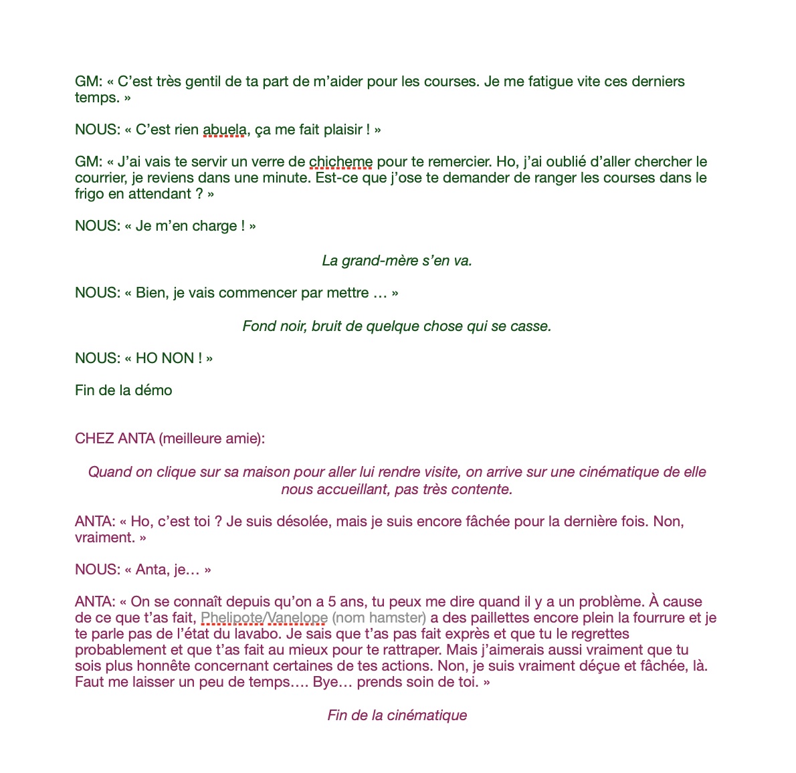

# Testing games and talking with a friend

## 18.03.2024

I took some time to analyse some point and click games. I observed the interface and how the interactions worked. In the afternoon, I talked with a friend about his family from Panama. This discussion helped me a lot to know what kind of objects to use for the background and the interactions. This was also really helpful to contextualize the character of the grandma (I took notes but I will not post them on Github since they contain private informations about his family). After that, I was able to fill some more elements in my demo's scenario.

