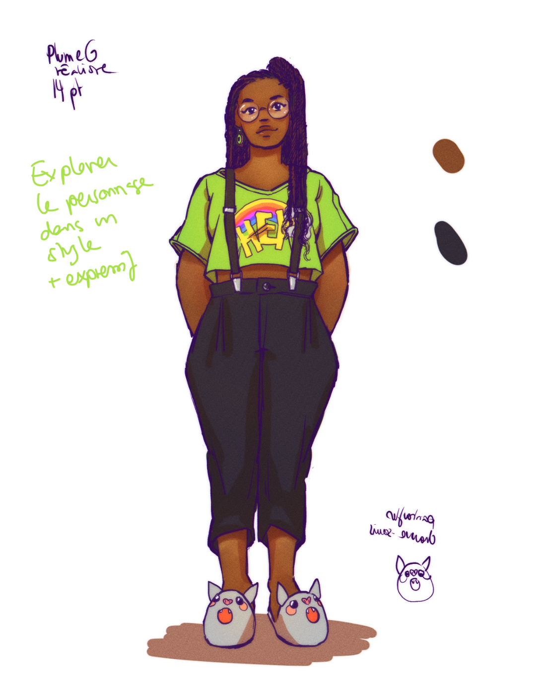

# Chara-design

## 19-20.03.2024

I made a first version of the characters of the grandma and the best-friend. I also listed some visual inspirations since I'm not totally satisfied with my "by default" art style.

## Visual inspirations

[Today's Special](https://melekzertal.net/today-s-special-2022) by Melek Zertal and Christina Svenson

[Weirdest Ritual](https://www.youtube.com/watch?v=mpIhZ9c7xP8) (Leoni Leoni) animated by Inger Bierma

The [Baby hotline](https://www.youtube.com/watch?v=ZC_ip-mwqRI) and [Forget](https://www.youtube.com/watch?v=JWyPQ47ju90) animation by Zemyata

Veil by [Kotteri](https://twitter.com/_k0tterl_)

[Funkytown](https://www.babelio.com/livres/Gheluwe-Funky-town/1189716) by Mathilde van Gheluwe

[Steven Universe](https://www.youtube.com/watch?v=nazd-KgCjVI)'s backgrounds

