# New objects list and Unity

## 21-22.03.2024

From what I talked about with my friend last monday, I made a new list of objects and a new table for possible interactions. I also started expermimenting with sprites and colliders in Unity.

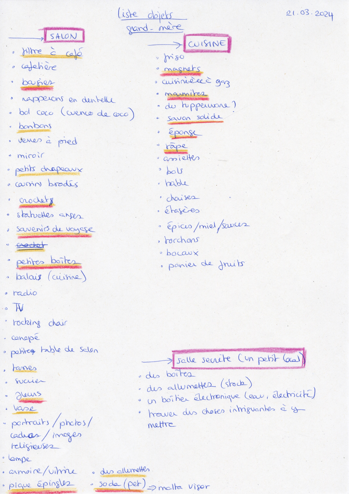

In Unity, I first tried to make a GameObject's sprite change when clicking on it. For this, I followed [this tutorial](https://www.youtube.com/watch?v=BLEjkIGrkLM) and [this tutorial](https://www.youtube.com/watch?v=pCXVJ-mmS0o) and ended up with this script:

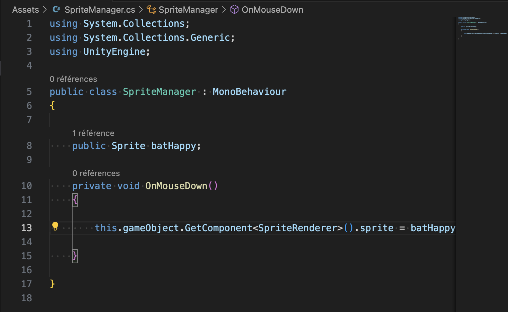

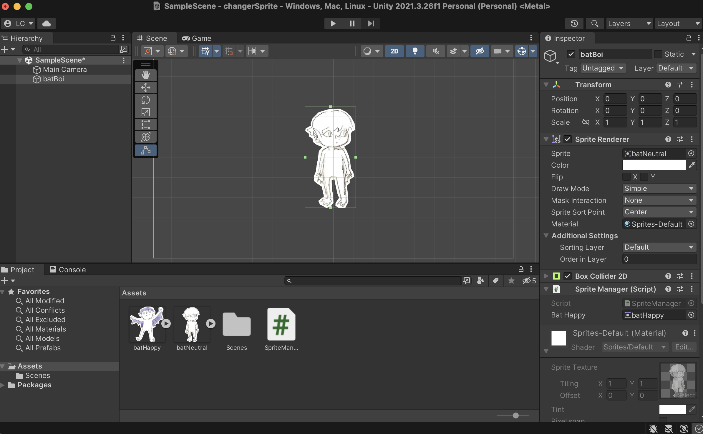

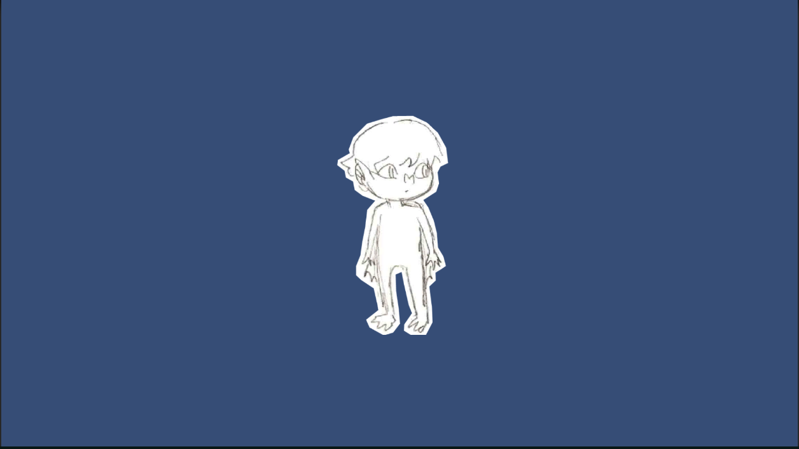

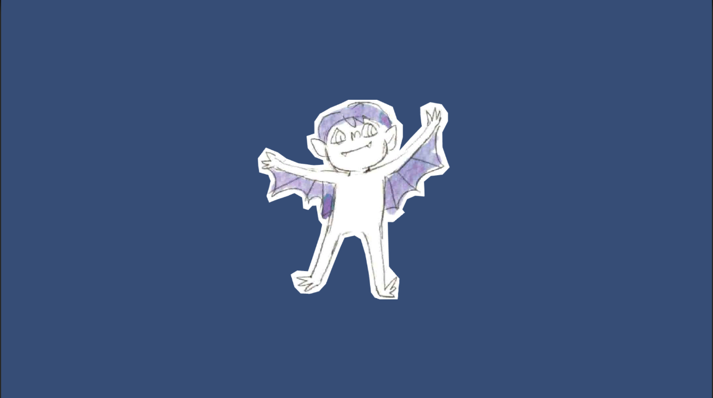

Then, I wanted to make the sprite change when entering a collider. I had some problems making it work but thanks to [this tutorial](https://www.youtube.com/watch?v=Bc9lmHjqLZc), I was able to understand what went wrong. I ended up with this script:

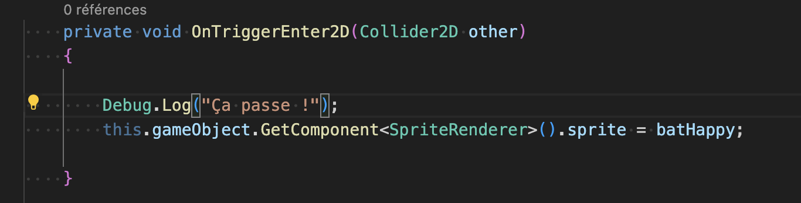

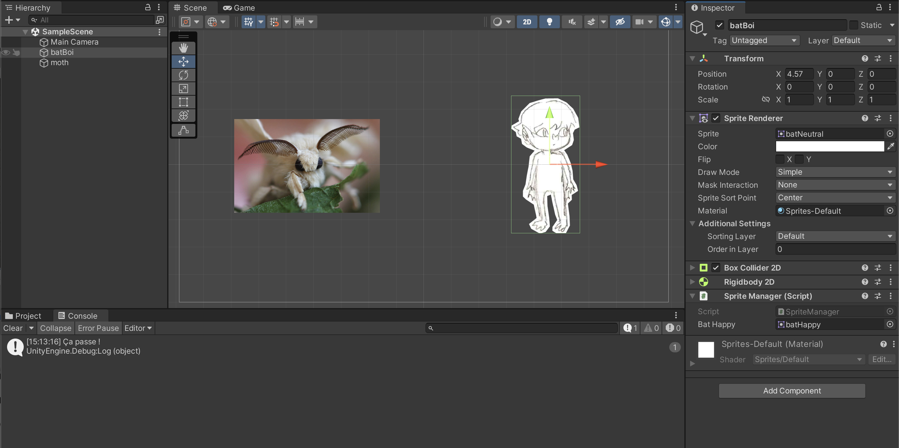

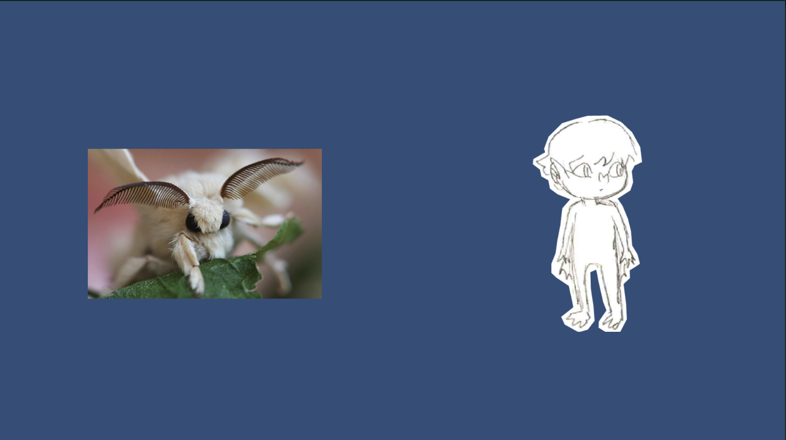

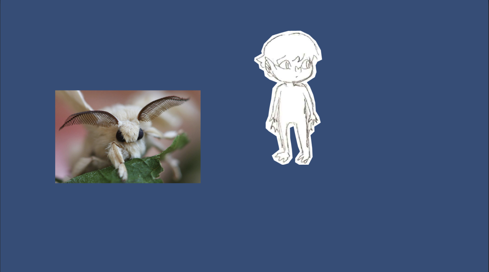

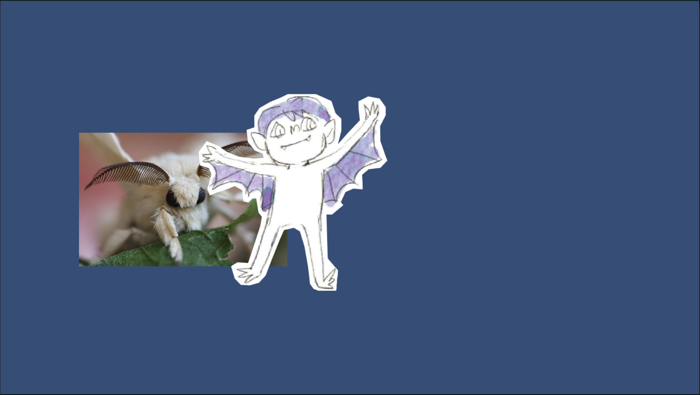

Then, I documented myself about how to check a gameObject's tag in order to make an element reacts to only colliders with a specific tag:

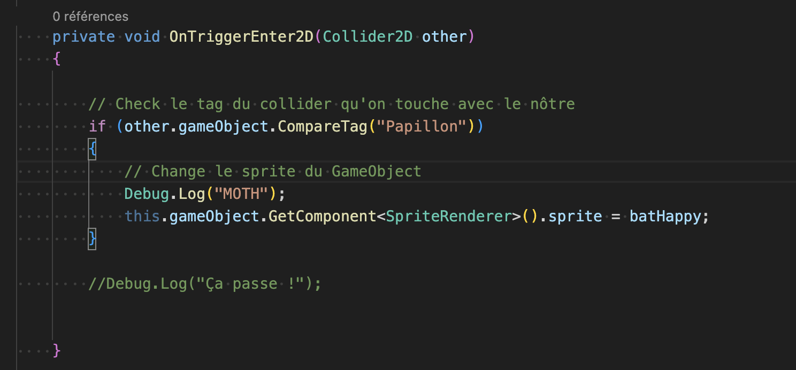

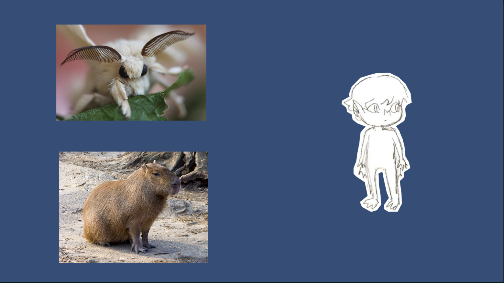

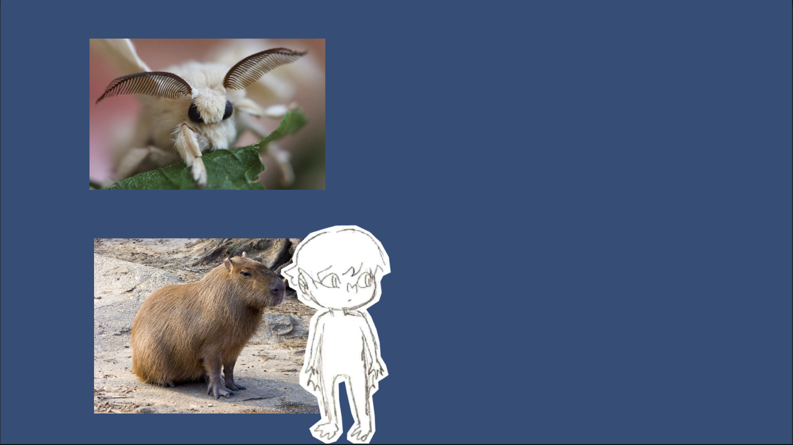

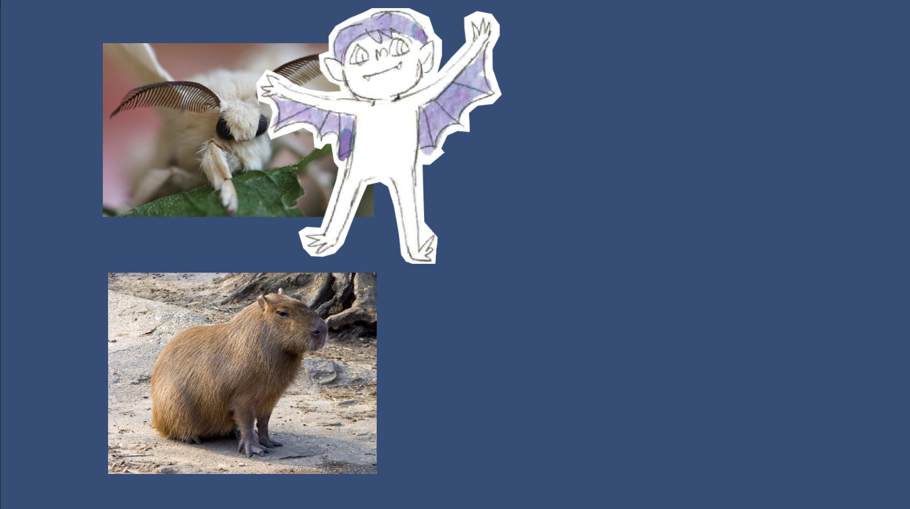

I also quickly added a way for the gameObject's sprite to go back to "normal" when not entering a collider:

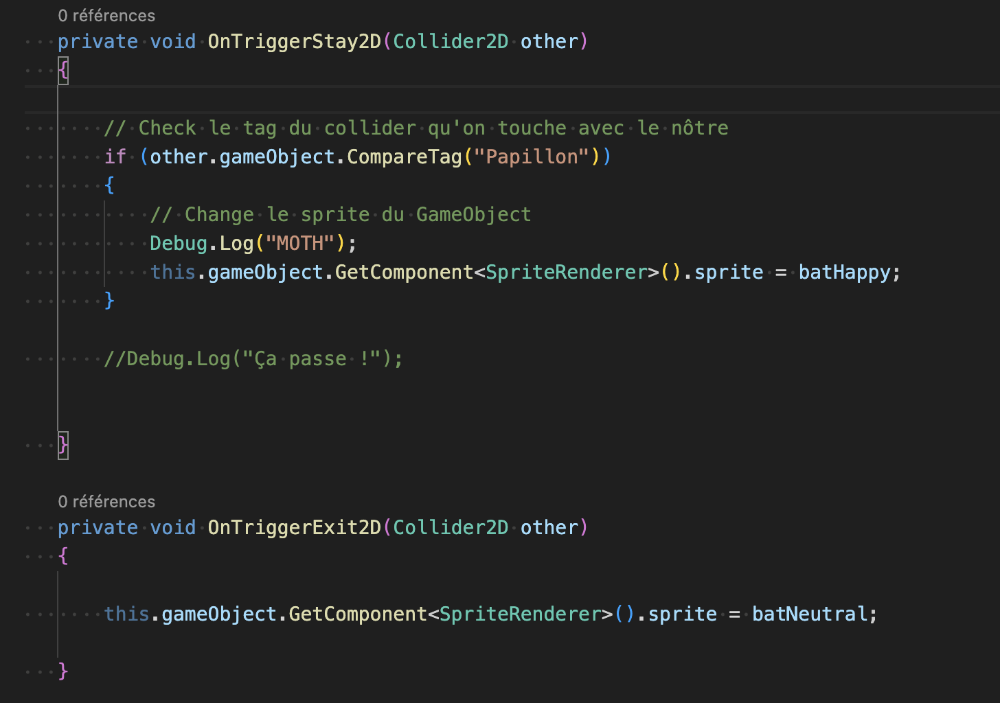

Then, I wanted to try to calculate the absolute distance of an object. I found a [post](https://forum.unity.com/threads/how-to-calculate-travel-distance.963671/) on a forum which explains how to do it. I followed the instructions and it worked perfectly. Now I need to figure out how to use the absolute distance to maybe make a gameObject's sprites change.
