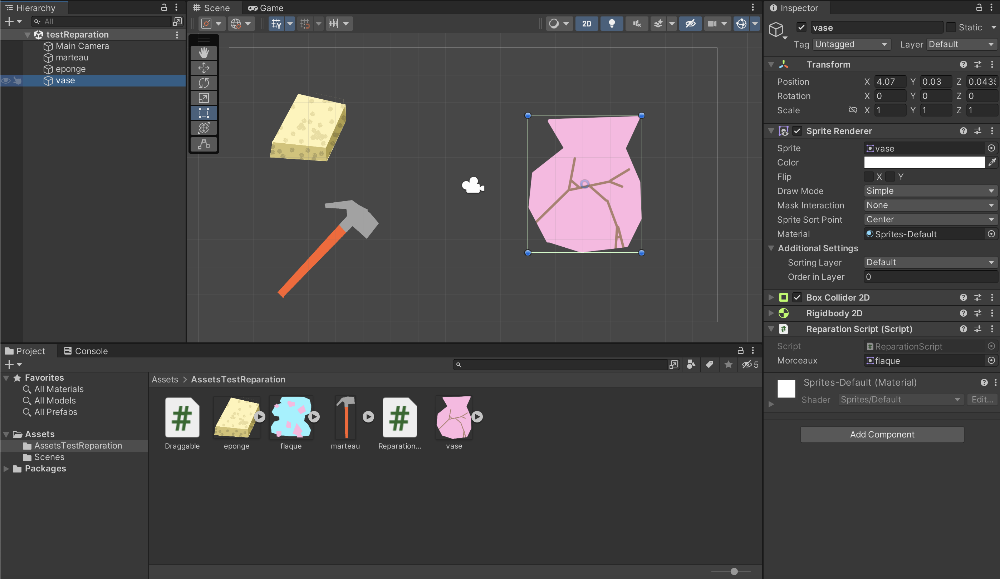
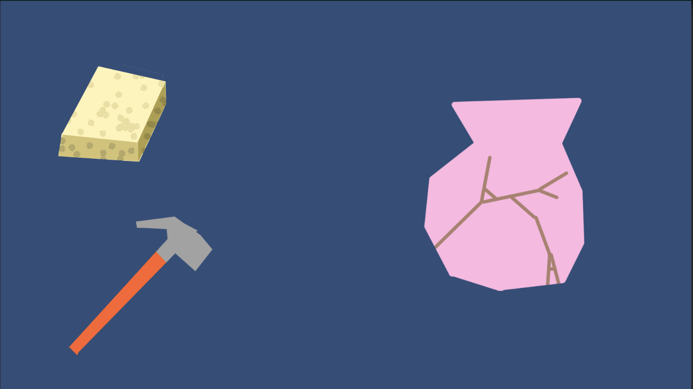
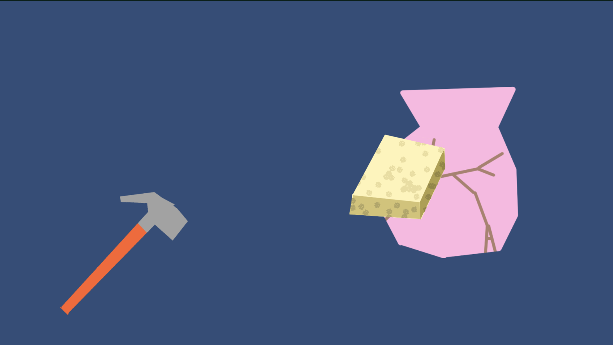
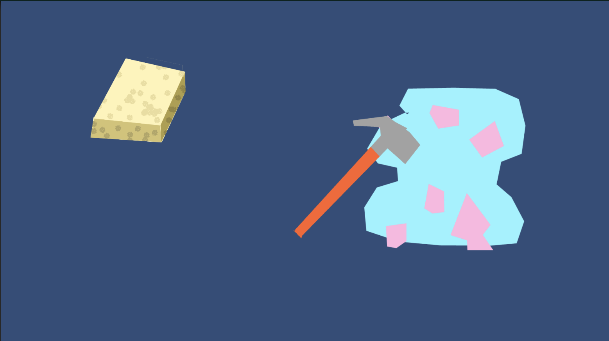
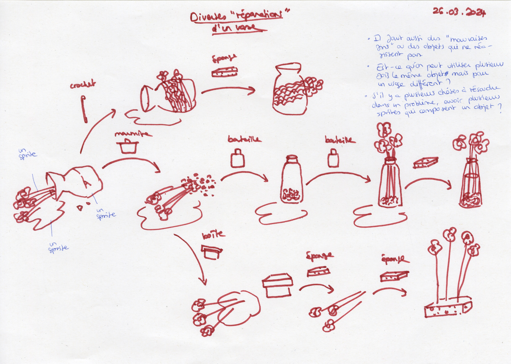
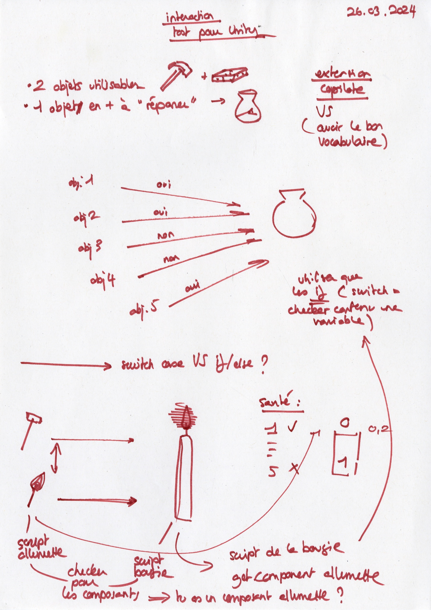
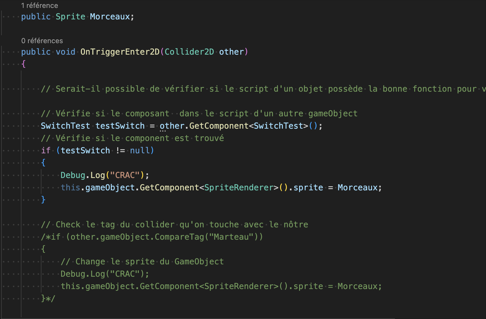

# Starting to work on the main interaction

## 26.03.2024

I spent the day working on Unity. I created some sprites to make a project that would fit a bit more my thematic. I made a vase, a sponge and a hammer. This way, I was able to build a quick story trough a simple interaction.

I also drew a quick story-board of some potential outputs we could get by using different objects. This showed me that I really need to scenarize this part of my game through story-boards and prototypes and explore the different outputs and reactions possible.

In the afternoon, I talked with Pierre about the best method to make different objects react to each other. He told me I should maybe use getComponent to check different states in a single object (ex: is this object a matchstick ? Yes ? Is this matchstick burning ? Yes ? Then the interaction is possible).

After this discussion, I changed the script of my project from working with tags to working with getComponent. I still need to check more documentation to understand how to use it properly but at least this example is working.

