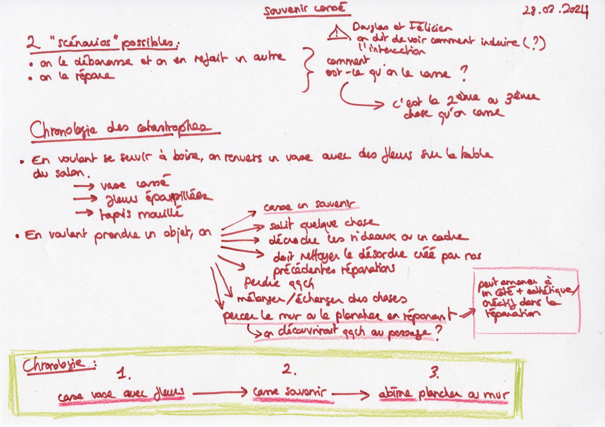

# Second class presentation

## 27-28.03.2024

I talked about my project with Douglas and Félicien. They gave me some advices and confirmed that the thing I need to focus on now is the main interaction of my project. For the next presentation, I need to do story-boards, prototypes and test in Unity.

The day after, I thought about the chronology of the different thing we break.

