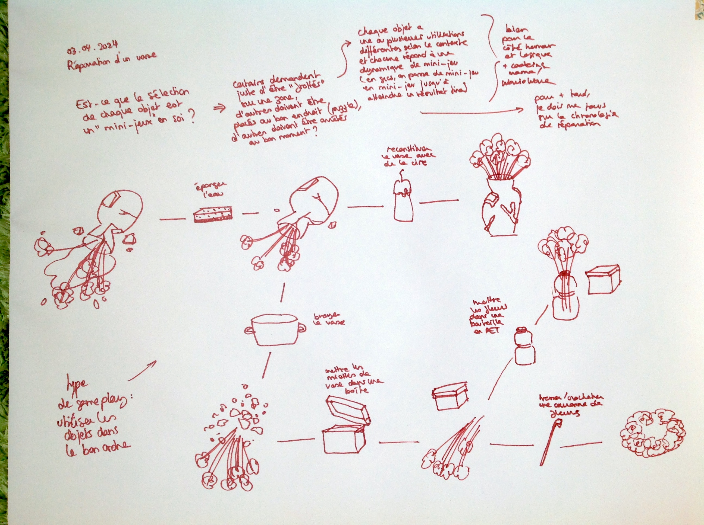
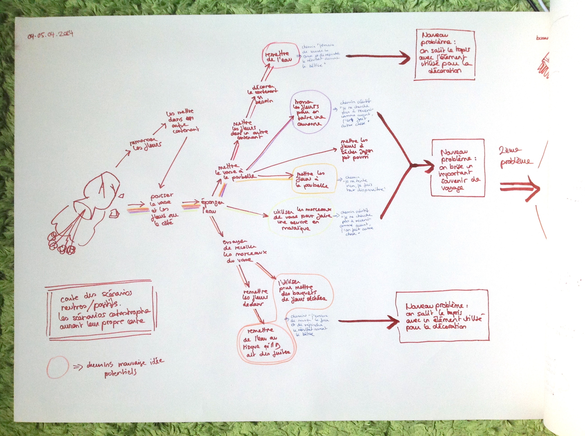
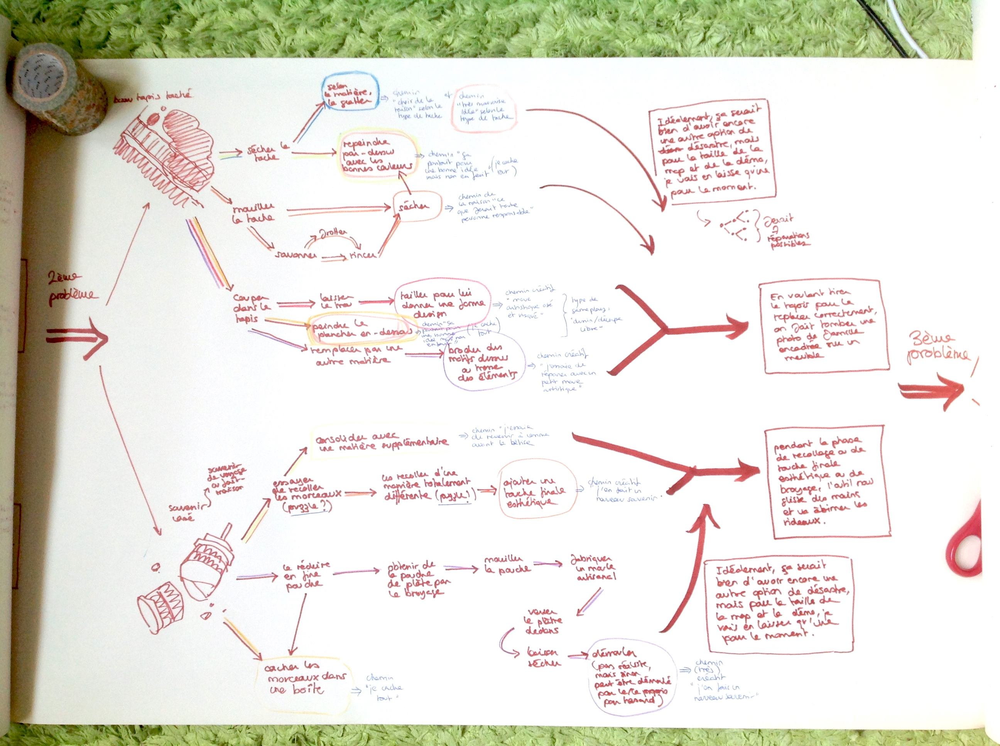
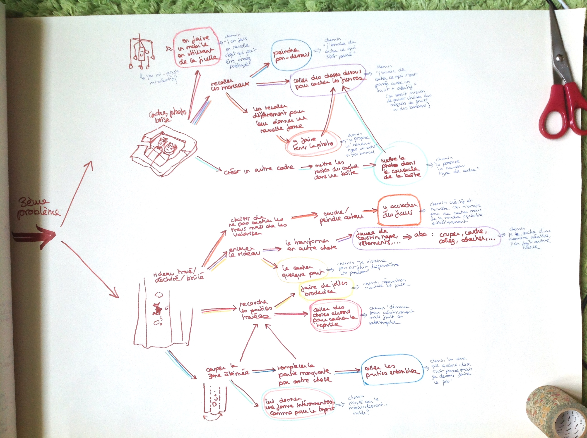
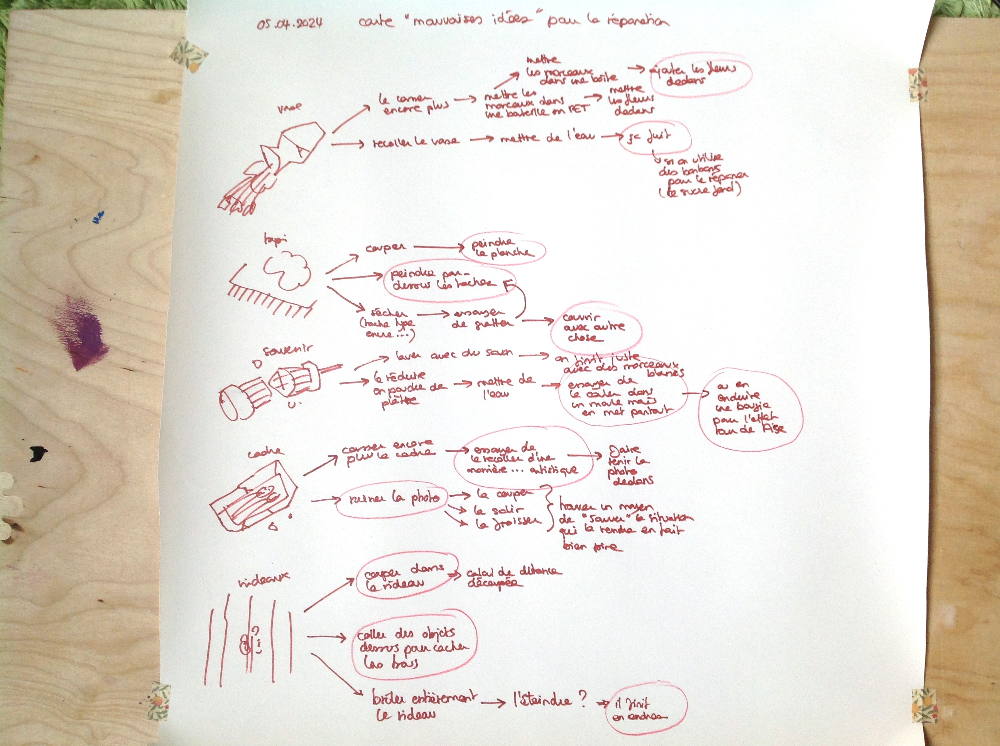
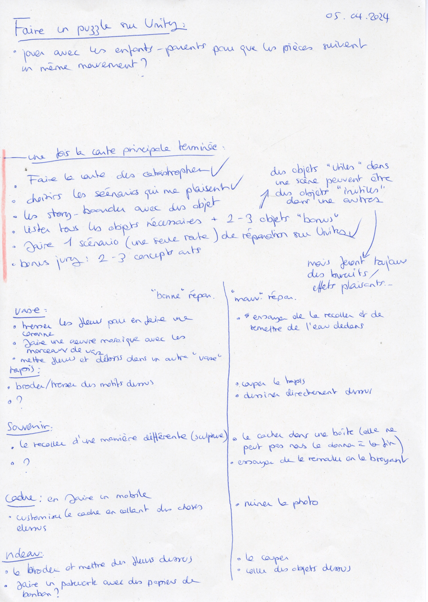
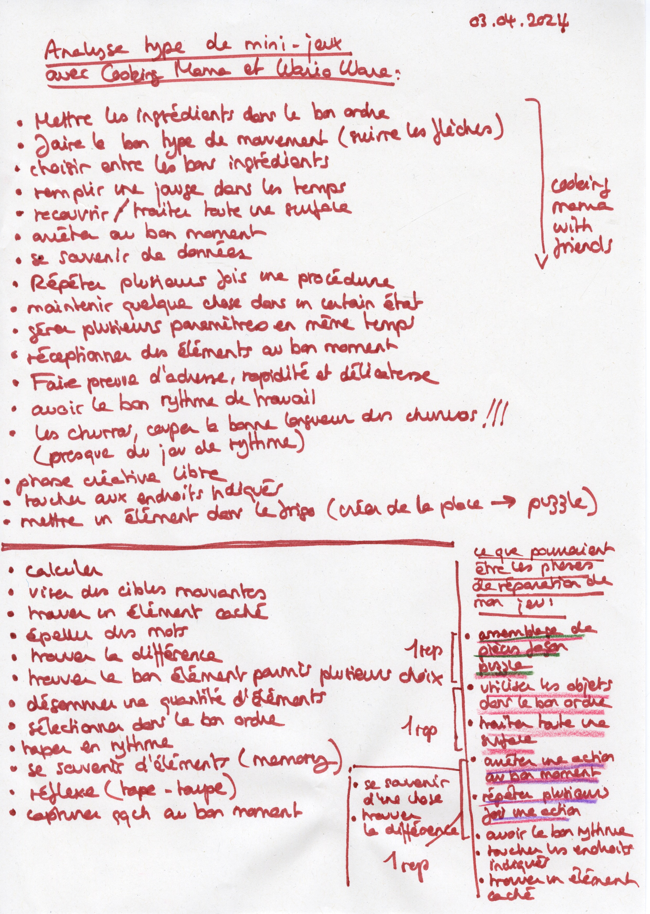

# Repairs scenarios and documentation

## 03-05.04.2024

For the rest of thw week, I made a "repairs scenarios map" focusing only on the actions and not on the tools. This way, I was able to imagine different scenarios faster and to feel less stuck by certain objects. With this map, I was also able to visualize more clearly the possible chronology of the events and how they might connect to each other. From this, I made a first selection of the different scenarios I like the best.

I started to read the book recommanded by Stpéphanie. It helped me to separate and understand the different "components" of a game and to focus more on some of them.
I also took some time to analyse the gameplay of [WarioWare Touched!](https://www.youtube.com/watch?v=cMrer0ZLf6I) and [Cooking Mama 2](https://www.youtube.com/watch?v=mtJ45SnL7Tk) to list the different types of gameplays/mini-games in this type of games which might help me to choose the type of gameplay(s) in my project.

I also wanted to check videos from content farms channels like [5-Minute Crafts](https://www.youtube.com/watch?v=fv9Gy_de0oY) and [Blossom](https://www.youtube.com/watch?v=fGqfWvm4TnQ) to see if I could find some inspiration from it. While some hacks were interesting, the majority of them was just fake, dangerous or useless.
