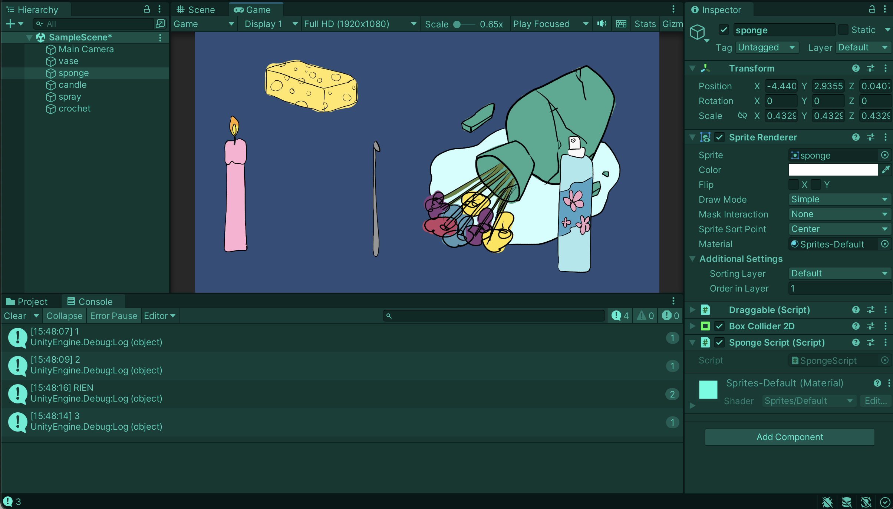

# Testing a repairs scenario in Unity

## 08.04.2024

I worked in Unity to make a first "repairs test". Before starting, I drew a small storyboard to help me visualize what were the different steps I need to achieve in Unity.

I had to find a way for the objects to be used in a specific order and also for them to not be recognize by the main object's collider after being used once. I used getCompenent to identify the objects and to make them "useable/not useable" by switching their booleans. Then, I used an int variable to define the order.

I still need to polish the visual aspect of it but I now have a first working structure that I can complexify.

