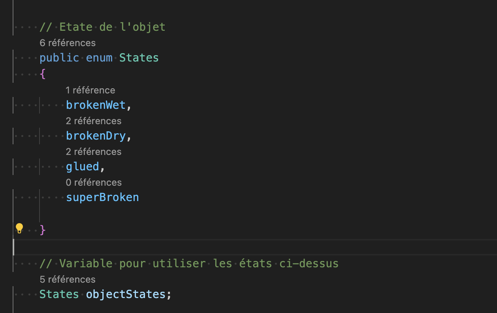
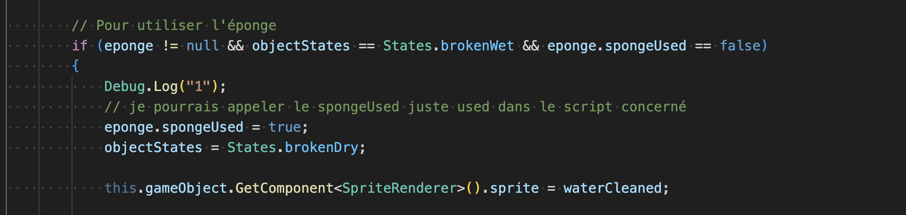
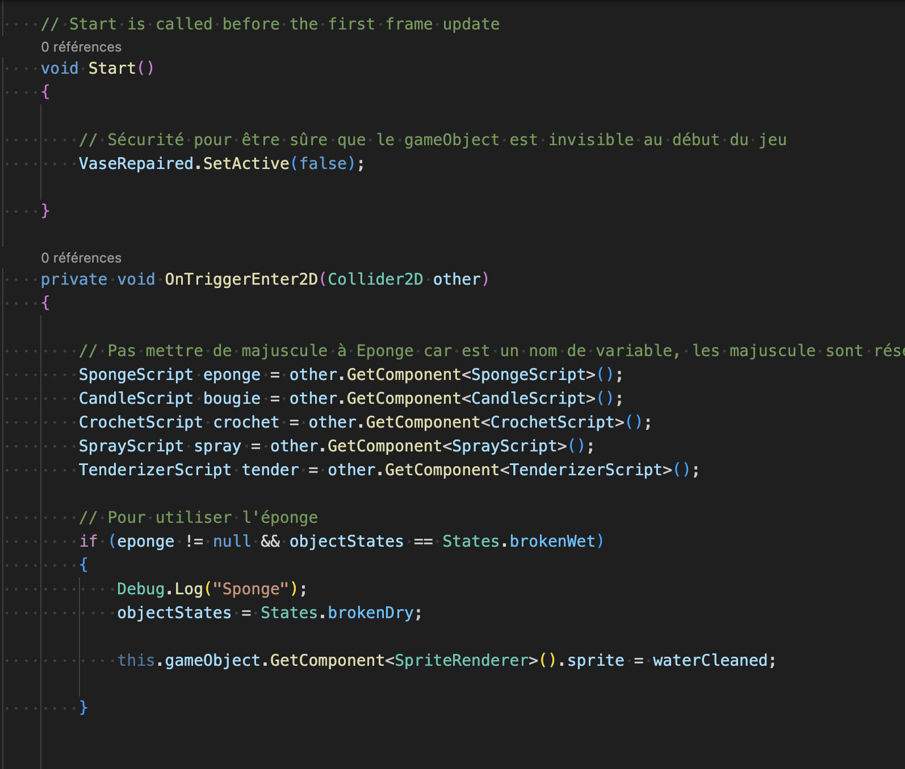
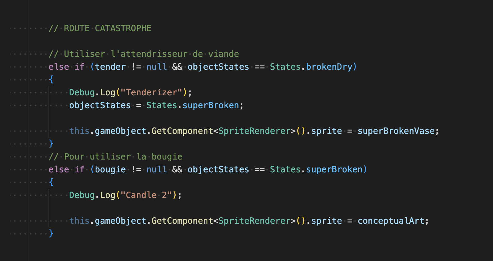
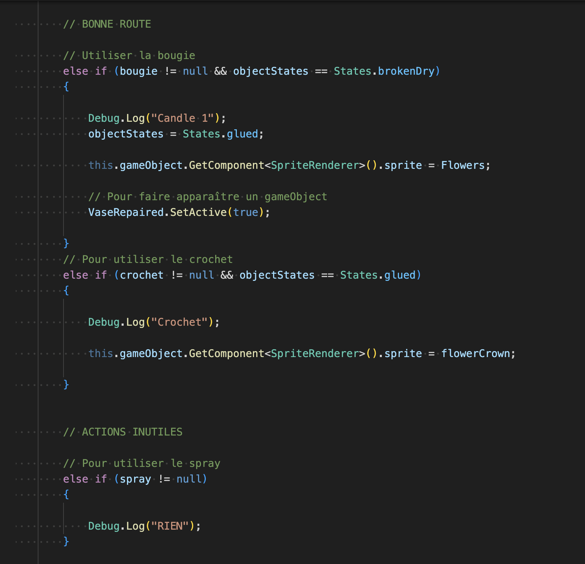
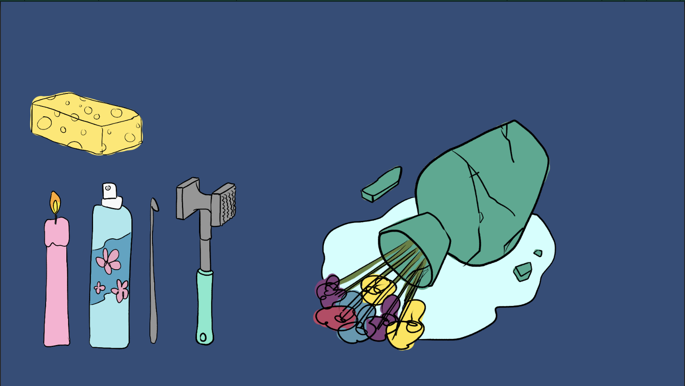
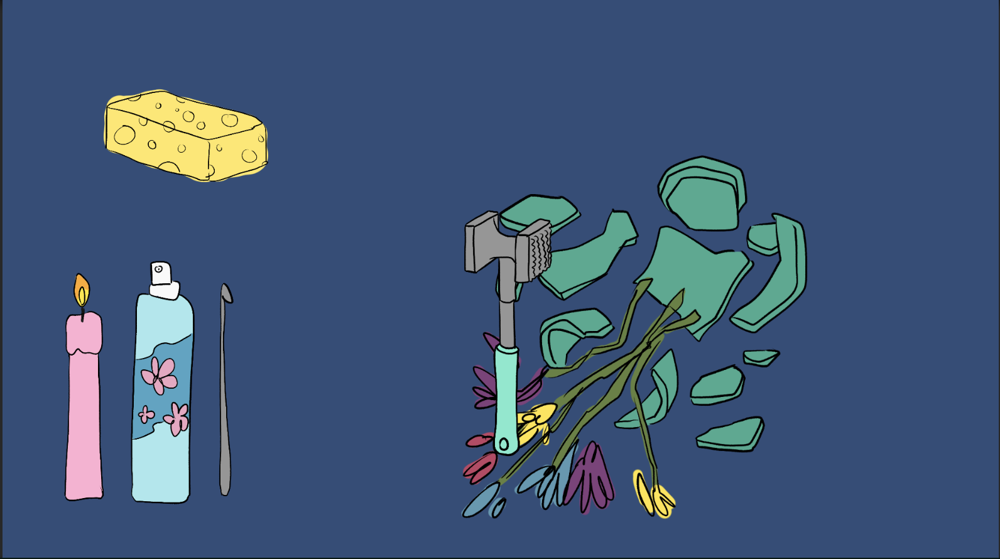
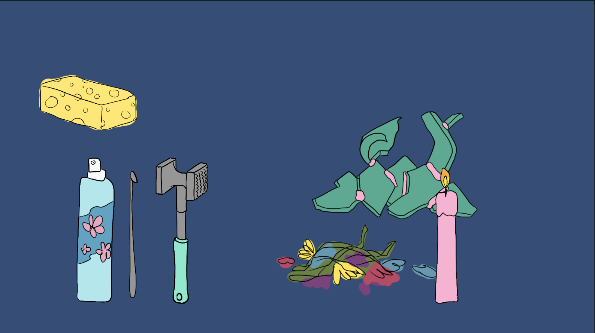

# Unity and video games references

## 09-10.04.2024

On Tuesday, I talked with Pierre about my first repairs structure in Unity. Since I checked the different steps in the process with an int (1, 2, 3, ...) he recommended me to use enum instead so the steps could be checked with words instead of numbers and would be easier to manage.

I documented myself about it and I focused on I tried doing it the day after.
It was rather easy to add and it allowed me to simplify my code since I noticed I didn't need bools. I also added a new path to my structure.

The script cleaned and with a new path:

!

The new path:

The same day, I checked the game [A little to the left](https://www.youtube.com/watch?v=zzrbTsfKVrg) Nathan told me about, the game [Florence](https://www.youtube.com/watch?v=GkxOJh3hClU) and I played to the game [Zagad](https://nekromana.itch.io/zagad).

I also listed some Unity tutorials that might be useful to me later:

[How to rotate an object](https://www.youtube.com/watch?v=0eM5molItfE)

[How to make objects snap](https://www.youtube.com/watch?v=zY62cJk9i30)

[How to draw in Unity](https://www.youtube.com/watch?v=XozHdfHrb1U)
