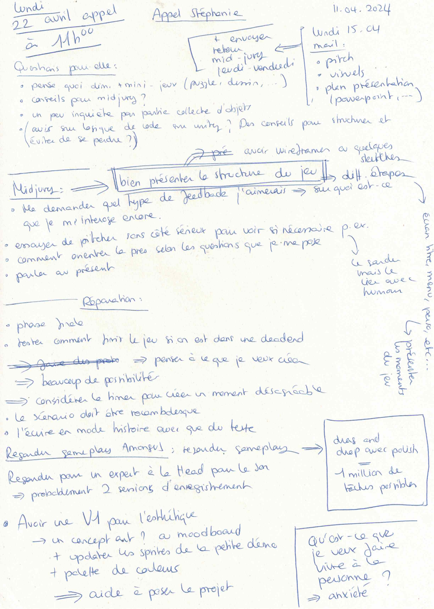

# Call with Stéphanie

## 11.04.2024

I had a call with Stéphanie. We talked about next week's midjury presentation and she recommended me to check the small tasks in [Among Us](https://play.google.com/store/apps/details?id=com.innersloth.spacemafia) since they use a minimalistic gameplay in a very efficient way. We also thought about the necessity of adding a subtle timer (through noises, sound effects) in my game to emphasize more the mental state (stress, anxiety) the main character is living at the moment.

