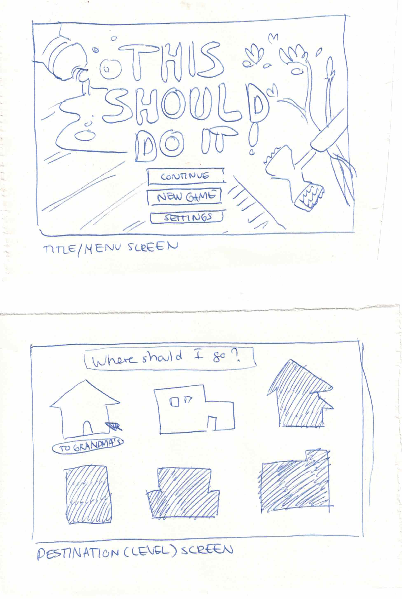
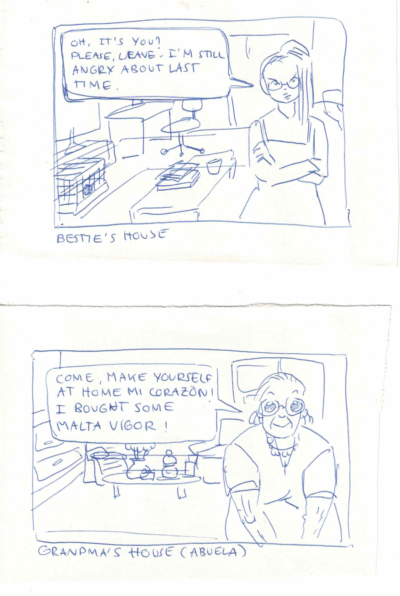
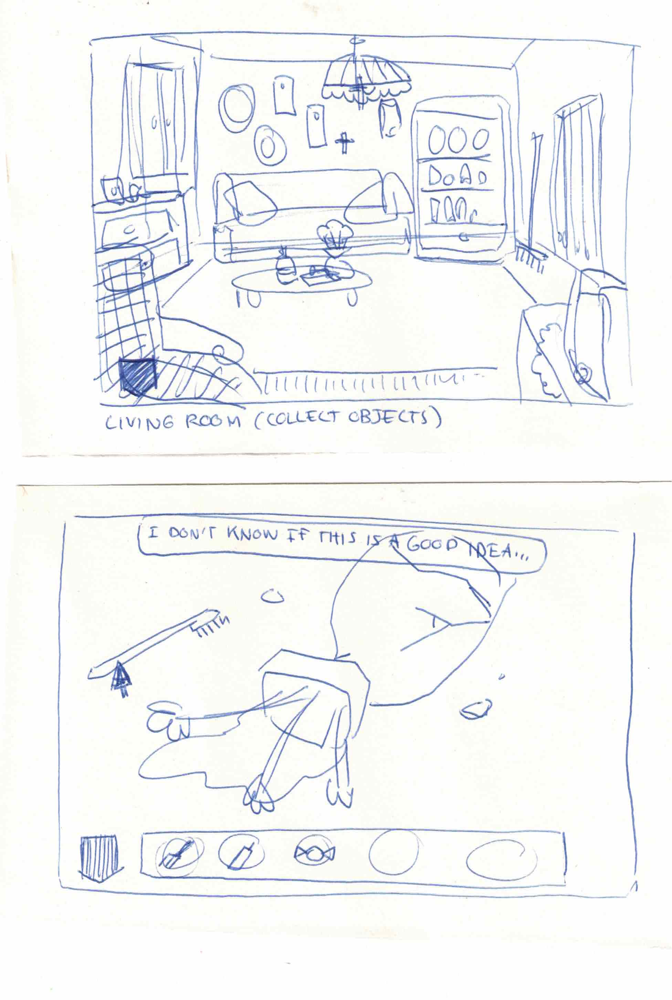
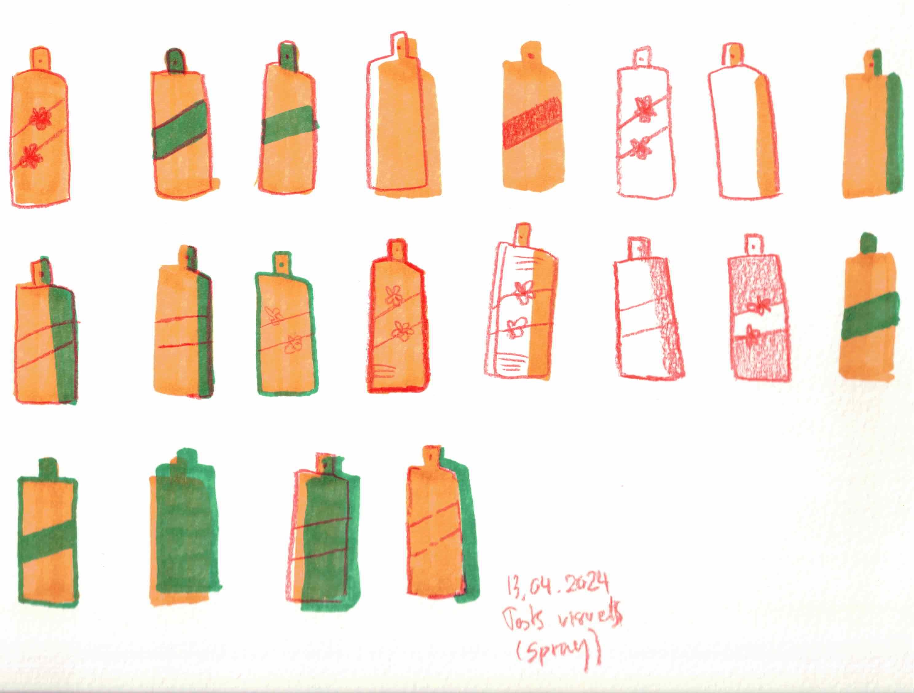

# Midjury sketches

## 13.04.2024

I drew some sketches to help me during the midjury presentation. This way, I can show to the jury the structure of my demo and the different screens the player will see.

I also drew quick variations of an objetc with one pencil and two alcohol markers to see the different visual possibilities I can do with limited material. This will help me to define the aesthetic of my game.

