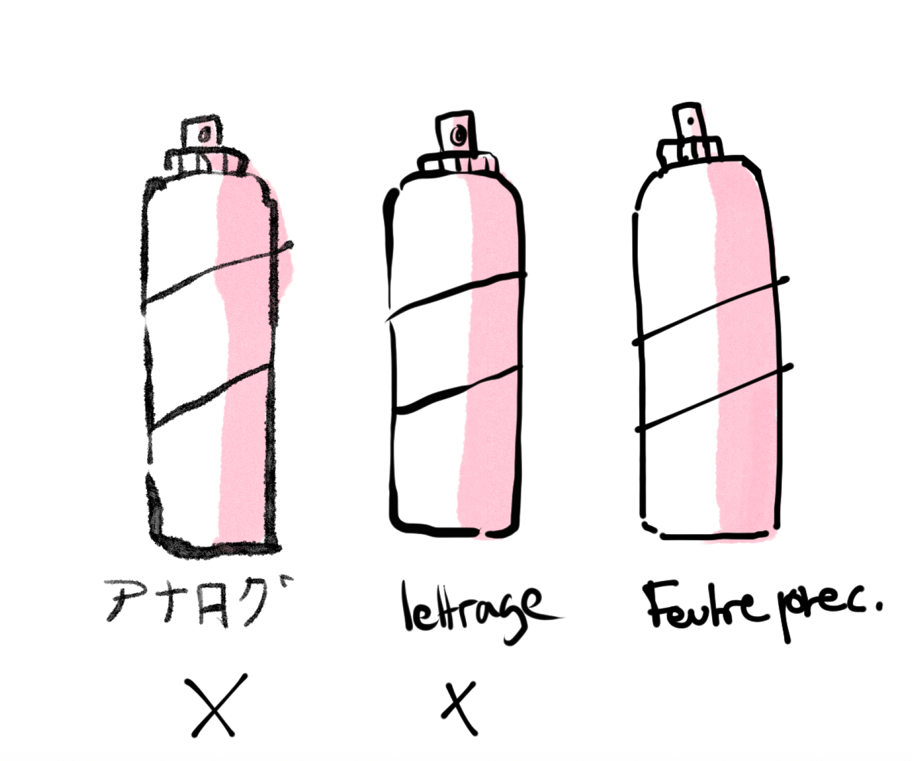

# Moodboard and tests

## 14.04.2024

I made a moodboard to observe and understand what I like and find interesting for the type of aesthetic I want to achieve in my project (comics, animations, games, ...) but also to compare it to point and click games I find inspiring (Birth, Unpacking, A little to the left, Florence).

I took some notes while analysing my moodbard, I listed a few observations:

- I would like a soft and organic stroke to convey some fragility to the environment and the objects since all of these do not belong to us, yet, we are breacking them.

- I would like to use different colors for each characters/places to show their personality through them. Therefore, I would like to have colour palettes of 4-5 colors.

- I wante to use flat colors to define clearly the shape of each object.

- I need to fin a way to keep the visual legible for the eyes.

I also started drawing some tests for the objects and the background.

