# Visuals work in progress

## 15.04.2024

I spent the majority of the day drawing, testing colors on the background drawn yesterday. I made a lot of variations.

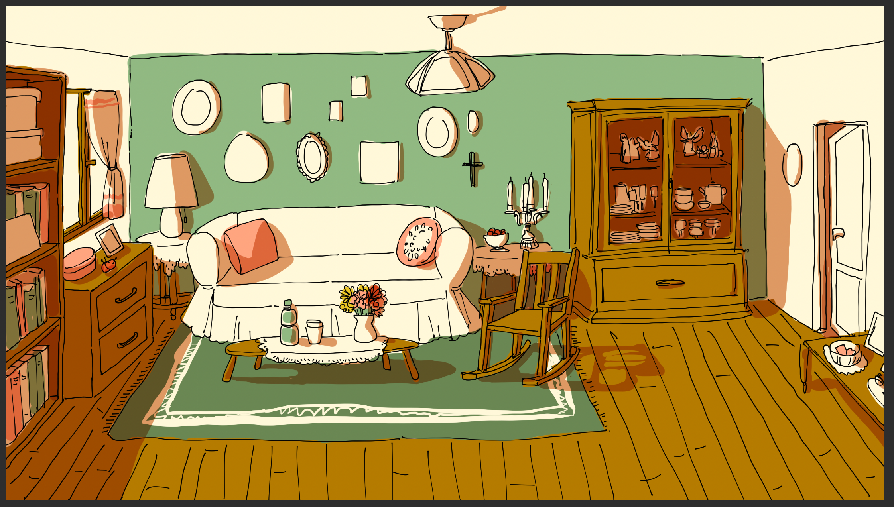

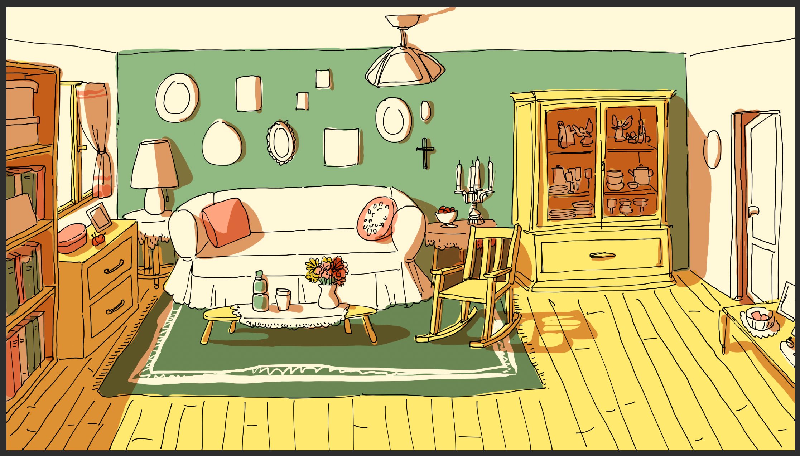

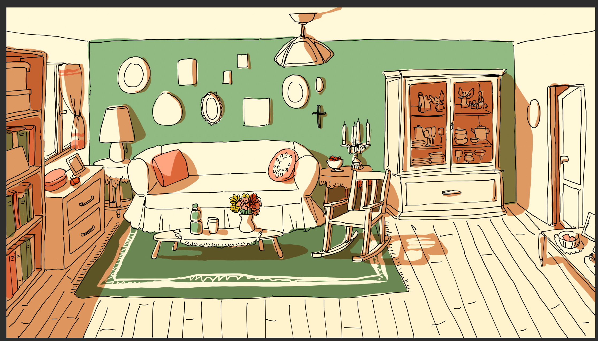

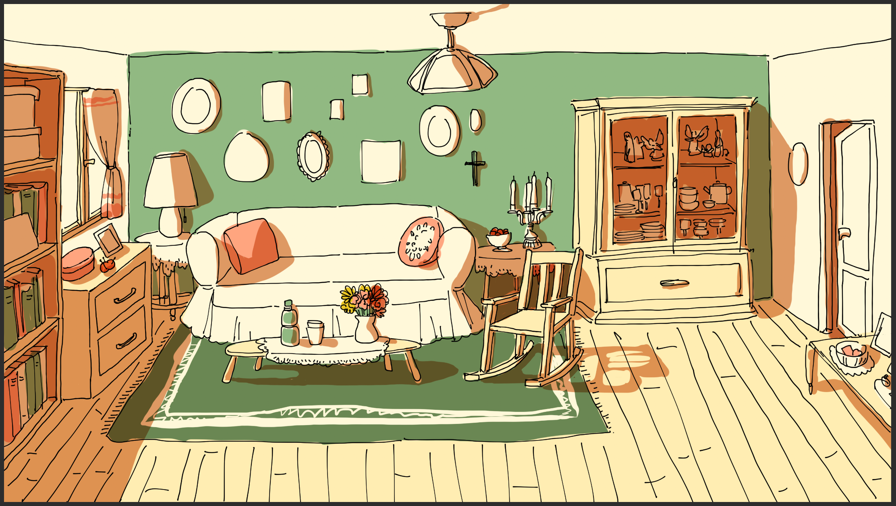

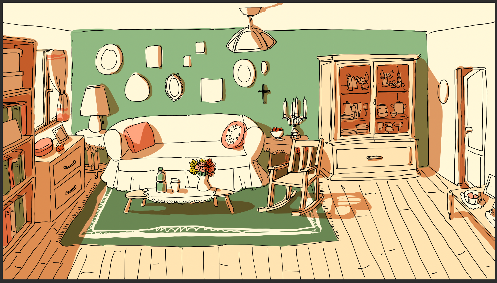

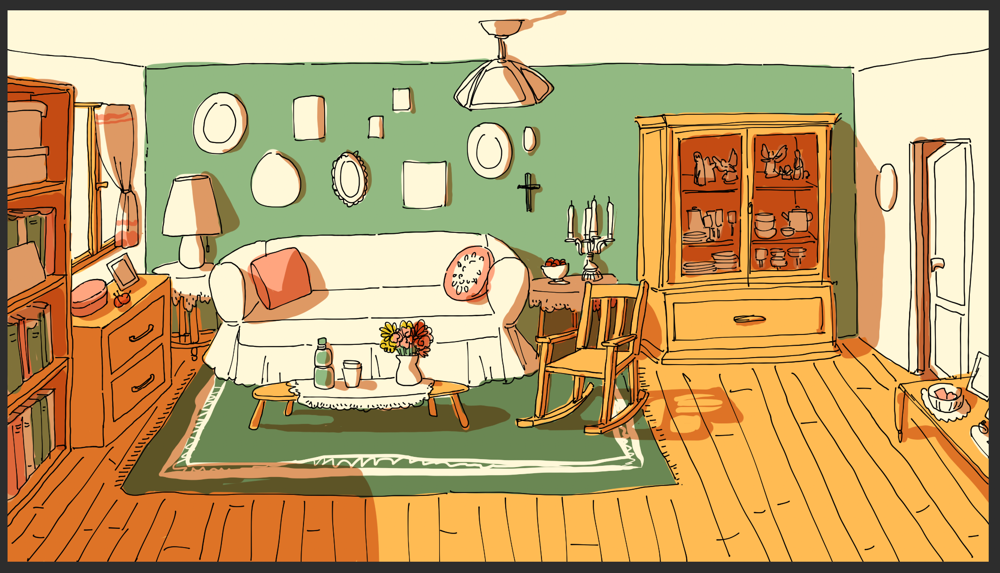

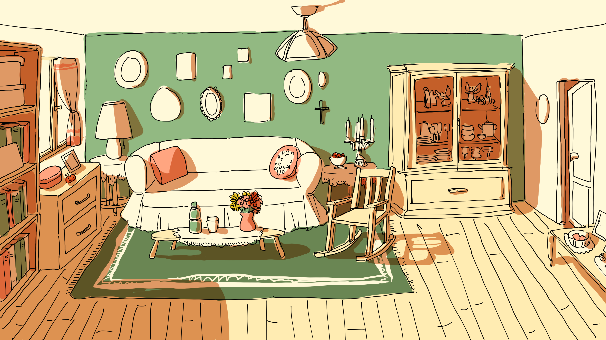

From these tests, I made a color palette for Abuela's objects and rooms:

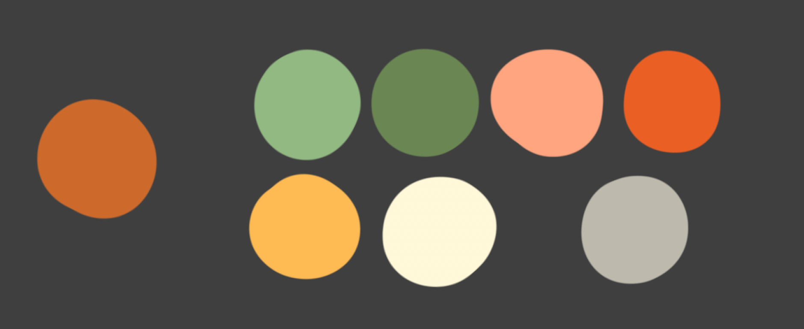

I also drew a background and the objects from my Unity project using this palette. Then, I updated some sprites.

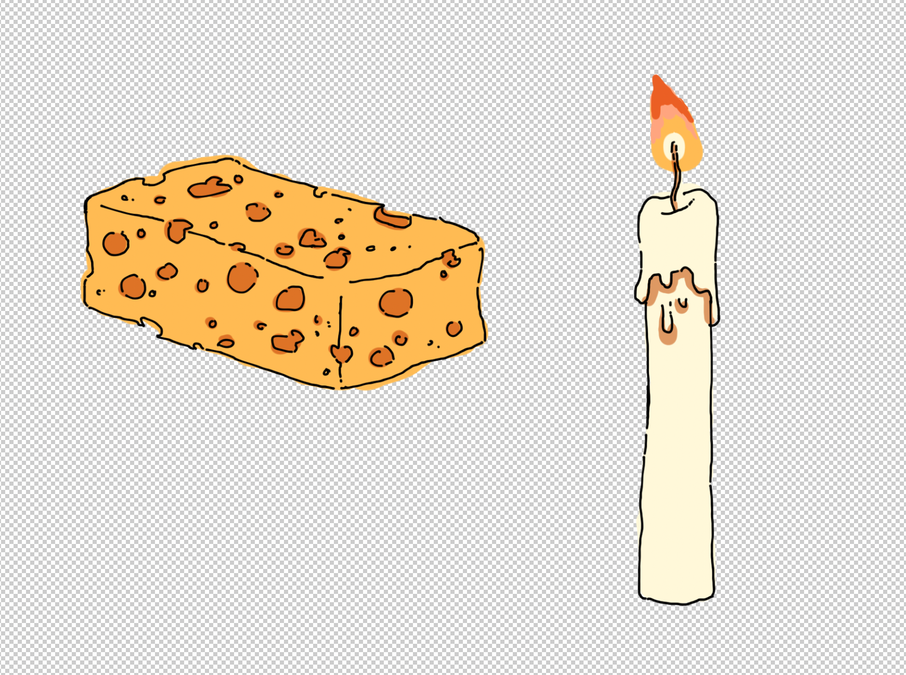

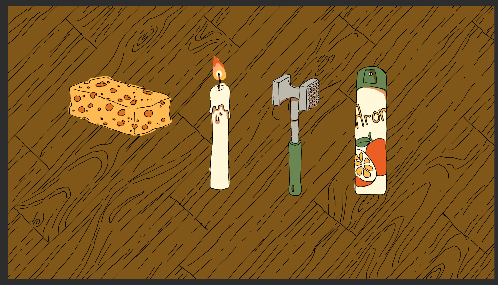

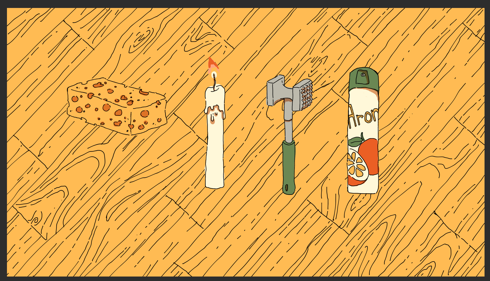

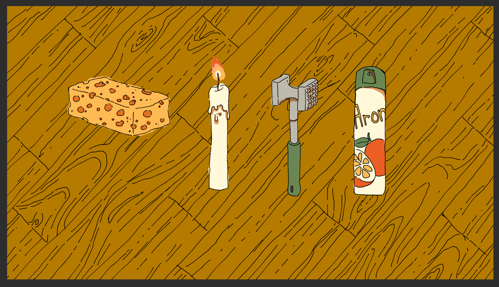

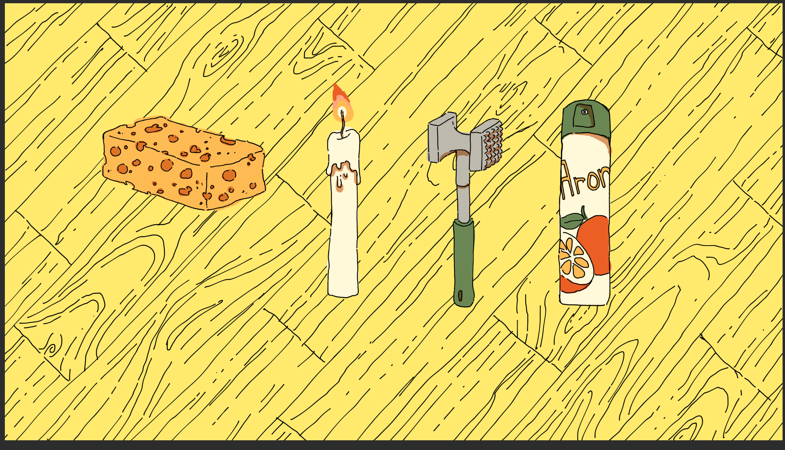

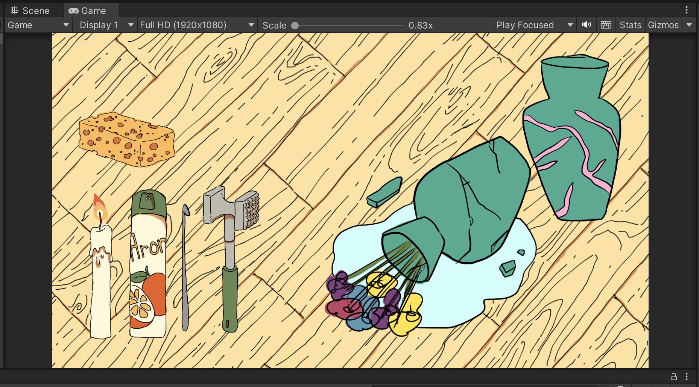

One of my challenges for now is staying legible with a limited color palette during repair phases. To avoid the objects and the background blending toghether, I want to experiment with textures (I also applied one to the general background, see below), details, saturation and opacity.

