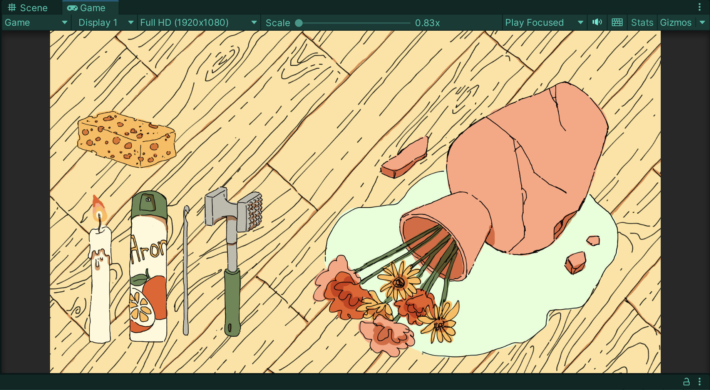
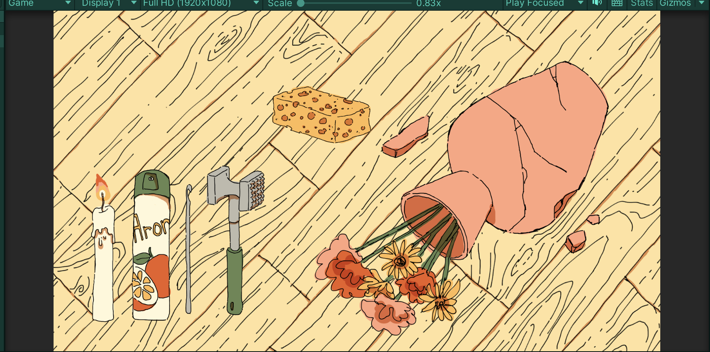
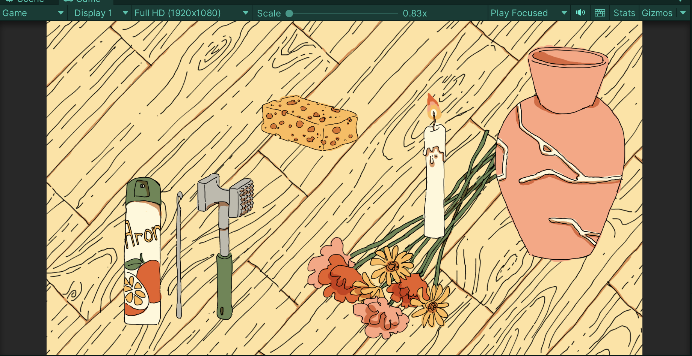
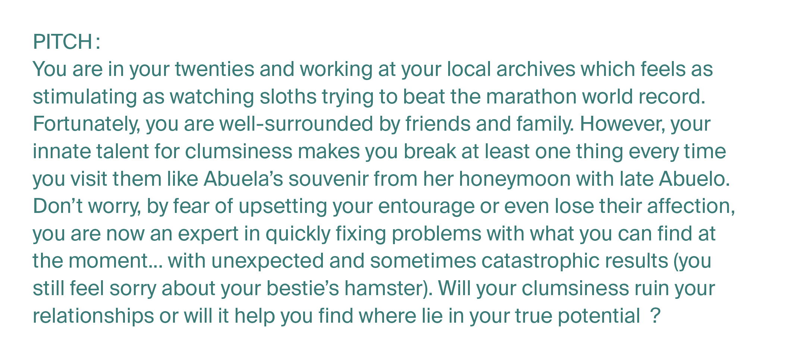
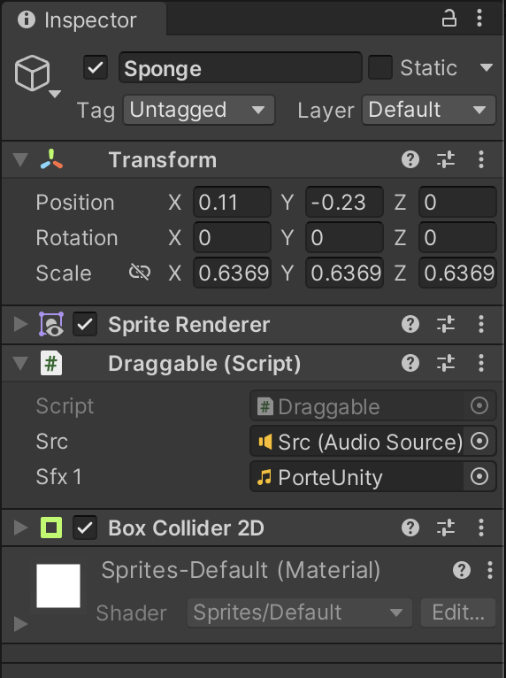
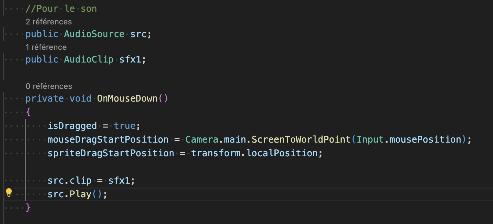

# Preparing midjury and adding sound

## 16.04.2024

I finished drawing and updating sprites for the small test in Unity.

I also rewrote the pitch with the help of Stéphanie.

In the afternoon, I took some time to see how to add sound in Unity. I found [a short tutorial](https://www.youtube.com/watch?v=mvaUho_a-q4) and I made a small test in a new Unity project. It worked perfectly.

