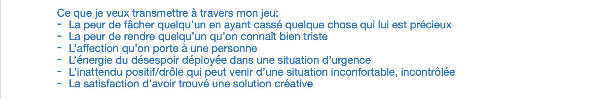

# Focusing on scenario and structure

## 18-21.04.2024

I spent the last few days focusing on what kind of story I want to tell through my game. I first wrote a part of the demo as if it was a book to project myself into the main character's shoes and imagine what I would do if I were in their situation. It helped me deciding how to organize the different scenes in main interaction of the game.

I also wrote down some thoughts about different elements of the demo.

Since I needed to be clear about the kind of feeling/message I want to communicate to the player, I took a step back and wrote about the core of my story (not juste the demo) and the main character's personnality. This helped my taking decisions like, for example, how to manage the timer.

From all of this, I drew some new wireframes and made a small structure for the repairs phases.

