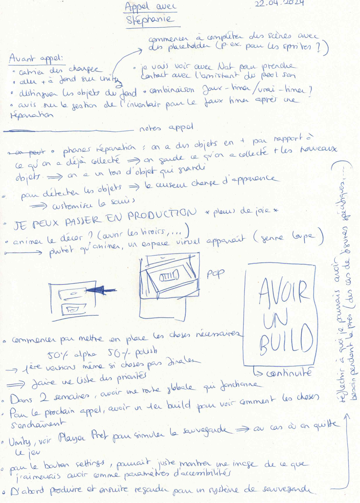
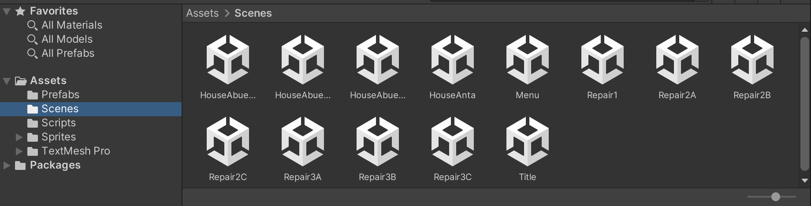
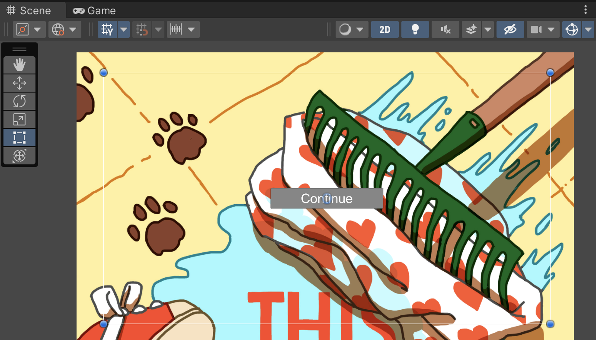
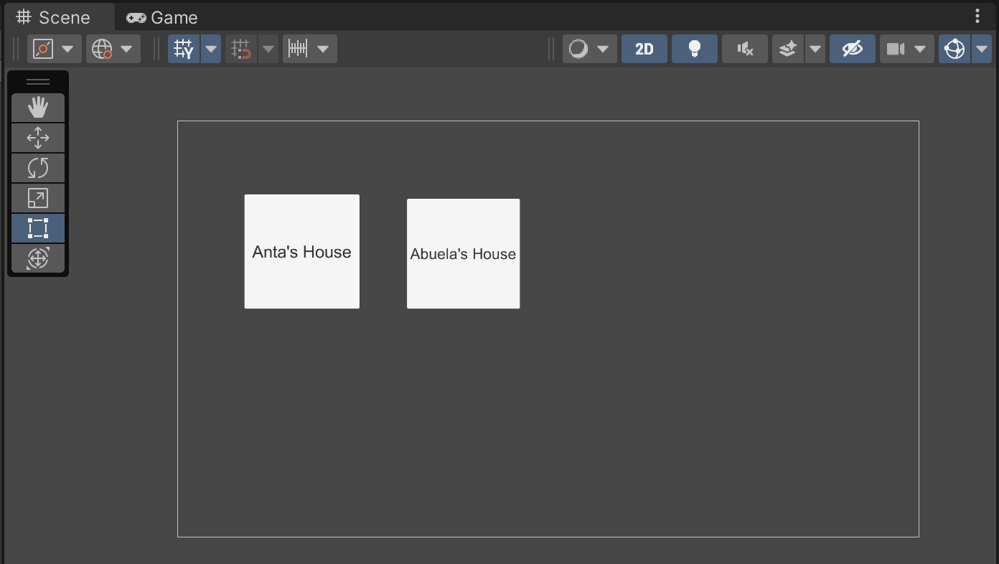

# Call with Stéphanie

## 22. 04. 2024

I can now fully focus on making the game on Unity ! For our next meeting, I need to have a basic structure that we can check toghether. Stéphanie told me about [the PlayerPrefs](https://docs.unity3d.com/ScriptReference/PlayerPrefs.html) in Unity.

I created a new project in Unity in order to start building my structure.

I also started checking tutorials about [dialogues systems](https://www.youtube.com/watch?v=8oTYabhj248).
