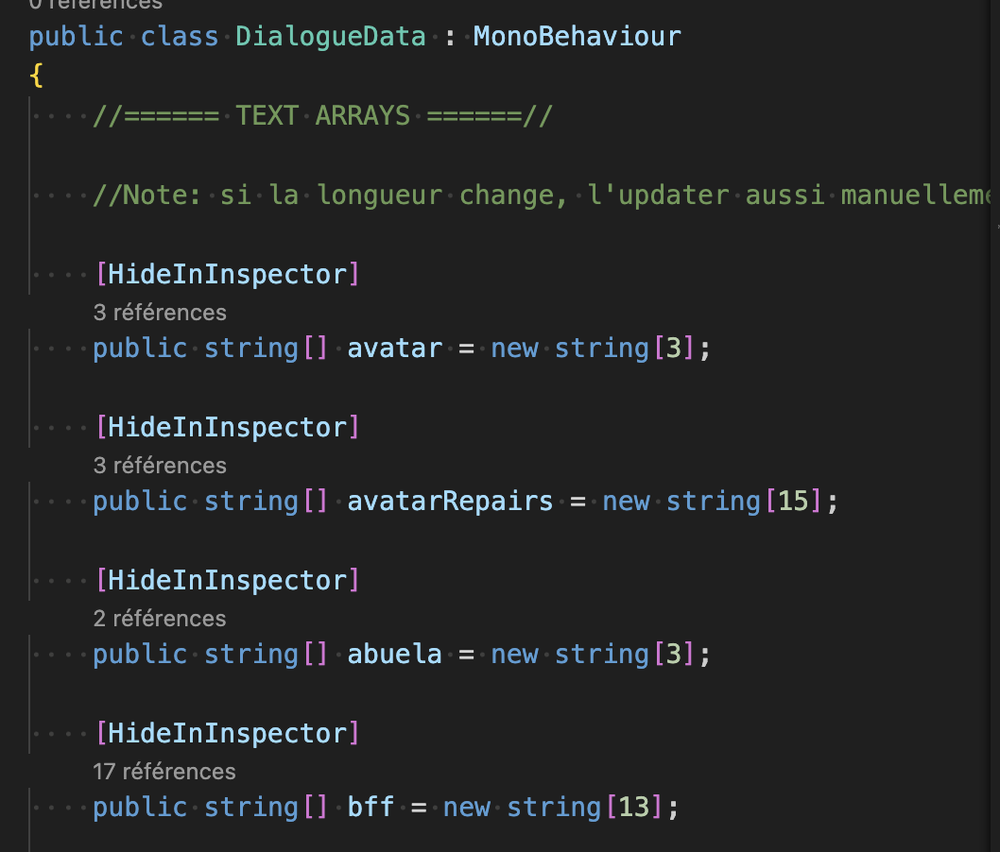
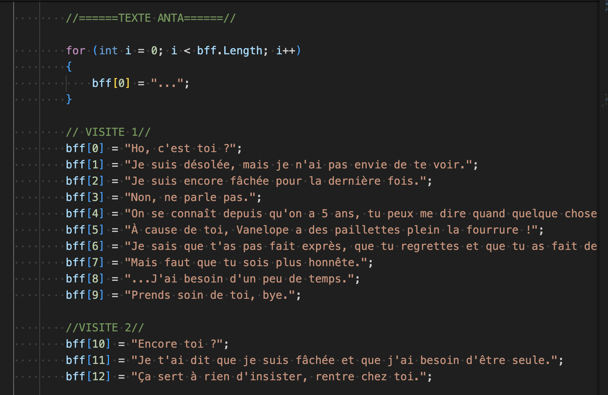
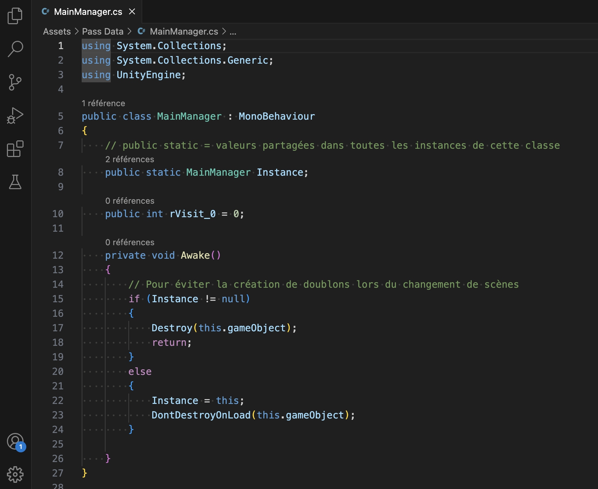
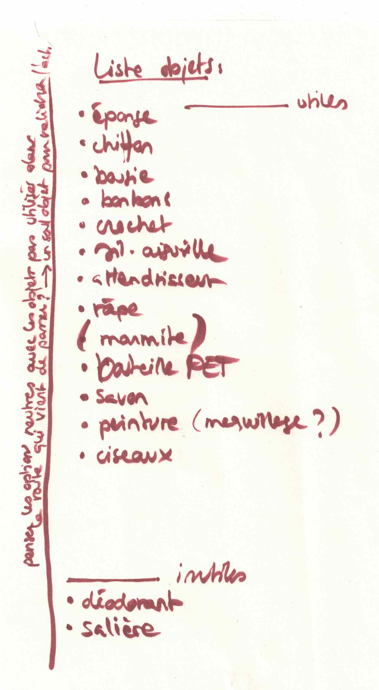
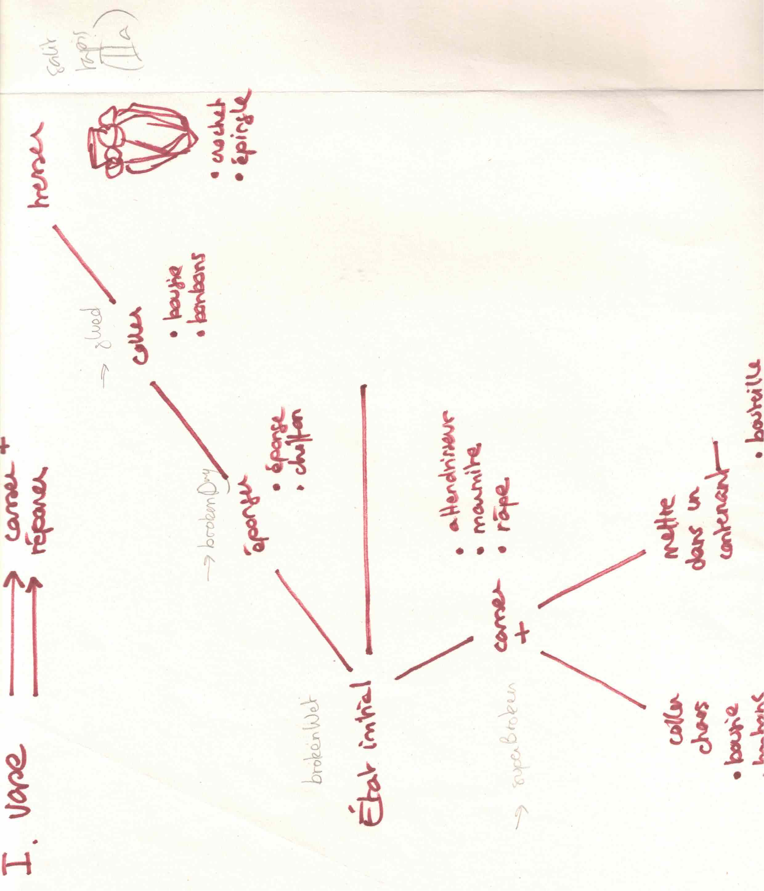
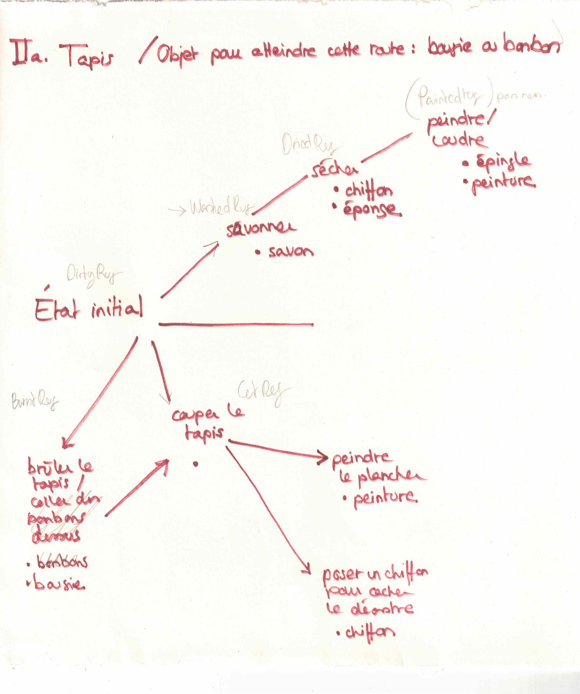
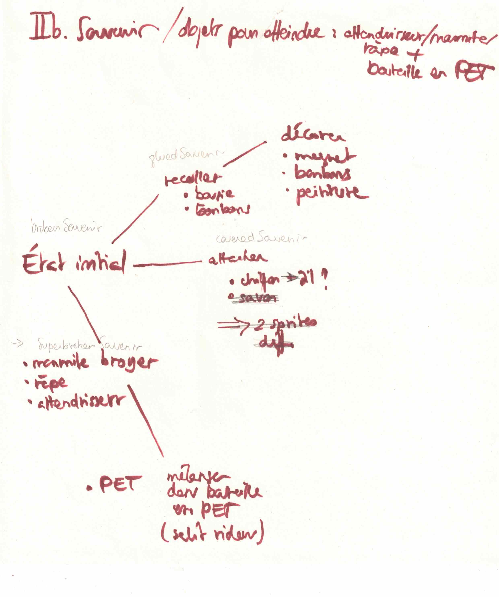
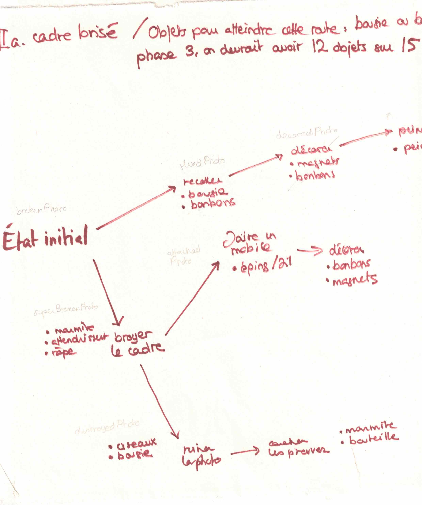
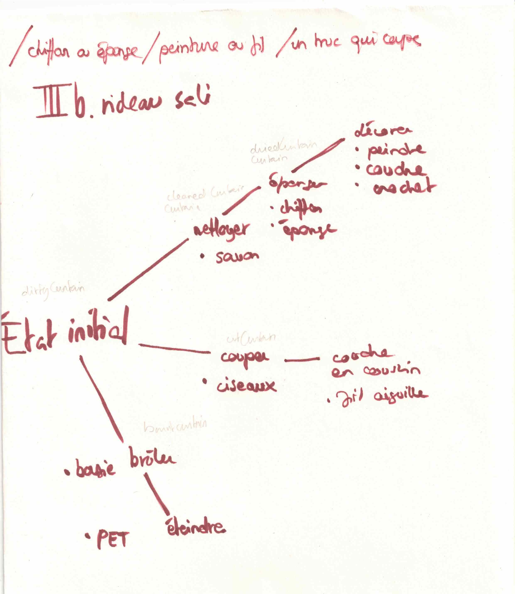

# Meeting with Stéphanie

## 30.04.2024

Today, I met Stéphanie. She helped me with my Dialogue System and told me that using Inkle or Yard Spinner was not absolutely necessary. She showed me how to make a script that contains all the dialogues within Arrays. This way, the text is centralized in one place and I can call what I need when I want.

We also checked toghether how to pass data between scenes. Before meeting her, I was able to use a small script (which I adapted from [this web article](https://www.sitepoint.com/saving-data-between-scenes-in-unity/)) to preserve the inventory's data between scenes. So we worked from this.

For the rest of the day, I drew repairs maps to choose the finale objects and to have a visual guide when scripting it.

