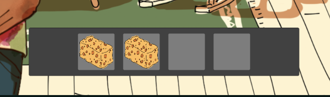
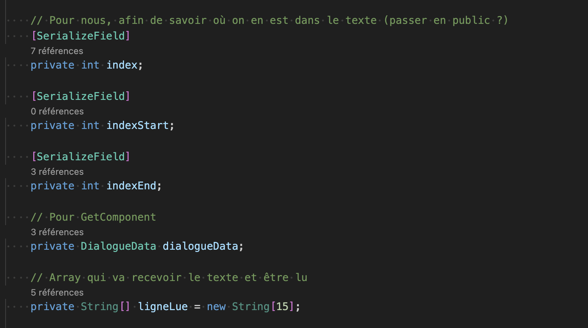
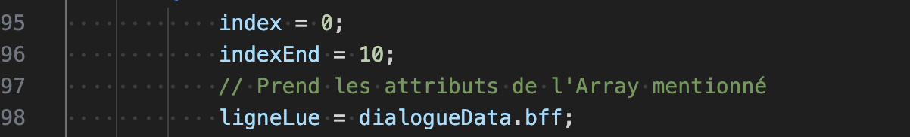
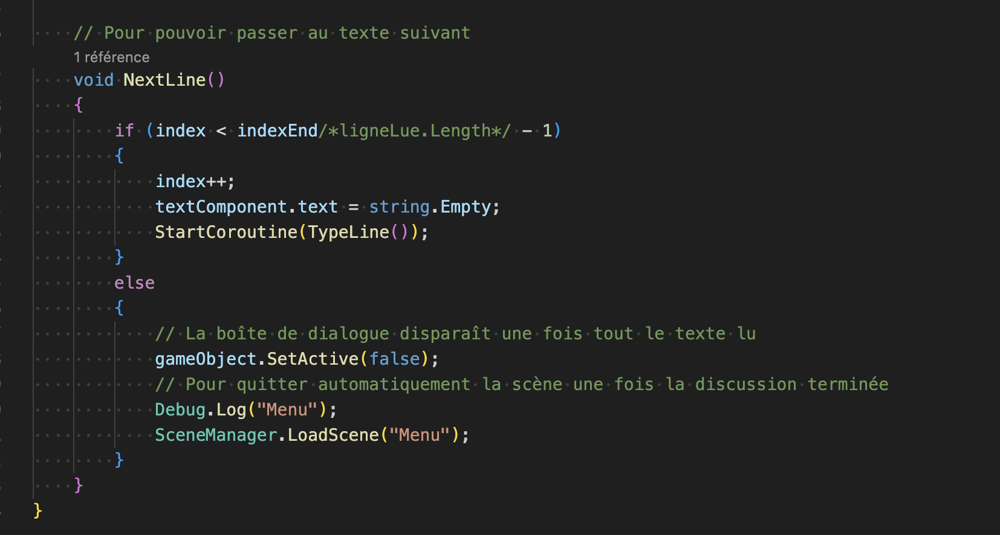

# Dialogues and inventory

## 01-02.05.2024

I added an inventory to my main Unity project.

I also worked on the dialogue system to make it more flexible. It took me some time but now I know which values to change to only read specific parts of an Array. For this, I created variables for the starting and ending line. I also created an Array to make it match with different Arrays from Dialogue Data script.

