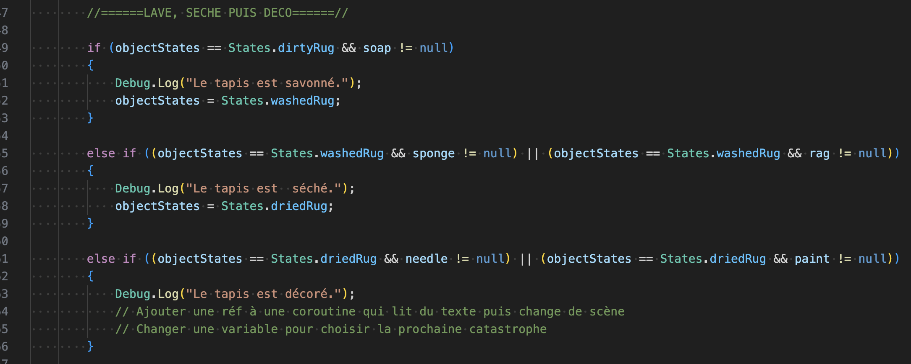
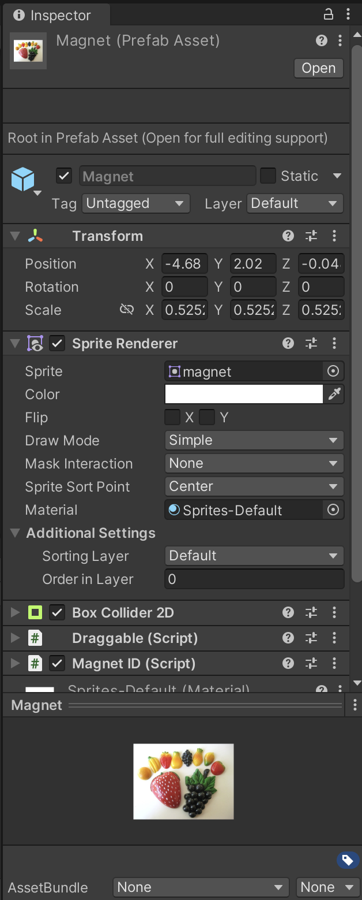
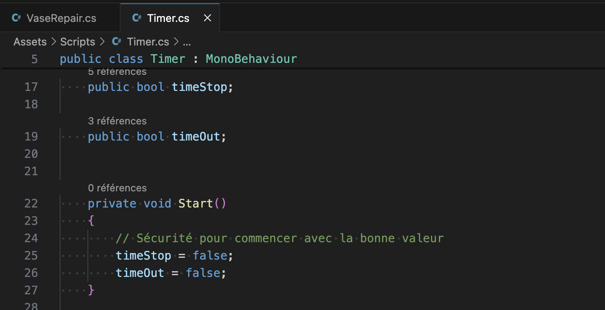
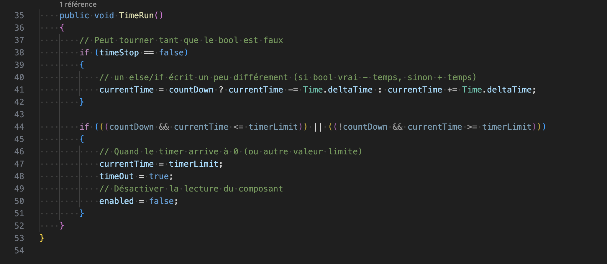
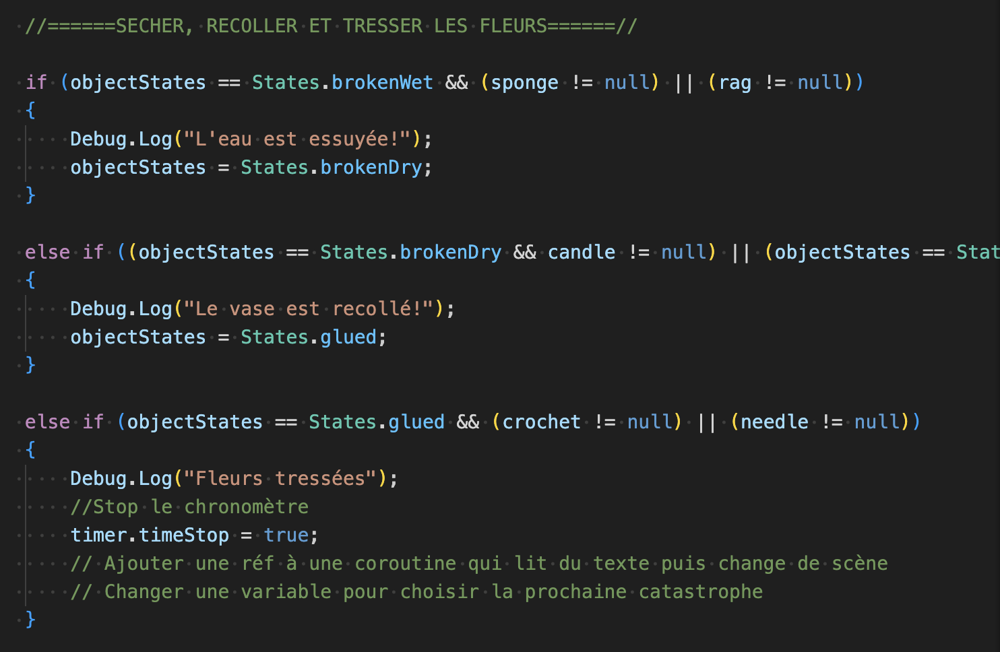
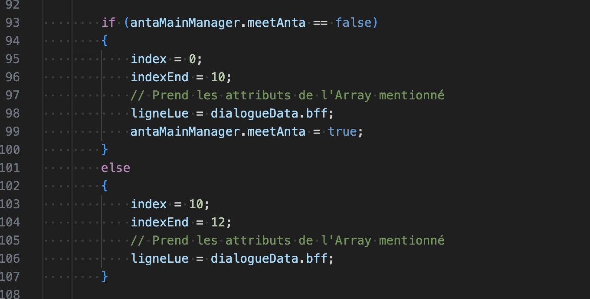
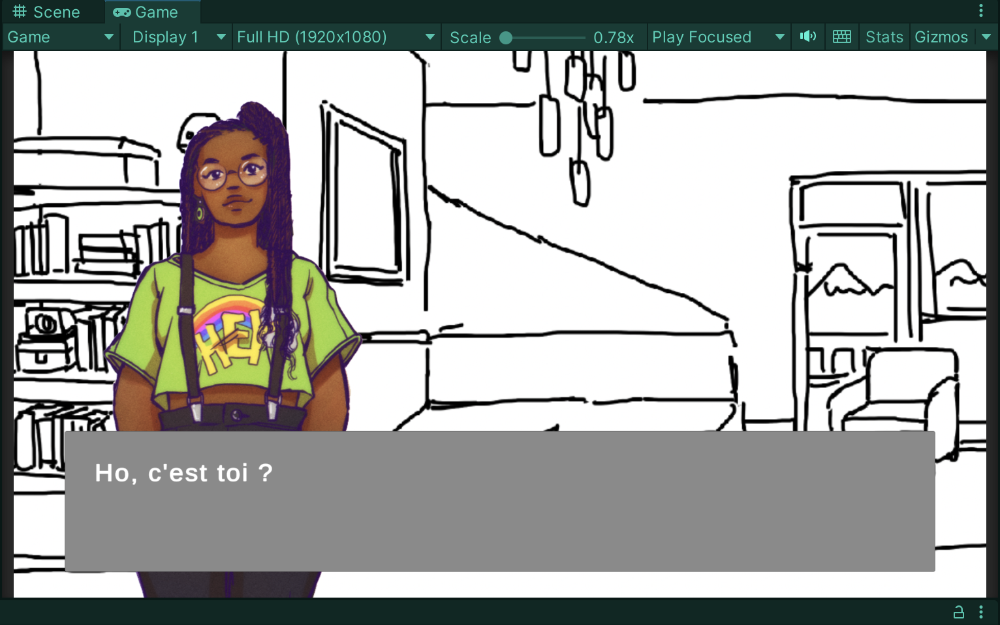
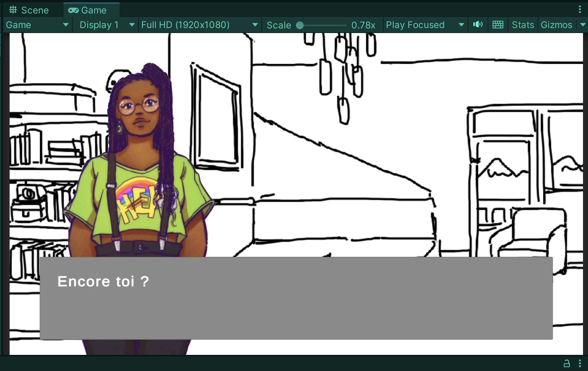

# Repairs, dialogue and timer

## 03-04.05.2024

I spent the two days scripting repairs structures in Unity.

I also added a prefab for the magnet object.

I also worked on stopping the timer when a repairs route is completed.

I kept working also on the singletones and I was able to use one to make the best friend's dialogue change between the first and second visit.

