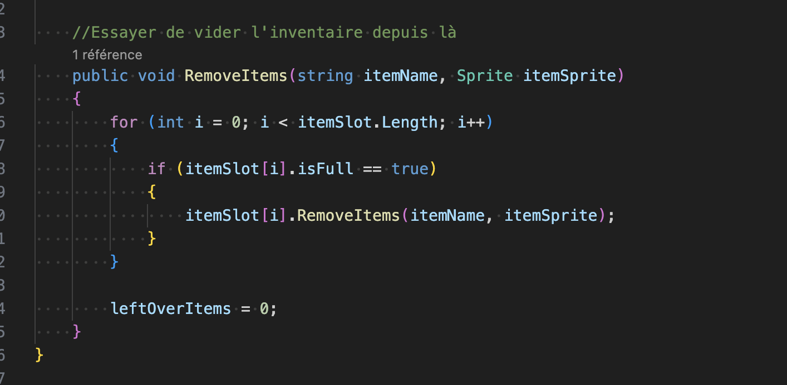
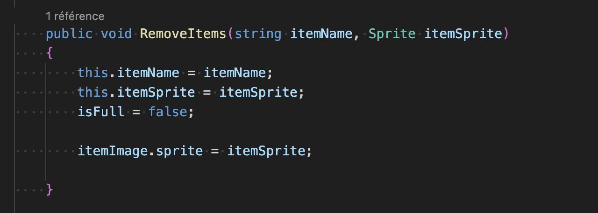
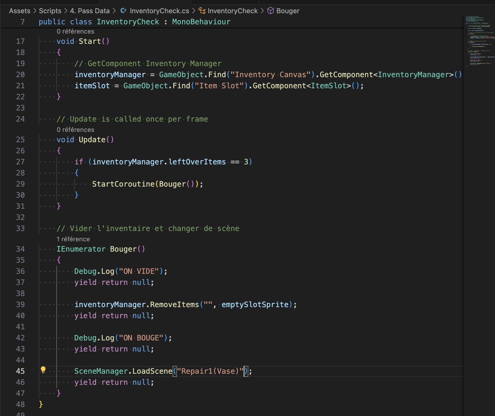

# Empty the inventory

## 05.05.2024

I adapted my scripts to empty the inventory when necessary. I created a coroutine using this action and it worked fine. I just need to see if it is possible to add items again after it.

