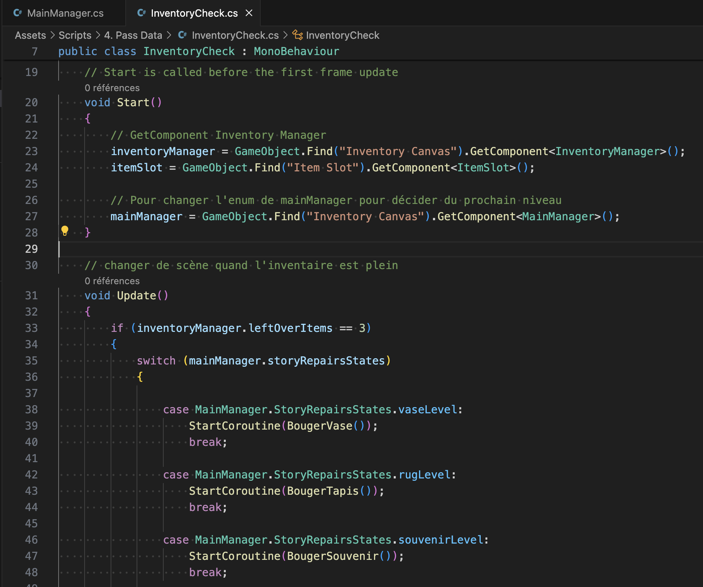

# Connecting the scenes

## 06-09.05.2024

On the last few days, I worked on having a functional structure for my game. Which means the inventory is now emptied when we switch to a repairs phase. It also activate the collected objects which means we can use them to fix the problem.

Depending on the type of repairs done, the next problem will also be different.

What is left to do for the "working" aspect of the game is to add the "time out routes", the dialogues and change the sprites depending on the repairs we have made. I also need to see how to save data in general if we want to leave the game when in the middle of it.
But the priority is to work on the visuals and the sound design.

Also, Pierre helped me to decide which technique to use to avoid having collected objects re-appearing when we come back to a room.

He also helped me figuring out why we couldn't move some items when we dropped them on the object to repair (it was because of the z value in the position of the objects).

I'm thinking of making the intro and outro of the main part of the game in a separate scene to help me focus on managing the dialogues and the sprites.
