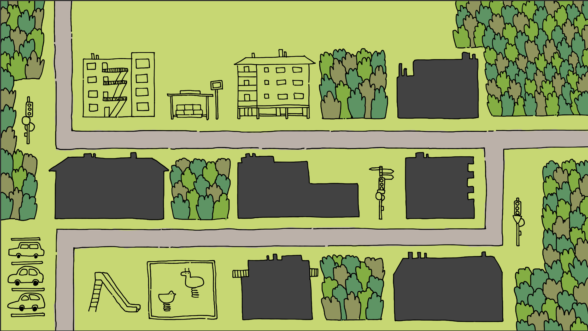
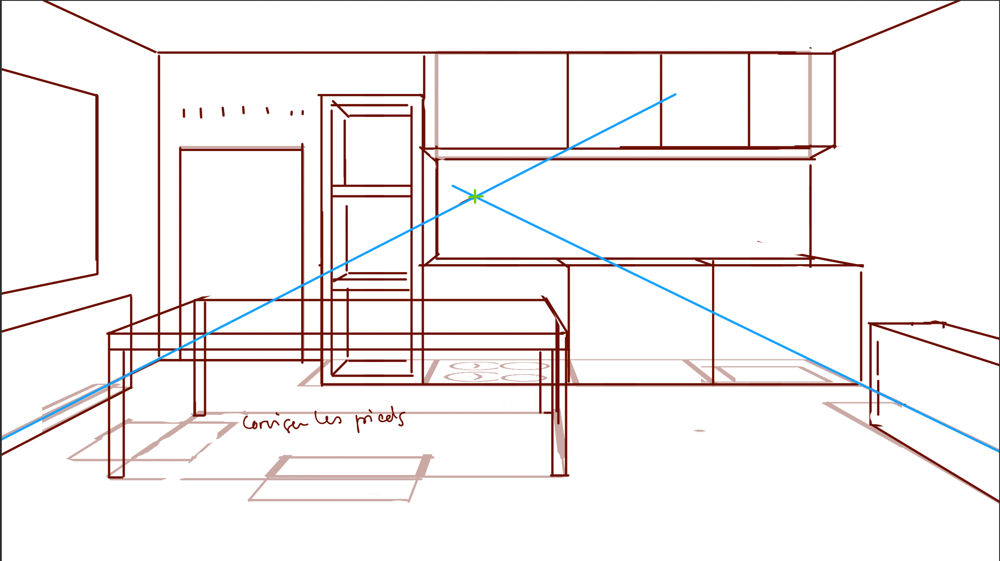
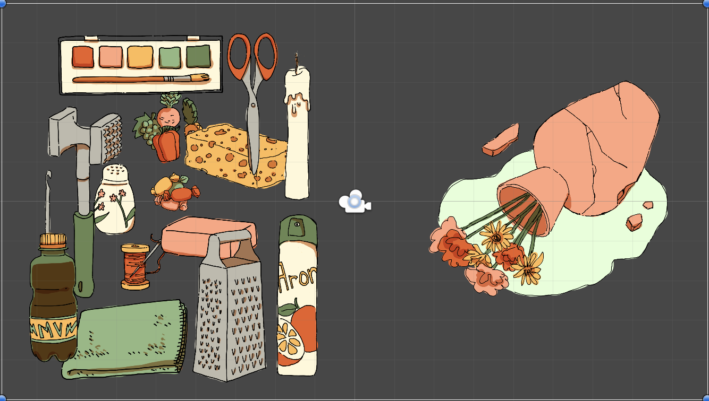

# Drawing and building

## 12-15.05.2024

I finished connecting the different scenes of my game depending of the player's actions.
I also kept drawing. I lined and start coloring the menu's background. I started sketching the kitchen's background. I drew and updated in Unity all the items used in repairs phases.

I also made a first build. I noticed that, unlike in Unity, the inventory wasn't showing when arriving at Abuela's apartment. I don't think it's a complex problem but I still need to solve this.
