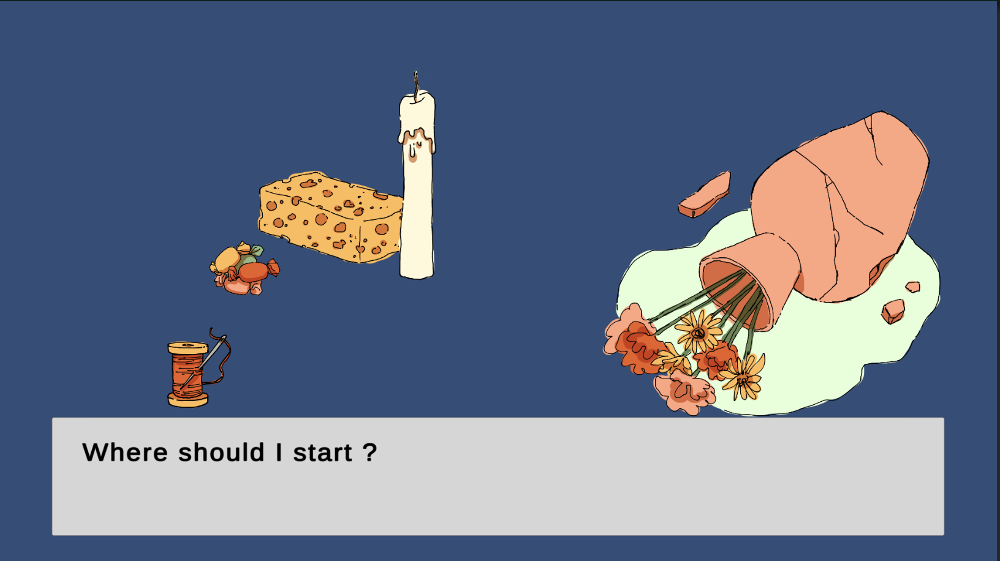

# Adjusting the dialogue system and drawing

## 17-18.05.2024

I worked on my existing dialogue system in order to simplify its use when adding comments in repairs phases.

I started adding comments to the Vase level. It works fine except for the comments used in a coroutine happening when a route is completed. In this case, comments should be displayed before changing scene but for now the scene changes before all the comments are shown. I tried solving this by using a bool but it doesn't work if more than one line in an array need to be called (it will only display the first one before changing scene).

I also wrote some text to later use it in the Dialogue System.

I drew all the Souvenir level's sprites, completed the ones missing for the Vase level and drew a first background for the repairs phases.

I also started listening to some music on [Free Music archives](https://freemusicarchive.org/home) to start looking for some soundtracks for my game. I also got rid of the pan camera, since the apartment we are moving in is small, it wasn't very useful.
