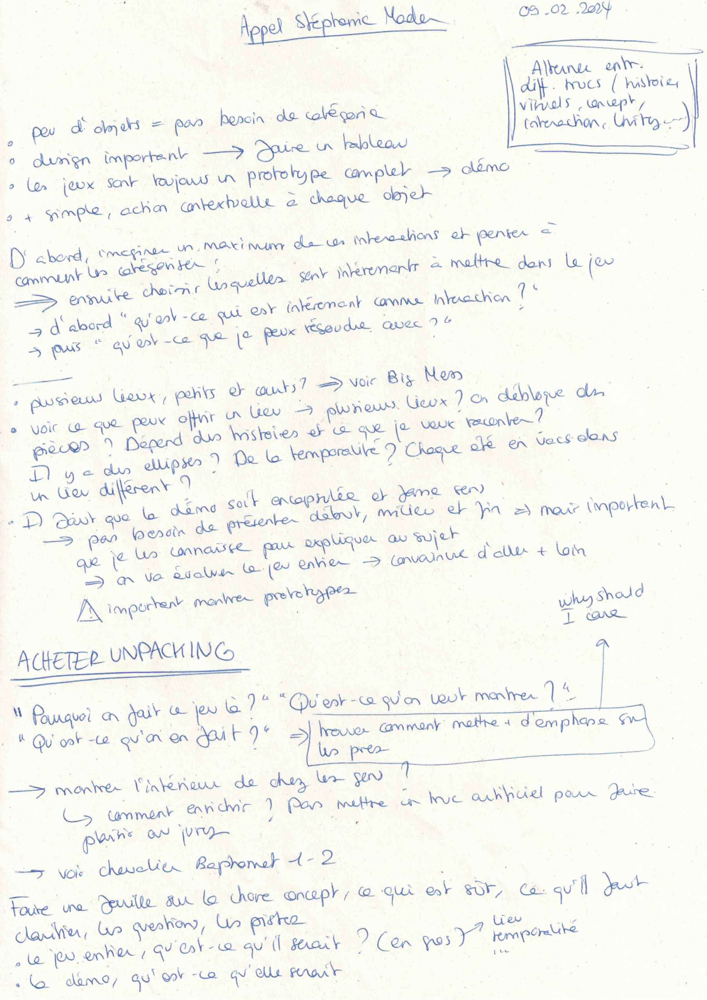

# First meeting with my tutor

## 09.02.2024

We had a call on Discord. I presented my project and we talked about what to do next.
I need to focus on the interactions between a short list of object. I also need to justify why my project is important outside of its humorous aspect.

This call was very useful to me. It is clearer to me now what is expected from the jury for june and I have a lot of different things to work on in the meantime.

