# Adding Dialogues

## 20.05.2024

I drew sprites for the rug level and I updated them in Unity. I also updated the vase's sprites.

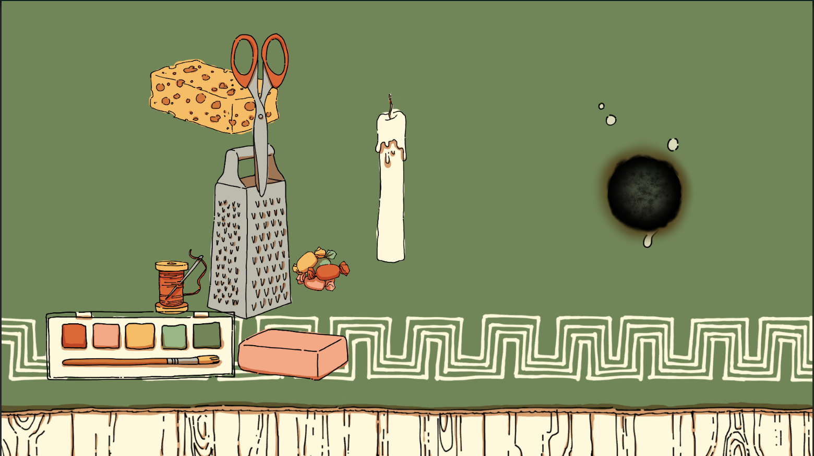

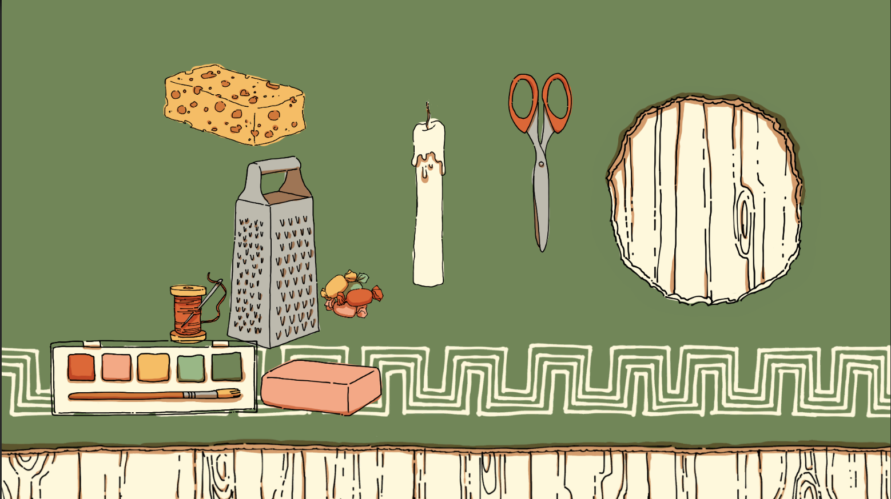

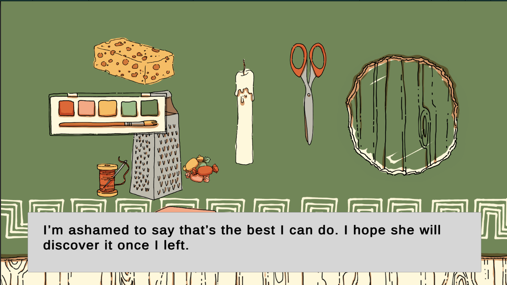

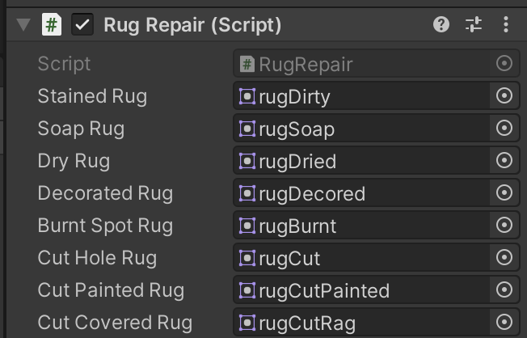

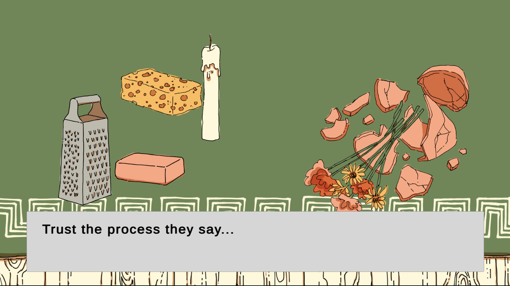

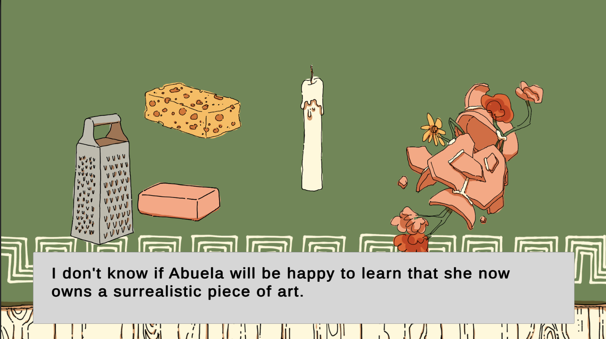

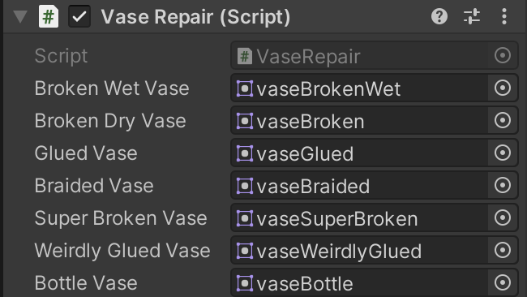

I noticed different bugs while adding the dialogues in the repairs levels. For example, the first line of text doesn't appear automatically, a character after an other, like the rest of it. Also, since there is no changes in the object's last state in repairs level, using again the last object will result in bugs. I was able to correct this quite easily by change the object's state one last time.

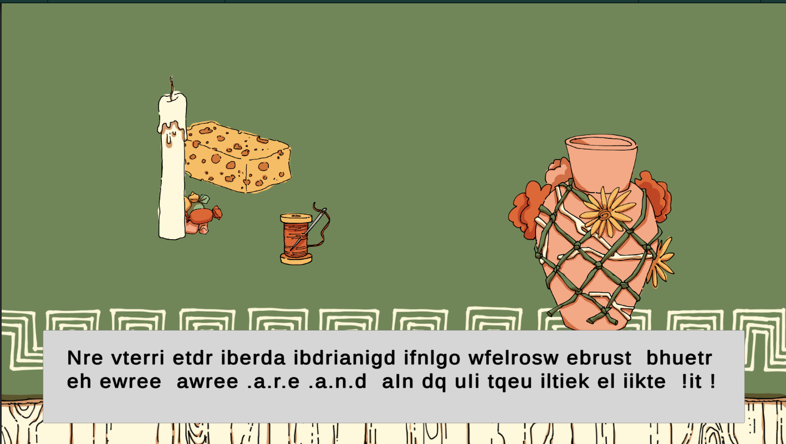

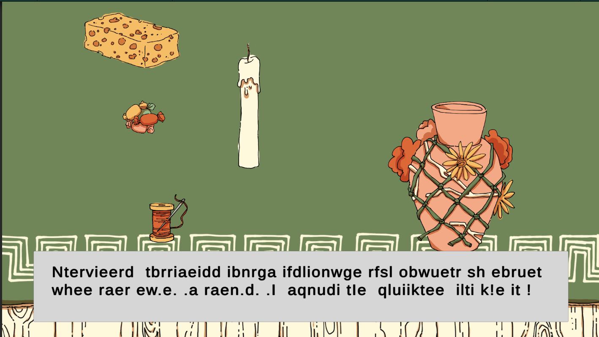

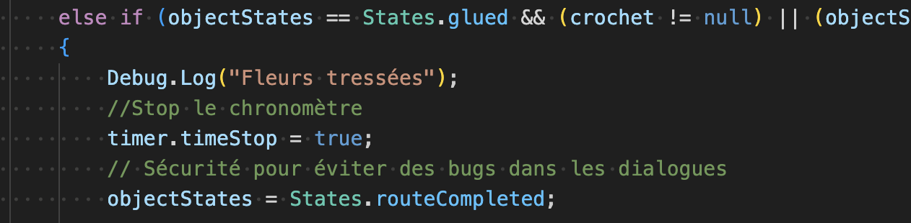

I solved the problem I had when calling multiple lines at once through an IEnumerator. I just need to call them separately, one after an other.

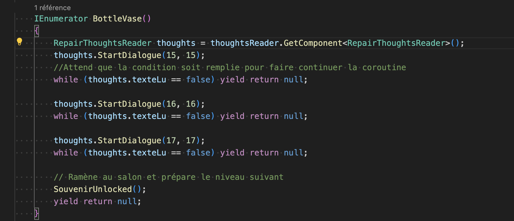
