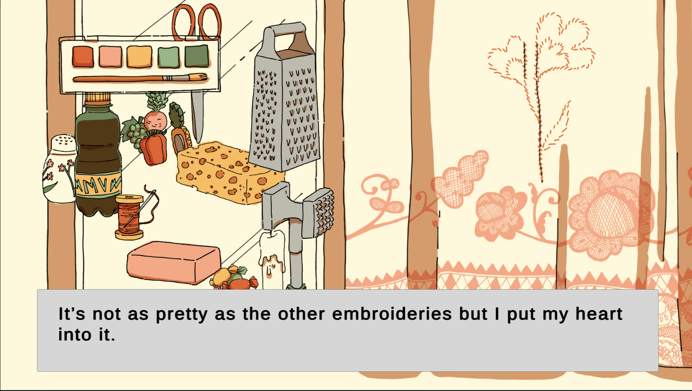

# Drawing and adding dialogues

## 23-26.05.2024

For the last few days, I spent most of my time drawing and updating the sprites for the repairs levels. All levels have been updated so I can now focus on drawing the others backgrounds and missing sprites. I also kept adding dialogues to the repairs levels.

