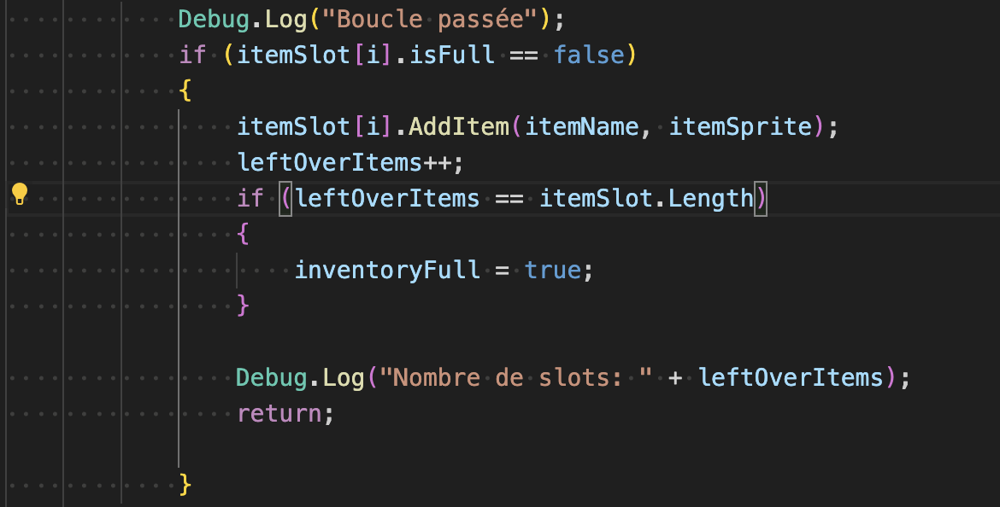
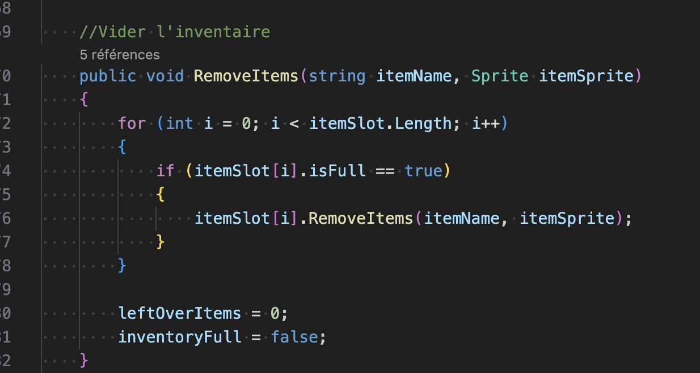
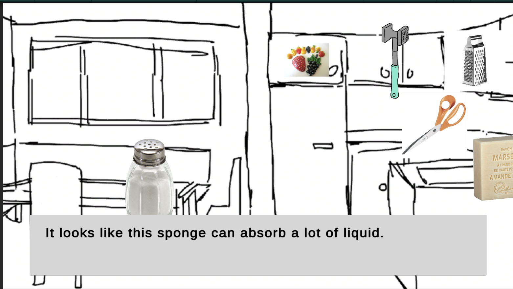
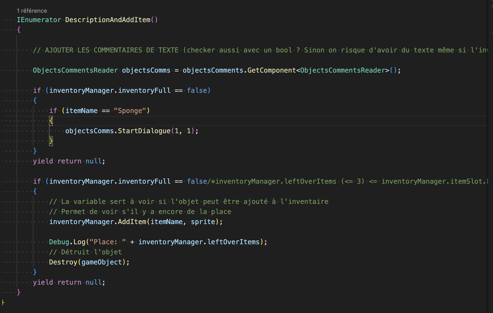
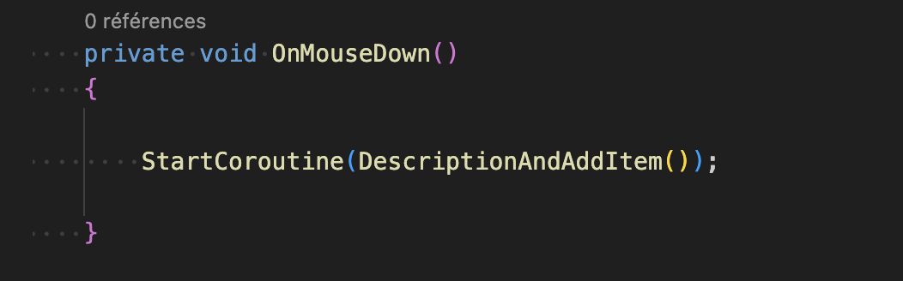
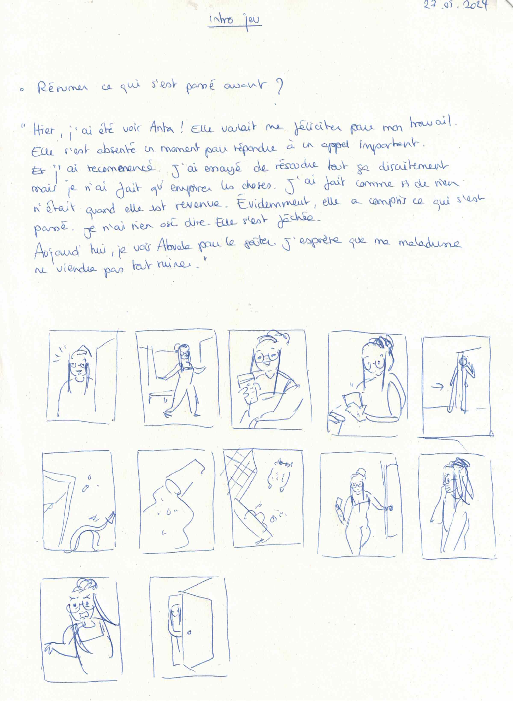

# Solving bugs

## 27.05.2024

I figured out how to prevent collecting/destroying objects when the inventory is full. Therefore, the player cannot destroy accidentally more objects while waiting for the scene to change.

I started adding comment to the objects we can collect. But I encountered a problem similar to the one I had a few days ago. The text doesn't appear a character after an other. Maybe it is because I call it from the OnMouseDown function and I should try to call it from the Update function.

I took a small moment to doodle a first version of the intro of my demo. I will work on it again tomorrow.

